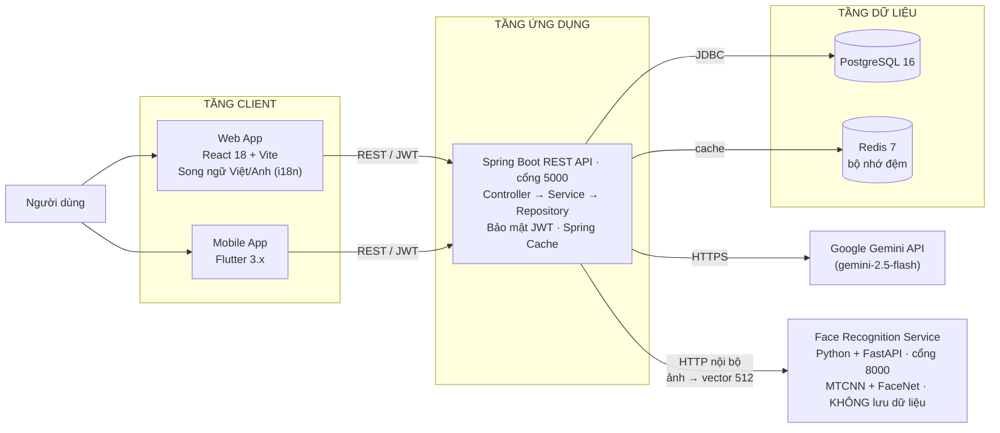

# 🗂️ TaskHub — Hệ thống Quản lý Công việc cho Doanh nghiệp Nhỏ Đa ngành

Hệ thống quản lý toàn diện giúp doanh nghiệp nhỏ quản lý nhân sự, chấm công, dự án, tiến độ công việc và nhận gợi ý phân công nhân viên thông minh từ AI (Google Gemini).

Chấm công xác thực hai lớp: **GPS geofence** (kiểm tra vị trí trong bán kính văn phòng) kết hợp **nhận diện khuôn mặt** có chống giả mạo — nhằm giải quyết bài toán chấm công hộ.

## 🚀 Deploy demo (free)

[](https://render.com/deploy?repo=https://github.com/nhathao428/taskhub)

Render Blueprint (`render.yaml`) tự tạo backend (Docker) + frontend (static) + Postgres free. Cold start ~30s sau 15ph idle. Sau khi deploy, set `GEMINI_API_KEY` ở Dashboard nếu muốn bật AI suggestion.

> ⚠️ Postgres free của Render **tự xoá sau 30 ngày** (không phải bản lưu trữ lâu dài) — phù hợp demo, không phù hợp lưu dữ liệu thật lâu dài. Xem hướng dẫn dùng DB free không hết hạn (Neon/Supabase) và deploy thủ công từng phần (Render/Vercel/Netlify/Cloudflare Pages — toàn bộ free) tại [`DEPLOY.md`](./DEPLOY.md).

---

## 🏗️ Kiến trúc tổng quan



Hệ thống chia 3 tầng: **Client** (Web React + Mobile Flutter) → **Application** (Spring Boot REST API, port 5000, bảo mật JWT) → **Data** (PostgreSQL 16, Redis 7). Module AI gọi Google Gemini để gợi ý nhân viên.

**Vì sao tách service Python riêng:** JVM không chạy trực tiếp được PyTorch, nên phần AI thị giác đặt ở tiến trình Python độc lập. Service này **stateless** — chỉ nhận ảnh và trả về vector đặc trưng, không lưu bất cứ thứ gì. Toàn bộ embedding của nhân viên do backend Java giữ trong PostgreSQL ở dạng đã mã hoá, và việc so khớp cũng làm ở Java. Nhờ vậy dữ liệu sinh trắc học chỉ nằm ở **một nơi duy nhất**, dễ kiểm soát và sao lưu.

---

## ✨ Tính năng chính

| Tính năng | Mô tả |
|---|---|
| 🔐 Xác thực JWT | Đăng ký, đăng nhập, phân quyền 3 vai trò (Admin / Manager / Employee) |
| 👥 Quản lý nhân viên | CRUD nhân viên, hồ sơ phòng ban / chức vụ / nhóm |
| 👤 Self-service nhân viên | Xem task được giao, cập nhật trạng thái, tự check-in/out, xem lịch sử chấm công |
| 📋 Quản lý dự án | Tạo, cập nhật, xóa dự án; liên kết với công việc |
| ✅ Quản lý công việc | Tạo công việc, phân công nhân viên, theo dõi trạng thái |
| 🕐 Chấm công | Ghi nhận giờ vào/ra theo ngày, xem lịch sử chấm công |
| 📍 Geofence GPS | Xác minh vị trí check-in trong bán kính văn phòng; ngoài vùng → chờ quản lý duyệt |
| 🙂 Nhận diện khuôn mặt | Check-in bằng khuôn mặt, chống chấm công hộ. Embedding mã hoá AES-256, có kiểm tra chống giả mạo |
| 🤖 AI Gợi ý nhân viên | Tích hợp Google Gemini để đề xuất top 5 nhân viên phù hợp nhất |
| 🔑 Quên mật khẩu | Gửi OTP 6 số qua email (Resend), hết hạn 10 phút, khoá sau 5 lần nhập sai |
| 📊 Dashboard | Biểu đồ thống kê tổng quan (Chart.js) |

---

## 🛠️ Công nghệ sử dụng

| Tầng | Công nghệ | Phiên bản |
|---|---|---|
| **Backend** | Java, Spring Boot, Maven | Java 17+, Spring Boot 3.5.0 |
| **Xác thực** | Spring Security + JWT (jjwt) | 0.12.x |
| **ORM** | Spring Data JPA / Hibernate | - |
| **Frontend** | React, Vite, Tailwind CSS | React 18, Vite 5 |
| **HTTP Client** | Axios + JWT interceptor | - |
| **Biểu đồ** | Chart.js + react-chartjs-2 | - |
| **Routing** | React Router DOM | v6 |
| **Mobile** | Flutter, Dart | Flutter 3.x, Dart ≥ 3.0 |
| **Cơ sở dữ liệu** | PostgreSQL | 16 |
| **Cache** | Redis + Spring Cache | 7 |
| **Container** | Docker, Docker Compose | - |
| **AI gợi ý** | Google Gemini API (fallback Groq) | gemini-2.5-flash |
| **AI thị giác** | Python, FastAPI, PyTorch, facenet-pytorch | Python 3.10/3.11, torch 2.2.2 |
| **Nhận diện khuôn mặt** | MTCNN (detect+align) + InceptionResnetV1 (VGGFace2) | facenet-pytorch 2.6.0 |
| **Chống giả mạo** | MediaPipe Face Mesh — Eye Aspect Ratio | mediapipe 0.10.14 |

---

## 📋 Yêu cầu hệ thống

- **Java** 17 trở lên
- **Node.js** 18 trở lên và **npm**
- **Docker** & **Docker Compose** (để chạy PostgreSQL và Redis)
- **Flutter SDK** 3.x trở lên (nếu phát triển mobile)
- **Android Studio** hoặc **Xcode** (để chạy emulator / simulator)

---

## 🚀 Khởi động nhanh với Docker Compose

```bash
# 1. Clone repository
git clone https://github.com/nhathao428/taskhub.git
cd taskhub

# 2. Tạo file biến môi trường (tuỳ chọn)
cp .env.example .env   # chỉnh JWT_SECRET nếu cần

# 3. Khởi động PostgreSQL, Redis và Backend
docker-compose up --build -d

# 4. Cài đặt và chạy Frontend riêng
cd frontend
npm install
npm run dev
```

- **API Backend**: `http://localhost:5000`
- **Giao diện Frontend**: `http://localhost:5173`

---

## 🔧 Cài đặt thủ công

### Backend (Spring Boot)

```bash
cd backend

# Cấu hình database trong src/main/resources/application.properties
# Xem mục "Cấu hình Backend" bên dưới

mvn spring-boot:run
```

API sẽ khởi động tại: `http://localhost:5000`

#### Cấu hình Backend (biến môi trường)

Mặc định backend chạy H2 in-memory (không cần set gì cũng chạy được cho dev). Để dùng PostgreSQL thật, set `SPRING_PROFILES_ACTIVE=postgres` + các biến dưới đây:

```bash
# Kết nối PostgreSQL (chỉ áp dụng khi SPRING_PROFILES_ACTIVE=postgres)
DB_URL=jdbc:postgresql://localhost:5432/task_management_db
DB_USERNAME=postgres
DB_PASSWORD=postgres

# JWT — bắt buộc, không có default value. Tạo bằng: openssl rand -base64 48
JWT_SECRET=your_jwt_secret_key_that_is_at_least_256_bits_long
JWT_EXPIRATION_MS=7200000          # mặc định 2h

# Admin seed — bắt buộc, app throw exception nếu thiếu
ADMIN_PASSWORD=Admin@12345

# Manager / Employee seed — tuỳ chọn, để trống thì không seed tài khoản demo
MANAGER_PASSWORD=
EMPLOYEE_PASSWORD=

# Redis Cache (set CACHE_TYPE=redis khi có Redis server, mặc định 'none')
REDIS_HOST=localhost
REDIS_PORT=6379
CACHE_TYPE=none

# Gemini (cho tính năng AI gợi ý — không có key thì endpoint trả 422)
GEMINI_API_KEY=
GEMINI_MODEL=gemini-2.5-flash

# CORS — domain frontend được phép gọi API
CORS_ORIGINS=http://localhost:3000,http://localhost:5173

# Rate limit (request/phút/IP) và Swagger — nên giữ mặc định, tắt Swagger ở prod
RATELIMIT_AUTH=20
RATELIMIT_AI=10
RATELIMIT_EMPLOYEES=40
SWAGGER_ENABLED=false

# Nhận diện khuôn mặt — để TRỐNG BIOMETRIC_KEY là TẮT hẳn tính năng,
# check-in bằng GPS vẫn chạy bình thường. Tạo khoá: openssl rand -base64 32
BIOMETRIC_KEY=
FACE_SERVICE_URL=http://127.0.0.1:8000
FACE_THRESHOLD=0.65
FACE_REQUIRE_LIVENESS=true
FACE_CAPTURE_RETENTION_DAYS=30

# Server port
server.port=5000
```

> Danh sách đầy đủ tất cả biến môi trường (kèm giải thích) xem tại [`.env.example`](./.env.example). Hướng dẫn deploy production chi tiết xem [`DEPLOY.md`](./DEPLOY.md).

### Frontend (React + Vite)

```bash
cd frontend
npm install
npm run dev          # Môi trường phát triển: http://localhost:5173
npm run build        # Build production → dist/
npm run preview      # Xem trước bản build production
```

#### Biến môi trường Frontend (`.env`)

```env
VITE_API_BASE_URL=http://localhost:5000
```

### Mobile (Flutter)

```bash
cd mobile
flutter pub get
flutter run           # Chạy trên emulator / thiết bị thật
flutter build apk     # Build Android APK
flutter build ios     # Build iOS (cần macOS + Xcode)
```

### Service Nhận diện Khuôn mặt (Python — tuỳ chọn)

Chỉ cần khi muốn bật check-in bằng khuôn mặt. Không chạy service này thì hệ thống tự động dùng chế độ chỉ GPS.

```bash
cd ml/face-recognition
python -m venv venv
# Windows: venv\Scripts\activate | macOS/Linux: source venv/bin/activate

# Cài torch TRƯỚC (bắt buộc ghim version — facenet-pytorch yêu cầu torch 2.2.x)
pip install torch==2.2.2 torchvision==0.17.2 --index-url https://download.pytorch.org/whl/cu121
pip install -r requirements.txt

uvicorn api_service:app --host 127.0.0.1 --port 8000
```

Sau đó set `BIOMETRIC_KEY` cho backend (tạo bằng `openssl rand -base64 32`) rồi khởi động lại.

> ⚠️ **Không deploy được trên free tier.** Service này cần PyTorch + model FaceNet, chiếm khoảng **1–2GB RAM**, trong khi Render free chỉ có 512MB. Trên bản deploy công khai nên để trống `BIOMETRIC_KEY`. Tính năng khuôn mặt chạy ở máy local là đủ cho demo. Muốn deploy thật cần export model sang ONNX hoặc dùng gói ≥2GB RAM.

Chi tiết cách chụp ảnh, huấn luyện, đánh giá Accuracy/FAR/FRR: xem [`ml/face-recognition/README.md`](ml/face-recognition/README.md).

---

## 📡 Tổng quan API Endpoints

| Phương thức | Đường dẫn | Mô tả | Yêu cầu Auth |
|---|---|---|---|
| `POST` | `/api/auth/register` | Đăng ký tài khoản | Không |
| `POST` | `/api/auth/login` | Đăng nhập, nhận JWT | Không |
| `GET` | `/api/employees` | Danh sách nhân viên | Manager / Admin |
| `GET` | `/api/employees/me` | Profile của nhân viên đang đăng nhập | Mọi role |
| `POST` | `/api/employees` | Thêm nhân viên | Manager / Admin |
| `PUT` | `/api/employees/{id}` | Cập nhật nhân viên | Manager / Admin |
| `DELETE` | `/api/employees/{id}` | Xóa nhân viên | Manager / Admin |
| `GET` | `/api/projects` | Danh sách dự án | Mọi role |
| `POST` | `/api/projects` | Tạo dự án mới | Manager / Admin |
| `PUT` | `/api/projects/{id}` | Cập nhật dự án | Manager / Admin |
| `DELETE` | `/api/projects/{id}` | Xóa dự án | Manager / Admin |
| `GET` | `/api/tasks` | Danh sách tất cả công việc | Mọi role |
| `GET` | `/api/tasks/me` | Task được giao cho nhân viên hiện tại | Mọi role |
| `POST` | `/api/tasks` | Tạo công việc mới | Manager / Admin |
| `PUT` | `/api/tasks/{id}` | Cập nhật toàn bộ công việc | Manager / Admin |
| `PATCH` | `/api/tasks/{id}/status` | Đổi status task của chính mình | Mọi role |
| `DELETE` | `/api/tasks/{id}` | Xóa công việc | Manager / Admin |
| `GET` | `/api/attendance` | Lịch sử chấm công toàn bộ | Manager / Admin |
| `GET` | `/api/attendance/me` | Lịch sử chấm công của bản thân | Mọi role |
| `POST` | `/api/attendance/me/checkin` | Tự check-in (lấy ID từ JWT) | Mọi role |
| `POST` | `/api/attendance/me/checkout` | Tự check-out (đóng bản ghi mở hôm nay) | Mọi role |
| `POST` | `/api/attendance/checkin` | Check-in cho nhân viên bất kỳ | Manager / Admin |
| `POST` | `/api/attendance/checkout` | Đóng bản ghi chấm công cụ thể | Manager / Admin |
| `PATCH` | `/api/attendance/{id}/review` | Duyệt / từ chối bản ghi chờ duyệt | Manager / Admin |
| `POST` | `/api/suggestions/recommend` | AI gợi ý nhân viên cho task | Manager / Admin |
| `GET` | `/api/suggestions/recommend/{taskId}` | AI gợi ý theo task ID có sẵn | Manager / Admin |
| `POST` | `/api/auth/forgot-password` | Gửi OTP 6 số qua email | Không |
| `POST` | `/api/auth/reset-password` | Đặt lại mật khẩu bằng email + OTP | Không |
| `GET` | `/api/face/me` | Trạng thái tính năng + đã đăng ký khuôn mặt chưa | Mọi role |
| `POST` | `/api/face/me/enroll` | Đăng ký khuôn mặt của chính mình (3–5 ảnh) | Mọi role |
| `DELETE` | `/api/face/me` | Tự xoá dữ liệu khuôn mặt của mình | Mọi role |
| `DELETE` | `/api/face/{employeeId}` | Xoá đăng ký của nhân viên bất kỳ | Manager / Admin |
| `GET` | `/api/face/capture/{attendanceId}` | Xem ảnh lần chấm công nghi vấn để đối chiếu | Manager / Admin |

> Bật `SWAGGER_ENABLED=true` khi chạy dev để xem đặc tả tương tác đầy đủ tại `http://localhost:5000/swagger-ui.html` (mặc định tắt ở production để không lộ API surface).

---

## 📁 Cấu trúc dự án

```
taskhub/
├── backend/                        # Spring Boot REST API
│   ├── src/main/java/com/example/taskmanagement/
│   │   ├── config/                 # Security, CORS, Redis, OpenAPI
│   │   ├── controller/             # REST Controllers
│   │   ├── dto/                    # Data Transfer Objects
│   │   ├── entity/                 # JPA Entities (User, Employee, Task…)
│   │   ├── repository/             # Spring Data JPA Repositories
│   │   ├── security/               # JWT Filter & Utility
│   │   └── service/                # Business Logic + AI Service
│   ├── src/main/resources/
│   │   └── application.properties
│   └── pom.xml
├── frontend/                       # React + Vite + Tailwind CSS
│   ├── src/
│   │   ├── api/axios.js            # Axios instance + JWT interceptor
│   │   ├── components/             # Layout, Sidebar, Modal, ProtectedRoute
│   │   ├── context/AuthContext.jsx # Auth state toàn cục
│   │   └── pages/                  # Login, Dashboard, Employees, …
│   └── package.json
├── mobile/                         # Flutter mobile app
│   └── pubspec.yaml
├── ml/face-recognition/            # Module nhận diện khuôn mặt (Python)
│   ├── api_service.py              # FastAPI: /embed, /liveness — stateless, không lưu dữ liệu
│   ├── face_pipeline.py            # MTCNN detect+align + FaceNet embedding
│   ├── capture_faces.py            # Chụp ảnh từ webcam vào dataset/
│   ├── enroll.py                   # Tính embedding trung bình mỗi người
│   ├── verify.py                   # Nhận diện qua webcam (1:N cosine similarity)
│   ├── evaluate.py                 # Đo Accuracy / FAR / FRR / EER
│   ├── liveness.py                 # Chống giả mạo bằng phát hiện chớp mắt (EAR)
│   └── README.md                   # Hướng dẫn chạy từng bước trên máy có GPU
├── docs/                           # Tài liệu kỹ thuật + báo cáo đồ án
│   ├── UML_DIAGRAMS.md
│   └── DATABASE_SCHEMA.md
├── .env.example                    # Toàn bộ biến môi trường + giải thích
├── render.yaml                     # Render Blueprint (one-click deploy free)
├── DEPLOY.md                       # Hướng dẫn deploy free (Render/Vercel/Netlify/Cloudflare)
├── DEPLOY-AWS.md                   # Hướng dẫn deploy lên AWS EC2 (có phí sau free-tier 12 tháng)
└── README.md
```

> Lưu ý: `docker-compose.yml`, `docker-compose.prod.yml`, `Caddyfile` **không còn trong repo** (đã bị xoá ở một commit trước) — nếu cần tự host bằng Docker Compose + Caddy, phải tự viết lại hoặc khôi phục từ lịch sử git.

---

## 🤖 Tính năng AI Gợi ý Nhân viên

Hệ thống tích hợp **Google Gemini** để phân tích và đề xuất nhân viên phù hợp nhất cho từng công việc. AI ra quyết định hoàn toàn — backend không tự tính điểm.

### Cách hoạt động

1. Manager gửi thông tin công việc (`tiêu đề`, `mô tả tùy chọn`) đến backend.
2. Backend thu thập **dữ liệu thô** của tất cả nhân viên:
   - **Tiến độ task trước**: tổng task được giao, số đã hoàn thành, số đang xử lý
   - **Thời gian hoàn thành**: số task đúng hạn / tổng task có due date, trung bình số ngày trễ
   - **Chấm công**: số ngày làm việc trong 30 ngày gần nhất
3. Backend đẩy raw data + 3 tiêu chí ưu tiên cho Google Gemini (`gemini-2.5-flash`) qua prompt tiếng Việt.
4. AI **tự xếp hạng** top 5 nhân viên kèm reasoning bằng tiếng Việt — không có tính điểm bằng code.
5. Nếu `GEMINI_API_KEY` chưa được set, endpoint trả về **HTTP 422** (`AI suggestion is unavailable`).

### Ví dụ Request

```json
POST /api/suggestions/recommend
{
  "taskTitle": "Phát triển API thanh toán",
  "taskDescription": "Xây dựng REST API tích hợp cổng thanh toán VNPay"
}
```

### Ví dụ Response

```json
[
  {
    "employeeId": 3,
    "firstName": "Nguyễn",
    "lastName": "Văn A",
    "department": "Kỹ thuật",
    "rank": 1,
    "reasoning": "Hoàn thành 9/10 task được giao, trong đó 8/9 đúng hạn, đi làm 21/22 ngày — phù hợp nhất với task đòi hỏi tin cậy về tiến độ."
  },
  {
    "employeeId": 7,
    "firstName": "Trần",
    "lastName": "Thị B",
    "department": "Kỹ thuật",
    "rank": 2,
    "reasoning": "Tỷ lệ hoàn thành cao (7/8), đúng hạn 6/7, chấm công 20/22 ngày."
  }
]
```

---

## 📖 Tài liệu

| Tài liệu | Mô tả |
|---|---|
| [Sơ đồ UML](docs/UML_DIAGRAMS.md) | Use Case, Class, Sequence, Activity diagrams (Mermaid — GitHub render trực tiếp) |
| [Lược đồ Cơ sở dữ liệu](docs/DATABASE_SCHEMA.md) | ERD, mô tả bảng, và lý do đằng sau các quyết định về dữ liệu nhạy cảm |
| [Module Nhận diện Khuôn mặt](ml/face-recognition/README.md) | Hướng dẫn từng bước: chụp ảnh, đăng ký, đánh giá FAR/FRR, chạy service |
| [Hướng dẫn Deploy](DEPLOY.md) | Deploy free (Render Blueprint, hoặc Render/Vercel/Netlify/Cloudflare Pages thủ công) |
| [Biến môi trường](.env.example) | Toàn bộ biến kèm giải thích chi tiết bằng tiếng Việt |
| [Backend](backend/README.md) | Tài liệu chi tiết về phần backend |
| [Frontend](frontend/README.md) | Tài liệu chi tiết về phần frontend |
| [Mobile](mobile/README.md) | Tài liệu chi tiết về ứng dụng di động |

> Đặc tả API tương tác: bật `SWAGGER_ENABLED=true` rồi mở `http://localhost:5000/swagger-ui.html`.

---

## 📄 Giấy phép

Dự án được phát triển cho mục đích học thuật. Mọi đóng góp và phản hồi đều được hoan nghênh.
