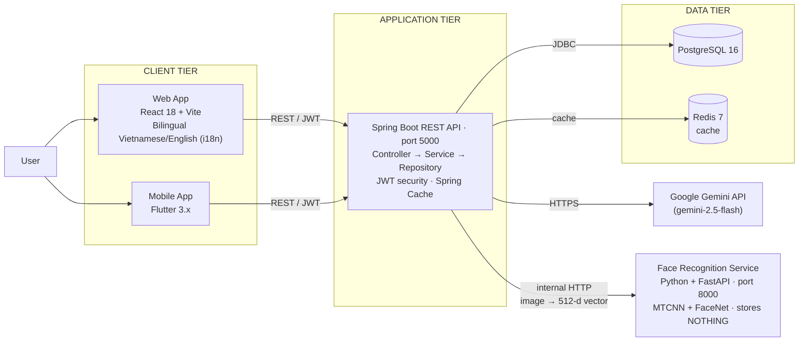

# 🗂️ TaskHub — Work Management System for Small Multi-Industry Businesses

A complete management system that helps small businesses handle staff, attendance, projects and task progress, with AI-assisted staff assignment suggestions (Google Gemini).

Attendance uses two independent checks: **GPS geofencing** (verifying the user is inside the office radius) combined with **face recognition** with anti-spoofing — the goal is to stop people clocking in on someone else's behalf.

## 🚀 Demo deployment (free)

[](https://render.com/deploy?repo=https://github.com/nhathao428/taskhub)

The Render Blueprint (`render.yaml`) provisions the backend (Docker), the frontend (static) and a free Postgres instance. Cold start is around 30s after 15 minutes idle. After deploying, set `GEMINI_API_KEY` in the Dashboard if you want AI suggestions enabled.

> ⚠️ Render's free Postgres is **deleted automatically after 30 days** — it is not durable storage. Fine for a demo, not for real data. For a free database that does not expire (Neon/Supabase) and for deploying each part manually (Render/Vercel/Netlify/Cloudflare Pages — all free tiers), see [`DEPLOY.md`](./DEPLOY.md).

---

## 🏗️ Architecture overview



The system is split into three tiers: **Client** (React web + Flutter mobile) → **Application** (Spring Boot REST API, port 5000, JWT-secured) → **Data** (PostgreSQL 16, Redis 7). The AI module calls Google Gemini to suggest employees.

**Why the Python service is separate:** the JVM cannot run PyTorch directly, so the computer-vision part lives in its own Python process. That service is **stateless** — it receives an image and returns a feature vector, and stores nothing. Every employee embedding is held by the Java backend in PostgreSQL in encrypted form, and matching is done in Java as well. As a result the biometric data lives in **exactly one place**, which makes it easier to control and to back up.

---

## ✨ Key features

| Feature | Description |
|---|---|
| 🔐 JWT authentication | Register, login, three roles (Admin / Manager / Employee) |
| 👥 Employee management | Employee CRUD, department / position / team records |
| 👤 Employee self-service | View assigned tasks, update their status, check in/out, view own attendance history |
| 📋 Project management | Create, update and delete projects; link them to tasks |
| ✅ Task management | Create tasks, assign employees, track status |
| 🕐 Attendance | Record daily clock-in/clock-out times, view attendance history |
| 📍 GPS geofencing | Verify the check-in location is inside the office radius; outside the zone → waits for manager approval |
| 🙂 Face recognition | Check in by face to prevent proxy attendance. Embeddings encrypted with AES-256, with anti-spoofing checks |
| 🤖 AI employee suggestions | Google Gemini integration proposing the top 5 best-fit employees |
| 🔑 Forgot password | 6-digit OTP by email (Resend), expires in 10 minutes, locks after 5 wrong attempts |
| 📊 Dashboard | Overview statistics charts (Chart.js) |

---

## 🛠️ Tech stack

| Layer | Technology | Version |
|---|---|---|
| **Backend** | Java, Spring Boot, Maven | Java 17+, Spring Boot 3.5.0 |
| **Authentication** | Spring Security + JWT (jjwt) | 0.12.x |
| **ORM** | Spring Data JPA / Hibernate | - |
| **Frontend** | React, Vite, Tailwind CSS | React 18, Vite 5 |
| **HTTP client** | Axios + JWT interceptor | - |
| **Charts** | Chart.js + react-chartjs-2 | - |
| **Routing** | React Router DOM | v6 |
| **Mobile** | Flutter, Dart | Flutter 3.x, Dart ≥ 3.0 |
| **Database** | PostgreSQL | 16 |
| **Cache** | Redis + Spring Cache | 7 |
| **Containers** | Docker, Docker Compose | - |
| **AI suggestions** | Google Gemini API (Groq fallback) | gemini-2.5-flash |
| **Computer vision** | Python, FastAPI, PyTorch, facenet-pytorch | Python 3.10/3.11, torch 2.2.2 |
| **Face recognition** | MTCNN (detect+align) + InceptionResnetV1 (VGGFace2) | facenet-pytorch 2.6.0 |
| **Anti-spoofing** | MediaPipe Face Mesh — Eye Aspect Ratio | mediapipe 0.10.14 |

---

## 📋 Requirements

- **Java** 17 or later
- **Node.js** 18 or later and **npm**
- **Docker** & **Docker Compose** (to run PostgreSQL and Redis)
- **Flutter SDK** 3.x or later (only for mobile development)
- **Android Studio** or **Xcode** (to run an emulator / simulator)

---

## 🚀 Quick start with Docker Compose

```bash
# 1. Clone the repository
git clone https://github.com/nhathao428/taskhub.git
cd taskhub

# 2. Create the environment file (optional)
cp .env.example .env   # adjust JWT_SECRET if needed

# 3. Start PostgreSQL, Redis and the backend
docker-compose up --build -d

# 4. Install and run the frontend separately
cd frontend
npm install
npm run dev
```

- **Backend API**: `http://localhost:5000`
- **Frontend UI**: `http://localhost:5173`

---

## 🔧 Manual setup

### Backend (Spring Boot)

```bash
cd backend

# Configure the database in src/main/resources/application.properties
# See "Backend configuration" below

mvn spring-boot:run
```

The API starts at: `http://localhost:5000`

#### Backend configuration (environment variables)

By default the backend runs on in-memory H2, so it starts for development without setting anything. To use a real PostgreSQL, set `SPRING_PROFILES_ACTIVE=postgres` plus the variables below:

```bash
# PostgreSQL connection (only applies when SPRING_PROFILES_ACTIVE=postgres)
DB_URL=jdbc:postgresql://localhost:5432/task_management_db
DB_USERNAME=postgres
DB_PASSWORD=postgres

# JWT — required, no default value. Generate with: openssl rand -base64 48
JWT_SECRET=your_jwt_secret_key_that_is_at_least_256_bits_long
JWT_EXPIRATION_MS=7200000          # default 2h

# Admin seed — required, the app throws on startup if missing
ADMIN_PASSWORD=Admin@12345

# Manager / Employee seed — optional, leave empty to skip seeding demo accounts
MANAGER_PASSWORD=
EMPLOYEE_PASSWORD=

# Redis cache (set CACHE_TYPE=redis when a Redis server is available, default 'none')
REDIS_HOST=localhost
REDIS_PORT=6379
CACHE_TYPE=none

# Gemini (for AI suggestions — without a key the endpoint returns 422)
GEMINI_API_KEY=
GEMINI_MODEL=gemini-2.5-flash

# CORS — frontend origins allowed to call the API
CORS_ORIGINS=http://localhost:3000,http://localhost:5173

# Rate limits (requests/minute/IP) and Swagger — keep the defaults, disable Swagger in production
RATELIMIT_AUTH=20
RATELIMIT_AI=10
RATELIMIT_EMPLOYEES=40
SWAGGER_ENABLED=false

# Face recognition — leaving BIOMETRIC_KEY EMPTY DISABLES the feature entirely,
# GPS check-in keeps working normally. Generate a key: openssl rand -base64 32
BIOMETRIC_KEY=
FACE_SERVICE_URL=http://127.0.0.1:8000
FACE_THRESHOLD=0.65
FACE_REQUIRE_LIVENESS=true
FACE_CAPTURE_RETENTION_DAYS=30

# Server port
server.port=5000
```

> The complete list of environment variables with explanations is in [`.env.example`](./.env.example) (written in Vietnamese). Detailed production deployment instructions are in [`DEPLOY.md`](./DEPLOY.md).

### Frontend (React + Vite)

```bash
cd frontend
npm install
npm run dev          # Development: http://localhost:5173
npm run build        # Production build → dist/
npm run preview      # Preview the production build
```

#### Frontend environment variables (`.env`)

```env
VITE_API_BASE_URL=http://localhost:5000
```

### Mobile (Flutter)

```bash
cd mobile
flutter pub get
flutter run           # Run on an emulator / real device
flutter build apk     # Build the Android APK
flutter build ios     # Build for iOS (requires macOS + Xcode)
```

### Face recognition service (Python — optional)

Only needed if you want face check-in. Without this service running, the system automatically falls back to GPS-only mode.

```bash
cd ml/face-recognition
python -m venv venv
# Windows: venv\Scripts\activate | macOS/Linux: source venv/bin/activate

# Install torch FIRST (the version must be pinned — facenet-pytorch requires torch 2.2.x)
pip install torch==2.2.2 torchvision==0.17.2 --index-url https://download.pytorch.org/whl/cu121
pip install -r requirements.txt

uvicorn api_service:app --host 127.0.0.1 --port 8000
```

Then set `BIOMETRIC_KEY` for the backend (generate it with `openssl rand -base64 32`) and restart.

> ⚠️ **This cannot be deployed on a free tier.** The service needs PyTorch plus the FaceNet model, which takes roughly **1–2 GB of RAM**, while Render's free plan gives you 512 MB. On a public deployment, leave `BIOMETRIC_KEY` empty. Running the face feature locally is enough for a demo. A real deployment would require exporting the model to ONNX or paying for a plan with ≥2 GB RAM.

For details on capturing images, enrolling, and measuring Accuracy/FAR/FRR, see [`ml/face-recognition/README.md`](ml/face-recognition/README.md).

---

## 📡 API endpoint overview

| Method | Path | Description | Auth required |
|---|---|---|---|
| `POST` | `/api/auth/register` | Register an account | None |
| `POST` | `/api/auth/login` | Log in, receive a JWT | None |
| `GET` | `/api/employees` | List employees | Manager / Admin |
| `GET` | `/api/employees/me` | Profile of the logged-in employee | Any role |
| `POST` | `/api/employees` | Add an employee | Manager / Admin |
| `PUT` | `/api/employees/{id}` | Update an employee | Manager / Admin |
| `DELETE` | `/api/employees/{id}` | Delete an employee | Manager / Admin |
| `GET` | `/api/projects` | List projects | Any role |
| `POST` | `/api/projects` | Create a project | Manager / Admin |
| `PUT` | `/api/projects/{id}` | Update a project | Manager / Admin |
| `DELETE` | `/api/projects/{id}` | Delete a project | Manager / Admin |
| `GET` | `/api/tasks` | List all tasks | Any role |
| `POST` | `/api/tasks` | Create a task | Manager / Admin |
| `GET` | `/api/tasks/me` | Tasks assigned to the current employee | Any role |
| `PUT` | `/api/tasks/{id}` | Update an entire task | Manager / Admin |
| `PATCH` | `/api/tasks/{id}/status` | Change the status of your own task | Any role |
| `DELETE` | `/api/tasks/{id}` | Delete a task | Manager / Admin |
| `GET` | `/api/attendance` | Full attendance history | Manager / Admin |
| `GET` | `/api/attendance/me` | Your own attendance history | Any role |
| `POST` | `/api/attendance/me/checkin` | Check yourself in (ID taken from the JWT) | Any role |
| `POST` | `/api/attendance/me/checkout` | Check yourself out (closes today's open record) | Any role |
| `POST` | `/api/attendance/checkin` | Check in on behalf of any employee | Manager / Admin |
| `POST` | `/api/attendance/checkout` | Close a specific attendance record | Manager / Admin |
| `PATCH` | `/api/attendance/{id}/review` | Approve / reject a pending record | Manager / Admin |
| `POST` | `/api/suggestions/recommend` | AI employee suggestions for a task | Manager / Admin |
| `GET` | `/api/suggestions/recommend/{taskId}` | AI suggestions for an existing task ID | Manager / Admin |
| `POST` | `/api/auth/forgot-password` | Send a 6-digit OTP by email | None |
| `POST` | `/api/auth/reset-password` | Reset the password using email + OTP | None |
| `GET` | `/api/face/me` | Feature status + whether a face is enrolled | Any role |
| `POST` | `/api/face/me/enroll` | Enrol your own face (3–5 images) | Any role |
| `DELETE` | `/api/face/me` | Delete your own face data | Any role |
| `DELETE` | `/api/face/{employeeId}` | Delete any employee's enrolment | Manager / Admin |
| `GET` | `/api/face/capture/{attendanceId}` | View the captured image of a suspicious check-in for comparison | Manager / Admin |

> Set `SWAGGER_ENABLED=true` in development to browse the full interactive specification at `http://localhost:5000/swagger-ui.html` (disabled by default in production so the API surface is not exposed).

---

## 📁 Project structure

```
taskhub/
├── backend/                        # Spring Boot REST API
│   ├── src/main/java/com/example/taskmanagement/
│   │   ├── config/                 # Security, CORS, Redis, OpenAPI
│   │   ├── controller/             # REST controllers
│   │   ├── dto/                    # Data transfer objects
│   │   ├── entity/                 # JPA entities (User, Employee, Task…)
│   │   ├── repository/             # Spring Data JPA repositories
│   │   ├── security/               # JWT filter & utilities
│   │   └── service/                # Business logic + AI service
│   ├── src/main/resources/
│   │   └── application.properties
│   └── pom.xml
├── frontend/                       # React + Vite + Tailwind CSS
│   ├── src/
│   │   ├── api/axios.js            # Axios instance + JWT interceptor
│   │   ├── components/             # Layout, Sidebar, Modal, ProtectedRoute
│   │   ├── context/AuthContext.jsx # Global auth state
│   │   └── pages/                  # Login, Dashboard, Employees, …
│   └── package.json
├── mobile/                         # Flutter mobile app
│   └── pubspec.yaml
├── ml/face-recognition/            # Face recognition module (Python)
│   ├── api_service.py              # FastAPI: /embed, /liveness — stateless, stores nothing
│   ├── face_pipeline.py            # MTCNN detect+align + FaceNet embedding
│   ├── capture_faces.py            # Capture webcam images into dataset/
│   ├── enroll.py                   # Compute the mean embedding per person
│   ├── verify.py                   # Recognise via webcam (1:N cosine similarity)
│   ├── evaluate.py                 # Measure Accuracy / FAR / FRR / EER
│   ├── liveness.py                 # Anti-spoofing via blink detection (EAR)
│   └── README.md                   # Step-by-step guide for a machine with a GPU
├── docs/                           # Technical documentation + project report
│   ├── UML_DIAGRAMS.md
│   └── DATABASE_SCHEMA.md
├── .env.example                    # Every environment variable, with explanations
├── render.yaml                     # Render Blueprint (one-click free deploy)
├── DEPLOY.md                       # Free deployment guide (Render/Vercel/Netlify/Cloudflare)
├── DEPLOY-AWS.md                   # AWS EC2 deployment guide (paid after the 12-month free tier)
└── README.md
```

> Note: `docker-compose.yml`, `docker-compose.prod.yml` and `Caddyfile` are **no longer in the repository** (removed in an earlier commit). If you want to self-host with Docker Compose + Caddy, you will need to write them again or restore them from the git history.

---

## 🤖 AI employee suggestions

The system integrates **Google Gemini** to analyse and propose the best-fit employee for a given task. The AI makes the decision entirely — the backend does not compute a score of its own.

### How it works

1. A manager sends the task details (`title`, `optional description`) to the backend.
2. The backend gathers **raw data** for every employee:
   - **Past task progress**: total tasks assigned, how many completed, how many in progress
   - **Delivery timing**: tasks delivered on time / total tasks with a due date, average days late
   - **Attendance**: days worked in the last 30 days
3. The backend passes the raw data plus three priority criteria to Google Gemini (`gemini-2.5-flash`) through a Vietnamese-language prompt.
4. The AI **ranks** the top 5 employees itself and returns its reasoning in Vietnamese — there is no scoring logic in the code.
5. If `GEMINI_API_KEY` is not set, the endpoint returns **HTTP 422** (`AI suggestion is unavailable`).

### Example request

```json
POST /api/suggestions/recommend
{
  "taskTitle": "Phát triển API thanh toán",
  "taskDescription": "Xây dựng REST API tích hợp cổng thanh toán VNPay"
}
```

### Example response

The `reasoning` field comes back in Vietnamese because the prompt is in Vietnamese:

```json
[
  {
    "employeeId": 3,
    "firstName": "Nguyễn",
    "lastName": "Văn A",
    "department": "Kỹ thuật",
    "rank": 1,
    "reasoning": "Hoàn thành 9/10 task được giao, trong đó 8/9 đúng hạn, đi làm 21/22 ngày — phù hợp nhất với task đòi hỏi tin cậy về tiến độ."
  },
  {
    "employeeId": 7,
    "firstName": "Trần",
    "lastName": "Thị B",
    "department": "Kỹ thuật",
    "rank": 2,
    "reasoning": "Tỷ lệ hoàn thành cao (7/8), đúng hạn 6/7, chấm công 20/22 ngày."
  }
]
```

---

## 📖 Documentation

| Document | Description |
|---|---|
| [UML diagrams](docs/UML_DIAGRAMS.md) | Use case, class, sequence and activity diagrams (Mermaid — rendered directly by GitHub) |
| [Database schema](docs/DATABASE_SCHEMA.md) | ERD, table descriptions, and the reasoning behind the decisions on sensitive data |
| [Face recognition module](ml/face-recognition/README.md) | Step-by-step: capturing images, enrolling, measuring FAR/FRR, running the service |
| [Deployment guide](DEPLOY.md) | Free deployment (Render Blueprint, or Render/Vercel/Netlify/Cloudflare Pages manually) |
| [Environment variables](.env.example) | Every variable with a detailed explanation (in Vietnamese) |
| [Backend](backend/README.md) | Detailed backend documentation |
| [Frontend](frontend/README.md) | Detailed frontend documentation |
| [Mobile](mobile/README.md) | Detailed mobile app documentation |

> Interactive API specification: set `SWAGGER_ENABLED=true` and open `http://localhost:5000/swagger-ui.html`.

---

## 📄 Licence

This project was built for academic purposes. Contributions and feedback are welcome.
