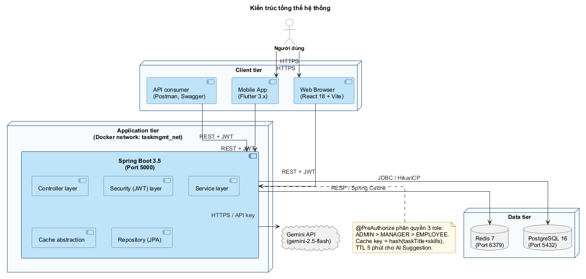

# 🗂️ Hệ thống Quản lý Công việc cho Doanh nghiệp Nhỏ Đa ngành

Hệ thống quản lý toàn diện giúp doanh nghiệp nhỏ quản lý nhân sự, chấm công, dự án, tiến độ công việc và nhận gợi ý phân công nhân viên thông minh từ AI (Google Gemini).

## 🚀 Deploy demo (free)

[](https://render.com/deploy?repo=https://github.com/nhathao428/task-management-system)

Render Blueprint (`render.yaml`) tự tạo backend (Docker) + frontend (static) + Postgres free. Cold start ~30s sau 15ph idle. Sau khi deploy, set `GEMINI_API_KEY` ở Dashboard nếu muốn bật AI suggestion.

Tự host với domain riêng: xem [`DEPLOY.md`](./DEPLOY.md).

---

## 🏗️ Kiến trúc tổng quan



Hệ thống chia 3 tầng: **Client** (Web React + Mobile Flutter) → **Application** (Spring Boot REST API, port 5000, bảo mật JWT) → **Data** (PostgreSQL 16, Redis 7). Module AI gọi Google Gemini để gợi ý nhân viên.

---

## ✨ Tính năng chính

| Tính năng | Mô tả |
|---|---|
| 🔐 Xác thực JWT | Đăng ký, đăng nhập, phân quyền 3 vai trò (Admin / Manager / Employee) |
| 👥 Quản lý nhân viên | CRUD nhân viên, hồ sơ phòng ban / chức vụ / nhóm |
| 👤 Self-service nhân viên | Xem task được giao, cập nhật trạng thái, tự check-in/out, xem lịch sử chấm công |
| 📋 Quản lý dự án | Tạo, cập nhật, xóa dự án; liên kết với công việc |
| ✅ Quản lý công việc | Tạo công việc, phân công nhân viên, theo dõi trạng thái |
| 🕐 Chấm công | Ghi nhận giờ vào/ra theo ngày, xem lịch sử chấm công |
| 🤖 AI Gợi ý nhân viên | Tích hợp Google Gemini để đề xuất top 5 nhân viên phù hợp nhất |
| 📊 Dashboard | Biểu đồ thống kê tổng quan (Chart.js) |

---

## 🛠️ Công nghệ sử dụng

| Tầng | Công nghệ | Phiên bản |
|---|---|---|
| **Backend** | Java, Spring Boot, Maven | Java 17+, Spring Boot 3.5.0 |
| **Xác thực** | Spring Security + JWT (jjwt) | 0.12.x |
| **ORM** | Spring Data JPA / Hibernate | - |
| **Frontend** | React, Vite, Tailwind CSS | React 18, Vite 5 |
| **HTTP Client** | Axios + JWT interceptor | - |
| **Biểu đồ** | Chart.js + react-chartjs-2 | - |
| **Routing** | React Router DOM | v6 |
| **Mobile** | Flutter, Dart | Flutter 3.x, Dart ≥ 3.0 |
| **Cơ sở dữ liệu** | PostgreSQL | 16 |
| **Cache** | Redis + Spring Cache | 7 |
| **Container** | Docker, Docker Compose | - |
| **AI** | Google Gemini API | gemini-2.5-flash |

---

## 📋 Yêu cầu hệ thống

- **Java** 17 trở lên
- **Node.js** 18 trở lên và **npm**
- **Docker** & **Docker Compose** (để chạy PostgreSQL và Redis)
- **Flutter SDK** 3.x trở lên (nếu phát triển mobile)
- **Android Studio** hoặc **Xcode** (để chạy emulator / simulator)

---

## 🚀 Khởi động nhanh với Docker Compose

```bash
# 1. Clone repository
git clone https://github.com/nhathao428/task-management-system.git
cd task-management-system

# 2. Tạo file biến môi trường (tuỳ chọn)
cp .env.example .env   # chỉnh JWT_SECRET nếu cần

# 3. Khởi động PostgreSQL, Redis và Backend
docker-compose up --build -d

# 4. Cài đặt và chạy Frontend riêng
cd frontend
npm install
npm run dev
```

- **API Backend**: `http://localhost:5000`
- **Giao diện Frontend**: `http://localhost:5173`

---

## 🔧 Cài đặt thủ công

### Backend (Spring Boot)

```bash
cd backend

# Cấu hình database trong src/main/resources/application.properties
# Xem mục "Cấu hình Backend" bên dưới

mvn spring-boot:run
```

API sẽ khởi động tại: `http://localhost:5000`

#### Cấu hình Backend (`application.properties`)

```properties
# Kết nối PostgreSQL (chỉ dùng khi SPRING_PROFILES_ACTIVE=postgres,
# mặc định backend chạy H2 in-memory cho dev)
spring.datasource.url=jdbc:postgresql://localhost:5432/task_management_db
spring.datasource.username=postgres
spring.datasource.password=postgres

# JWT — bắt buộc set qua env var, không có default value
app.jwt.secret=${JWT_SECRET}
app.jwt.expiration=86400000

# Redis Cache (set CACHE_TYPE=redis khi có Redis server, default 'none')
spring.data.redis.host=localhost
spring.data.redis.port=6379
spring.cache.type=${CACHE_TYPE:none}

# Gemini (cho tính năng AI gợi ý — không có key thì endpoint trả 422)
gemini.api.key=${GEMINI_API_KEY:}
gemini.api.model=${GEMINI_MODEL:gemini-2.5-flash}

# Admin seed (bắt buộc set ADMIN_PASSWORD)
app.admin.password=${ADMIN_PASSWORD}

# Server port
server.port=5000
```

### Frontend (React + Vite)

```bash
cd frontend
npm install
npm run dev          # Môi trường phát triển: http://localhost:5173
npm run build        # Build production → dist/
npm run preview      # Xem trước bản build production
```

#### Biến môi trường Frontend (`.env`)

```env
VITE_API_BASE_URL=http://localhost:5000
```

### Mobile (Flutter)

```bash
cd mobile
flutter pub get
flutter run           # Chạy trên emulator / thiết bị thật
flutter build apk     # Build Android APK
flutter build ios     # Build iOS (cần macOS + Xcode)
```

---

## 📡 Tổng quan API Endpoints

| Phương thức | Đường dẫn | Mô tả | Yêu cầu Auth |
|---|---|---|---|
| `POST` | `/api/auth/register` | Đăng ký tài khoản | Không |
| `POST` | `/api/auth/login` | Đăng nhập, nhận JWT | Không |
| `GET` | `/api/employees` | Danh sách nhân viên | Manager / Admin |
| `GET` | `/api/employees/me` | Profile của nhân viên đang đăng nhập | Mọi role |
| `POST` | `/api/employees` | Thêm nhân viên | Manager / Admin |
| `PUT` | `/api/employees/{id}` | Cập nhật nhân viên | Manager / Admin |
| `DELETE` | `/api/employees/{id}` | Xóa nhân viên | Manager / Admin |
| `GET` | `/api/projects` | Danh sách dự án | Mọi role |
| `POST` | `/api/projects` | Tạo dự án mới | Manager / Admin |
| `PUT` | `/api/projects/{id}` | Cập nhật dự án | Manager / Admin |
| `DELETE` | `/api/projects/{id}` | Xóa dự án | Manager / Admin |
| `GET` | `/api/tasks` | Danh sách tất cả công việc | Mọi role |
| `GET` | `/api/tasks/me` | Task được giao cho nhân viên hiện tại | Mọi role |
| `POST` | `/api/tasks` | Tạo công việc mới | Manager / Admin |
| `PUT` | `/api/tasks/{id}` | Cập nhật toàn bộ công việc | Manager / Admin |
| `PATCH` | `/api/tasks/{id}/status` | Đổi status task của chính mình | Mọi role |
| `DELETE` | `/api/tasks/{id}` | Xóa công việc | Manager / Admin |
| `GET` | `/api/attendance` | Lịch sử chấm công toàn bộ | Manager / Admin |
| `GET` | `/api/attendance/me` | Lịch sử chấm công của bản thân | Mọi role |
| `POST` | `/api/attendance/me/checkin` | Tự check-in (lấy ID từ JWT) | Mọi role |
| `POST` | `/api/attendance/me/checkout` | Tự check-out (đóng bản ghi mở hôm nay) | Mọi role |
| `POST` | `/api/attendance/checkin` | Check-in cho nhân viên bất kỳ | Manager / Admin |
| `POST` | `/api/attendance/checkout` | Đóng bản ghi chấm công cụ thể | Manager / Admin |
| `POST` | `/api/suggestions/recommend` | AI gợi ý nhân viên cho task | Manager / Admin |
| `GET` | `/api/suggestions/recommend/{taskId}` | AI gợi ý theo task ID có sẵn | Manager / Admin |

> Xem đặc tả đầy đủ tại [docs/API_SPECIFICATION.md](docs/API_SPECIFICATION.md)

---

## 📁 Cấu trúc dự án

```
task-management-system/
├── backend/                        # Spring Boot REST API
│   ├── src/main/java/com/example/taskmanagement/
│   │   ├── config/                 # Security, CORS, Redis, OpenAPI
│   │   ├── controller/             # REST Controllers
│   │   ├── dto/                    # Data Transfer Objects
│   │   ├── entity/                 # JPA Entities (User, Employee, Task…)
│   │   ├── repository/             # Spring Data JPA Repositories
│   │   ├── security/               # JWT Filter & Utility
│   │   └── service/                # Business Logic + AI Service
│   ├── src/main/resources/
│   │   └── application.properties
│   └── pom.xml
├── frontend/                       # React + Vite + Tailwind CSS
│   ├── src/
│   │   ├── api/axios.js            # Axios instance + JWT interceptor
│   │   ├── components/             # Layout, Sidebar, Modal, ProtectedRoute
│   │   ├── context/AuthContext.jsx # Auth state toàn cục
│   │   └── pages/                  # Login, Dashboard, Employees, …
│   └── package.json
├── mobile/                         # Flutter mobile app
│   └── pubspec.yaml
├── docs/                           # Tài liệu kỹ thuật
│   ├── API_SPECIFICATION.md
│   ├── DATABASE_SCHEMA.md
│   ├── SETUP_GUIDE.md
│   └── UML_DIAGRAMS.md
├── docker-compose.yml              # PostgreSQL + Redis + Backend (dev)
├── docker-compose.prod.yml         # Production overrides + Caddy HTTPS
├── Caddyfile                       # Reverse proxy + auto Let's Encrypt
├── render.yaml                     # Render Blueprint (one-click deploy)
├── DEPLOY.md                       # Hướng dẫn deploy production lên VPS
└── README.md
```

---

## 🤖 Tính năng AI Gợi ý Nhân viên

Hệ thống tích hợp **Google Gemini** để phân tích và đề xuất nhân viên phù hợp nhất cho từng công việc. AI ra quyết định hoàn toàn — backend không tự tính điểm.

### Cách hoạt động

1. Manager gửi thông tin công việc (`tiêu đề`, `mô tả tùy chọn`) đến backend.
2. Backend thu thập **dữ liệu thô** của tất cả nhân viên:
   - **Tiến độ task trước**: tổng task được giao, số đã hoàn thành, số đang xử lý
   - **Thời gian hoàn thành**: số task đúng hạn / tổng task có due date, trung bình số ngày trễ
   - **Chấm công**: số ngày làm việc trong 30 ngày gần nhất
3. Backend đẩy raw data + 3 tiêu chí ưu tiên cho Google Gemini (`gemini-2.5-flash`) qua prompt tiếng Việt.
4. AI **tự xếp hạng** top 5 nhân viên kèm reasoning bằng tiếng Việt — không có tính điểm bằng code.
5. Nếu `GEMINI_API_KEY` chưa được set, endpoint trả về **HTTP 422** (`AI suggestion is unavailable`).

### Ví dụ Request

```json
POST /api/suggestions/recommend
{
  "taskTitle": "Phát triển API thanh toán",
  "taskDescription": "Xây dựng REST API tích hợp cổng thanh toán VNPay"
}
```

### Ví dụ Response

```json
[
  {
    "employeeId": 3,
    "firstName": "Nguyễn",
    "lastName": "Văn A",
    "department": "Kỹ thuật",
    "rank": 1,
    "reasoning": "Hoàn thành 9/10 task được giao, trong đó 8/9 đúng hạn, đi làm 21/22 ngày — phù hợp nhất với task đòi hỏi tin cậy về tiến độ."
  },
  {
    "employeeId": 7,
    "firstName": "Trần",
    "lastName": "Thị B",
    "department": "Kỹ thuật",
    "rank": 2,
    "reasoning": "Tỷ lệ hoàn thành cao (7/8), đúng hạn 6/7, chấm công 20/22 ngày."
  }
]
```

---

## 📖 Tài liệu

| Tài liệu | Mô tả |
|---|---|
| [Đặc tả API](docs/API_SPECIFICATION.md) | Danh sách tất cả API endpoints kèm mô tả và ví dụ |
| [Lược đồ Cơ sở dữ liệu](docs/DATABASE_SCHEMA.md) | Cấu trúc bảng và quan hệ dữ liệu |
| [Hướng dẫn Cài đặt](docs/SETUP_GUIDE.md) | Hướng dẫn cài đặt môi trường chi tiết |
| [Sơ đồ UML](docs/UML_DIAGRAMS.md) | Use Case, Class, Sequence, Activity diagrams |
| [Hướng dẫn Deploy](DEPLOY.md) | Triển khai production lên VPS với Docker + Caddy |
| [Backend](backend/README.md) | Tài liệu chi tiết về phần backend |
| [Frontend](frontend/README.md) | Tài liệu chi tiết về phần frontend |
| [Mobile](mobile/README.md) | Tài liệu chi tiết về ứng dụng di động |

---

## 📄 Giấy phép

Dự án được phát triển cho mục đích học thuật. Mọi đóng góp và phản hồi đều được hoan nghênh.
