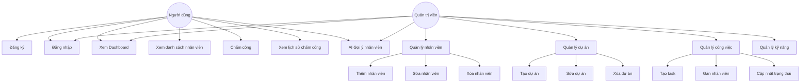
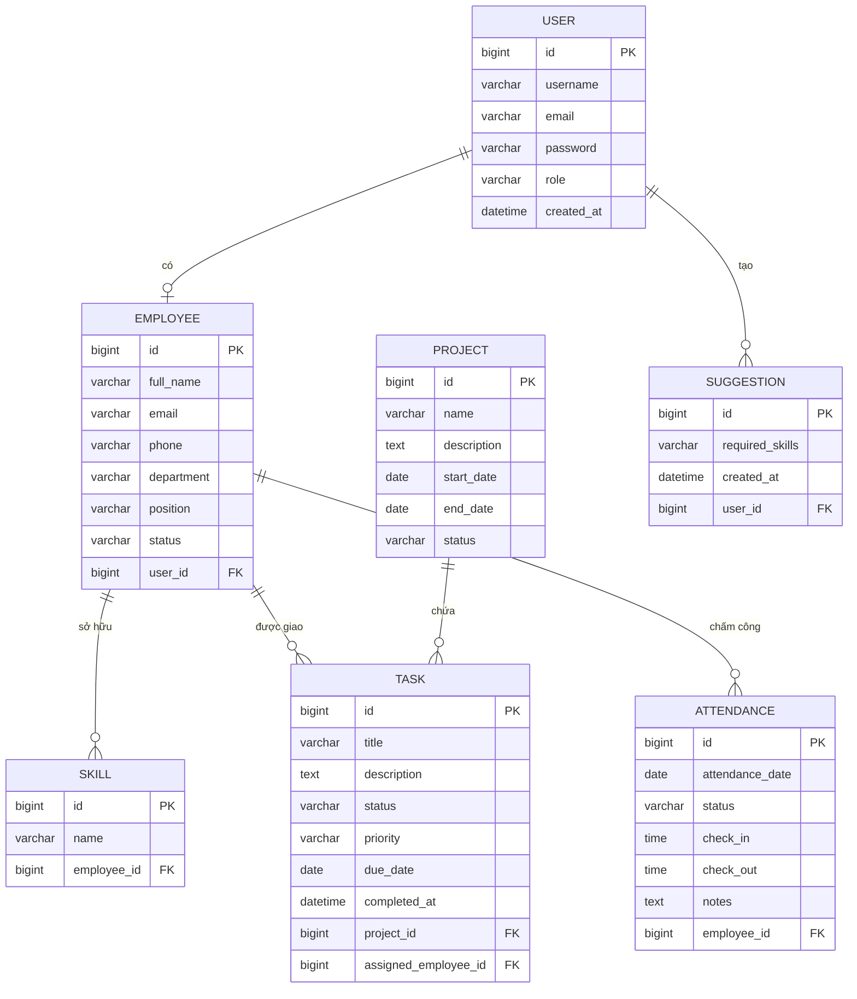
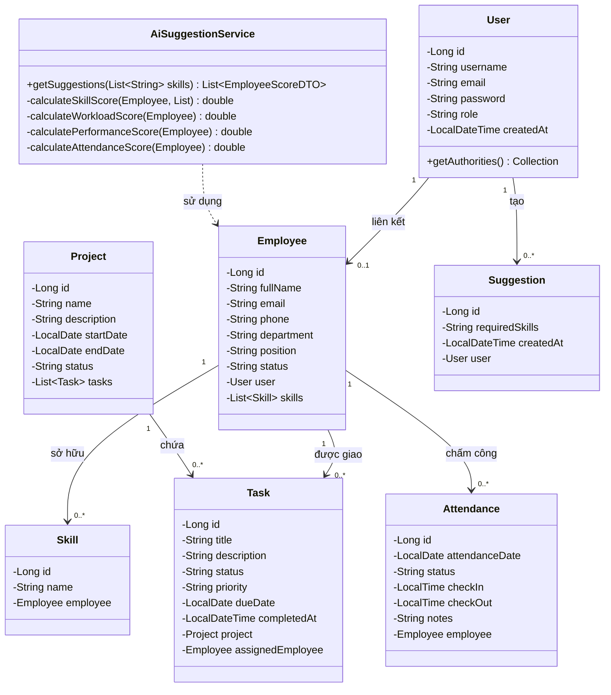
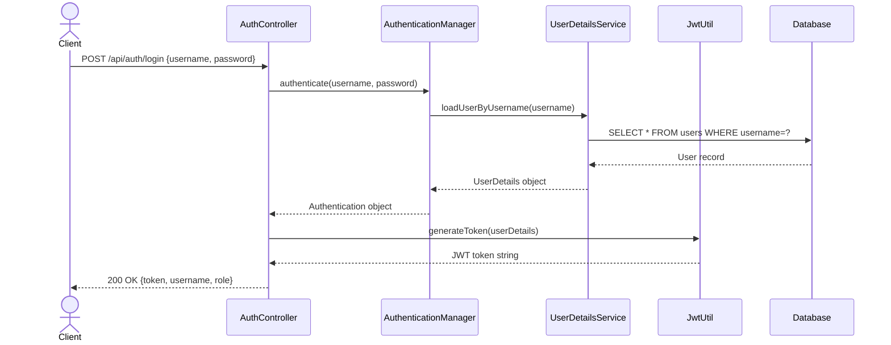
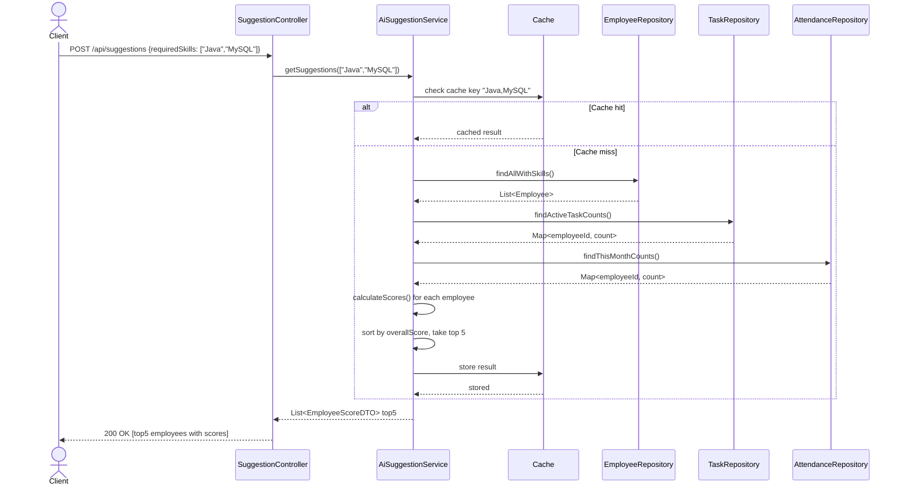
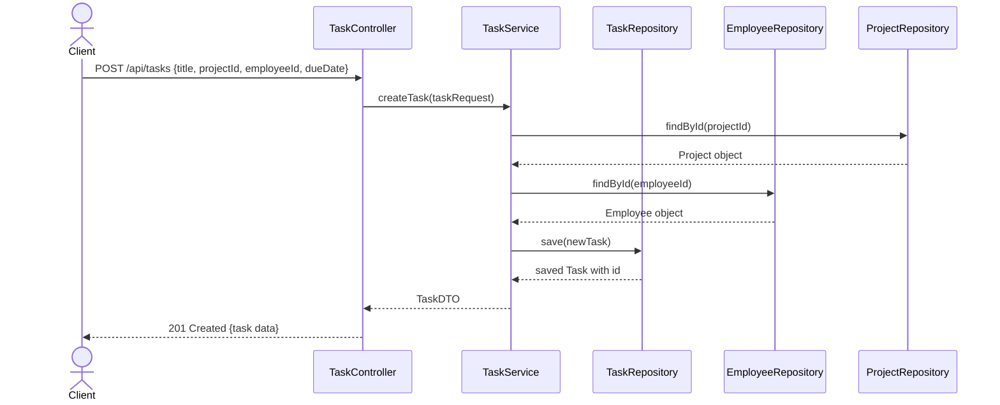

# BÁO CÁO ĐỒ ÁN MÔN HỌC — CÔNG NGHỆ PHẦN MỀM

---

## TRANG BÌA

```
BỘ GIÁO DỤC VÀ ĐÀO TẠO
TRƯỜNG ĐẠI HỌC CÔNG NGHỆ TP.HCM (HUTECH)
KHOA CÔNG NGHỆ THÔNG TIN
━━━━━━━━━━━━━━━━━━━━━━━━━━━━━━━━━━━━━━━━

          BÁO CÁO ĐỒ ÁN MÔN HỌC
          CÔNG NGHỆ PHẦN MỀM

ĐỀ TÀI:
HỆ THỐNG QUẢN LÝ CÔNG VIỆC
CHO DOANH NGHIỆP NHỎ ĐA NGÀNH

━━━━━━━━━━━━━━━━━━━━━━━━━━━━━━━━━━━━━━━━

GIẢNG VIÊN HƯỚNG DẪN : ThS. Nguyễn Mạnh Hùng
SINH VIÊN THỰC HIỆN  : Nguyễn Nhật Hào
MSSV                 : 2380612688
LỚP                  : (Lớp học phần)
NĂM HỌC              : 2024 – 2025

━━━━━━━━━━━━━━━━━━━━━━━━━━━━━━━━━━━━━━━━
         TP. HỒ CHÍ MINH, NĂM 2025
```

---

## LỜI CẢM ƠN

Lời đầu tiên, em xin gửi lời cảm ơn chân thành và sâu sắc nhất đến **ThS. Nguyễn Mạnh Hùng** — giảng viên hướng dẫn đồ án môn Công nghệ Phần mềm. Trong suốt quá trình thực hiện đề tài, thầy đã tận tình hướng dẫn, giải đáp thắc mắc, cung cấp tài liệu và góp ý để em có thể hoàn thành đồ án một cách tốt nhất. Sự hướng dẫn tận tâm của thầy là nguồn động lực lớn giúp em vượt qua những khó khăn trong quá trình nghiên cứu và triển khai hệ thống.

Em xin gửi lời cảm ơn đến **Ban Giám hiệu Trường Đại học Công nghệ TP.HCM (HUTECH)** và **Khoa Công nghệ Thông tin** đã tạo điều kiện thuận lợi, cung cấp cơ sở vật chất và môi trường học tập tốt trong suốt quá trình học tập tại trường. Chương trình đào tạo và các môn học bài bản của khoa đã trang bị cho em nền tảng kiến thức vững chắc để thực hiện đề tài này.

Em cũng xin gửi lời cảm ơn đến toàn thể **các thầy cô trong Khoa Công nghệ Thông tin** đã truyền đạt kiến thức trong suốt những năm học vừa qua. Những kiến thức về lập trình, cơ sở dữ liệu, kỹ thuật phần mềm, và an toàn bảo mật mà các thầy cô đã dạy là nền tảng trực tiếp để em xây dựng hệ thống trong đồ án này.

Cuối cùng, em xin bày tỏ lòng biết ơn sâu sắc đến **gia đình** đã luôn động viên, ủng hộ và tạo mọi điều kiện tốt nhất để em học tập và hoàn thành đồ án. Sự quan tâm và khích lệ của gia đình là nguồn sức mạnh tinh thần vô giá giúp em vượt qua mọi khó khăn.

Do thời gian và kinh nghiệm còn hạn chế, đồ án không tránh khỏi những thiếu sót. Em rất mong nhận được sự góp ý và nhận xét từ thầy để em có thể hoàn thiện hơn trong tương lai.

Em xin chân thành cảm ơn!

> *TP. Hồ Chí Minh, năm 2025*
> *Sinh viên thực hiện*
> *Nguyễn Nhật Hào*

---

## NHẬN XÉT CỦA GIẢNG VIÊN HƯỚNG DẪN

**Họ và tên sinh viên:** Nguyễn Nhật Hào — **MSSV:** 2380612688

**Tên đề tài:** Hệ thống Quản lý Công việc cho Doanh nghiệp Nhỏ Đa ngành

**Nhận xét:**

&nbsp;

........................................................................................................................................

........................................................................................................................................

........................................................................................................................................

........................................................................................................................................

........................................................................................................................................

........................................................................................................................................

........................................................................................................................................

........................................................................................................................................

**Điểm số:** ................................

**Chữ ký giảng viên:**

&nbsp;

........................................................................................................................................

*ThS. Nguyễn Mạnh Hùng*

---

## MỤC LỤC

- [CHƯƠNG 1: TỔNG QUAN ĐỀ TÀI](#chương-1-tổng-quan-đề-tài)
  - [1.1. Lý do chọn đề tài](#11-lý-do-chọn-đề-tài)
  - [1.2. Mục tiêu đề tài](#12-mục-tiêu-đề-tài)
  - [1.3. Phạm vi đề tài](#13-phạm-vi-đề-tài)
  - [1.4. Phương pháp nghiên cứu](#14-phương-pháp-nghiên-cứu)
  - [1.5. Bố cục báo cáo](#15-bố-cục-báo-cáo)
- [CHƯƠNG 2: CƠ SỞ LÝ THUYẾT](#chương-2-cơ-sở-lý-thuyết)
  - [2.1. Kiến trúc Client-Server](#21-kiến-trúc-client-server)
  - [2.2. Spring Boot & Spring Security & JWT](#22-spring-boot--spring-security--jwt)
  - [2.3. React & Vite & Tailwind CSS](#23-react--vite--tailwind-css)
  - [2.4. Flutter](#24-flutter)
  - [2.5. Thuật toán AI Gợi ý Nhân viên](#25-thuật-toán-ai-gợi-ý-nhân-viên)
  - [2.6. Docker](#26-docker)
  - [2.7. MySQL](#27-mysql)
- [CHƯƠNG 3: PHÂN TÍCH VÀ THIẾT KẾ HỆ THỐNG](#chương-3-phân-tích-và-thiết-kế-hệ-thống)
  - [3.1. Yêu cầu chức năng](#31-yêu-cầu-chức-năng)
  - [3.2. Yêu cầu phi chức năng](#32-yêu-cầu-phi-chức-năng)
  - [3.3. Sơ đồ Use Case](#33-sơ-đồ-use-case)
  - [3.4. Sơ đồ ERD](#34-sơ-đồ-erd)
  - [3.5. Mô tả chi tiết bảng CSDL](#35-mô-tả-chi-tiết-bảng-csdl)
  - [3.6. Sơ đồ lớp - Class Diagram](#36-sơ-đồ-lớp---class-diagram)
  - [3.7. Sơ đồ tuần tự](#37-sơ-đồ-tuần-tự)
  - [3.8. Sơ đồ kiến trúc hệ thống](#38-sơ-đồ-kiến-trúc-hệ-thống)
- [CHƯƠNG 4: XÂY DỰNG ỨNG DỤNG](#chương-4-xây-dựng-ứng-dụng)
  - [4.1. Cấu trúc dự án](#41-cấu-trúc-dự-án)
  - [4.2. Cài đặt môi trường](#42-cài-đặt-môi-trường)
  - [4.3. Backend - Spring Security & JWT](#43-backend---spring-security--jwt)
  - [4.4. Backend - API Endpoints](#44-backend---api-endpoints)
  - [4.5. Backend - AiSuggestionService](#45-backend---aisuggestionservice)
  - [4.6. Frontend - Routing & Auth](#46-frontend---routing--auth)
  - [4.7. Frontend - Các trang chính](#47-frontend---các-trang-chính)
  - [4.8. Docker Compose](#48-docker-compose)
- [CHƯƠNG 5: KIỂM THỬ VÀ KẾT QUẢ](#chương-5-kiểm-thử-và-kết-quả)
  - [5.1. Kế hoạch kiểm thử](#51-kế-hoạch-kiểm-thử)
  - [5.2. Bảng test cases](#52-bảng-test-cases)
  - [5.3. Demo giao diện](#53-demo-giao-diện)
- [CHƯƠNG 6: KẾT LUẬN VÀ HƯỚNG PHÁT TRIỂN](#chương-6-kết-luận-và-hướng-phát-triển)
  - [6.1. Kết quả đạt được](#61-kết-quả-đạt-được)
  - [6.2. Hạn chế](#62-hạn-chế)
  - [6.3. Hướng phát triển](#63-hướng-phát-triển)
- [TÀI LIỆU THAM KHẢO](#tài-liệu-tham-khảo)

---

## CHƯƠNG 1: TỔNG QUAN ĐỀ TÀI

### 1.1. Lý do chọn đề tài

Trong bối cảnh chuyển đổi số đang diễn ra mạnh mẽ tại Việt Nam, các doanh nghiệp nhỏ và vừa (SME) ngày càng nhận thức rõ tầm quan trọng của việc ứng dụng công nghệ thông tin vào quản lý hoạt động nội bộ. Tuy nhiên, phần lớn các doanh nghiệp nhỏ đa ngành hiện nay vẫn đang sử dụng các phương pháp quản lý thủ công như bảng tính Excel, sổ ghi chép hoặc nhóm chat (Zalo, Facebook Messenger) để phân công công việc, theo dõi tiến độ và chấm công nhân viên. Điều này dẫn đến nhiều bất cập nghiêm trọng:

- **Thiếu minh bạch**: Khó theo dõi tiến độ công việc theo thời gian thực, thông tin bị phân tán ở nhiều nơi.
- **Phân công không tối ưu**: Người quản lý thường phân công công việc dựa trên cảm tính, không dựa trên năng lực thực tế hay khối lượng công việc hiện tại của từng nhân viên.
- **Quản lý nhân sự kém hiệu quả**: Việc theo dõi chấm công, đánh giá hiệu suất và quản lý hồ sơ nhân viên đòi hỏi nhiều công sức thủ công.
- **Không có dữ liệu để phân tích**: Thiếu cơ sở dữ liệu tập trung làm cho việc báo cáo và ra quyết định trở nên khó khăn.

Nhận thấy những vấn đề thực tế đó, đồ án này được thực hiện với mục tiêu xây dựng một **Hệ thống Quản lý Công việc cho Doanh nghiệp Nhỏ Đa ngành** — một nền tảng phần mềm toàn diện, tích hợp quản lý dự án, phân công công việc, chấm công và đặc biệt là **module AI gợi ý nhân viên phù hợp** dựa trên nhiều tiêu chí đánh giá khách quan.

Đề tài được chọn vì:
1. Có tính thực tiễn cao, giải quyết bài toán thực tế của doanh nghiệp Việt Nam.
2. Cho phép áp dụng đầy đủ kiến thức môn Công nghệ Phần mềm: phân tích yêu cầu, thiết kế hệ thống, lập trình, kiểm thử.
3. Tích hợp công nghệ hiện đại (Spring Boot, React, Flutter, JWT, Docker) và thuật toán AI cơ bản.
4. Có khả năng mở rộng và phát triển thành sản phẩm thương mại trong tương lai.

### 1.2. Mục tiêu đề tài

**Mục tiêu chính:**
- Xây dựng hệ thống quản lý công việc hoàn chỉnh, bao gồm quản lý nhân viên, dự án, công việc, và chấm công.
- Phát triển thuật toán AI gợi ý nhân viên phù hợp cho từng công việc dựa trên 4 tiêu chí: kỹ năng, khối lượng công việc, hiệu suất, và chuyên cần.
- Xây dựng giao diện web (React) và ứng dụng di động (Flutter) thân thiện, dễ sử dụng.
- Triển khai hệ thống bằng Docker Compose để dễ dàng cài đặt và vận hành.

**Mục tiêu kỹ thuật:**
- Thiết kế RESTful API chuẩn với xác thực JWT (JSON Web Token).
- Tối ưu hiệu năng truy vấn cơ sở dữ liệu MySQL.
- Áp dụng Spring Cache để tăng tốc độ phản hồi của module AI.
- Đảm bảo bảo mật thông tin người dùng theo tiêu chuẩn hiện đại.

### 1.3. Phạm vi đề tài

**Phạm vi bao gồm:**

| Chức năng | Mô tả |
|-----------|-------|
| Quản lý nhân viên | Thêm, sửa, xóa, xem danh sách nhân viên; quản lý kỹ năng (Skills) |
| Quản lý dự án | CRUD dự án, theo dõi trạng thái, phân công nhân viên vào dự án |
| Quản lý công việc | CRUD task, gán nhân viên, theo dõi tiến độ, deadline |
| Chấm công | Ghi nhận chấm công hằng ngày, xem lịch sử chấm công |
| AI Gợi ý | Gợi ý top 5 nhân viên phù hợp nhất cho một công việc cụ thể |
| Xác thực & Phân quyền | Đăng nhập, đăng ký, JWT, phân quyền theo vai trò |
| Giao diện Web | React 18 + Vite + Tailwind CSS |
| Ứng dụng Mobile | Flutter (iOS & Android) |
| Triển khai | Docker Compose |

**Phạm vi không bao gồm:**
- Quản lý tài chính, kế toán, lương thưởng.
- Tích hợp với các phần mềm ERP bên ngoài.
- Tính năng video call hay chat nội bộ.

### 1.4. Phương pháp nghiên cứu

1. **Nghiên cứu tài liệu**: Đọc tài liệu chính thức của Spring Boot, React, Flutter, JWT, Docker; nghiên cứu các bài báo về thuật toán gợi ý.
2. **Phân tích hệ thống hiện có**: Nghiên cứu các phần mềm quản lý công việc phổ biến như Trello, Jira, Asana để hiểu các tính năng cốt lõi.
3. **Thiết kế hướng đối tượng (OOP)**: Sử dụng UML để mô hình hóa hệ thống.
4. **Phát triển theo mô hình Agile**: Chia dự án thành các sprint ngắn, mỗi sprint hoàn thiện một nhóm chức năng.
5. **Kiểm thử thực nghiệm**: Kiểm thử từng module sau khi hoàn thành, sử dụng Postman để kiểm thử API.

### 1.5. Bố cục báo cáo

- **Chương 1**: Tổng quan đề tài — lý do, mục tiêu, phạm vi, phương pháp nghiên cứu.
- **Chương 2**: Cơ sở lý thuyết — các công nghệ và lý thuyết nền tảng.
- **Chương 3**: Phân tích và thiết kế hệ thống — UML, ERD, kiến trúc.
- **Chương 4**: Xây dựng ứng dụng — triển khai kỹ thuật chi tiết.
- **Chương 5**: Kiểm thử và kết quả — test cases, demo giao diện.
- **Chương 6**: Kết luận và hướng phát triển.

---

## CHƯƠNG 2: CƠ SỞ LÝ THUYẾT

### 2.1. Kiến trúc Client-Server

Kiến trúc Client-Server là mô hình phân tán trong đó các tác vụ và khối lượng công việc được phân chia giữa hai thành phần chính: **Client** (máy khách) và **Server** (máy chủ).

- **Client**: Là phía người dùng, chịu trách nhiệm gửi yêu cầu (request) và hiển thị kết quả. Trong hệ thống này, Client là ứng dụng React (web) và Flutter (mobile).
- **Server**: Là phía xử lý nghiệp vụ, nhận yêu cầu từ Client, xử lý logic, truy vấn cơ sở dữ liệu và trả về kết quả (response). Trong hệ thống này, Server là ứng dụng Spring Boot.

**Giao tiếp**: Client và Server giao tiếp thông qua giao thức HTTP/HTTPS theo phong cách **RESTful API**. Dữ liệu trao đổi được định dạng JSON, nhẹ và dễ xử lý.

**Ưu điểm của kiến trúc này:**
- Tách biệt rõ ràng giữa tầng giao diện và tầng nghiệp vụ, dễ bảo trì và mở rộng.
- Backend có thể phục vụ nhiều loại Client khác nhau (web, mobile, desktop) cùng một lúc.
- Dễ dàng scale từng thành phần độc lập theo nhu cầu.

### 2.2. Spring Boot & Spring Security & JWT

**Spring Boot** là framework phát triển ứng dụng Java nhanh chóng, được xây dựng trên nền tảng Spring Framework. Spring Boot cung cấp cấu hình tự động (auto-configuration), giúp giảm thiểu boilerplate code và cho phép lập trình viên tập trung vào logic nghiệp vụ.

Các thành phần chính được sử dụng:
- **Spring MVC**: Xây dựng RESTful API với các annotation như `@RestController`, `@GetMapping`, `@PostMapping`.
- **Spring Data JPA**: ORM (Object-Relational Mapping) để tương tác với MySQL thông qua các Repository interface.
- **Spring Security**: Framework bảo mật toàn diện, xử lý xác thực (Authentication) và phân quyền (Authorization).
- **Spring Cache**: Cơ chế cache trong bộ nhớ để tăng tốc các API tốn nhiều tài nguyên tính toán.

**JWT (JSON Web Token)** là tiêu chuẩn mở (RFC 7519) để truyền thông tin an toàn giữa các bên dưới dạng JSON. JWT gồm 3 phần: Header, Payload, và Signature, được mã hóa bằng thuật toán HMAC SHA-256 hoặc RSA.

**Quy trình xác thực JWT trong hệ thống:**
1. Client gửi thông tin đăng nhập (username, password) đến `/api/auth/login`.
2. Server xác thực, tạo JWT token và trả về cho Client.
3. Client lưu token (localStorage) và gửi kèm trong header `Authorization: Bearer <token>` mỗi khi gọi API.
4. Server xác minh token qua `JwtAuthenticationFilter`, giải mã và xác nhận danh tính người dùng.
5. Nếu token hợp lệ, request được xử lý; nếu không hợp lệ, trả về HTTP 401.

### 2.3. React & Vite & Tailwind CSS

**React 18** là thư viện JavaScript do Meta phát triển, cho phép xây dựng giao diện người dùng theo mô hình component-based. Mỗi component là một đơn vị UI độc lập, có thể tái sử dụng. React sử dụng Virtual DOM để tối ưu hóa việc cập nhật giao diện, chỉ render lại những phần thay đổi thực sự.

Các tính năng React được sử dụng trong đề tài:
- **useState, useEffect**: Quản lý state và lifecycle của component.
- **Context API**: Quản lý trạng thái xác thực (auth) toàn cục.
- **React Router v6**: Điều hướng giữa các trang (SPA routing).
- **Axios**: HTTP client để gọi Backend API.

**Vite** là build tool thế hệ mới, nhanh hơn Webpack nhiều lần nhờ sử dụng ES Modules native. Vite cung cấp Hot Module Replacement (HMR) giúp phát triển nhanh hơn.

**Tailwind CSS** là framework CSS theo hướng utility-first, cho phép xây dựng giao diện trực tiếp trong JSX bằng các class tiện ích như `flex`, `p-4`, `bg-blue-500`, `rounded-lg`. Tailwind giúp đồng nhất thiết kế và giảm việc viết CSS tùy chỉnh.

### 2.4. Flutter

**Flutter** là framework phát triển ứng dụng đa nền tảng (cross-platform) do Google phát triển, sử dụng ngôn ngữ lập trình **Dart**. Flutter cho phép viết một lần và triển khai trên iOS, Android, Web và Desktop từ cùng một codebase.

Đặc điểm nổi bật của Flutter:
- **Widget-based**: Mọi thứ trong Flutter đều là Widget — Button, Text, Column, Row đều là Widget.
- **Hot Reload**: Thay đổi code được phản ánh ngay lập tức trên thiết bị/emulator mà không cần khởi động lại.
- **Hiệu năng cao**: Flutter render UI bằng engine Skia/Impeller, không phụ thuộc vào WebView hay native components.
- **Pub.dev**: Hệ sinh thái package phong phú cho mọi nhu cầu (HTTP, SQLite, State Management).

Trong đề tài, ứng dụng Flutter đóng vai trò Client mobile, giao tiếp với Backend Spring Boot qua HTTP/REST API.

### 2.5. Thuật toán AI Gợi ý Nhân viên

Module AI Gợi ý Nhân viên (AiSuggestionService) là tính năng đặc trưng của hệ thống, sử dụng thuật toán **Weighted Scoring** (Chấm điểm có trọng số) để xếp hạng nhân viên phù hợp nhất cho một công việc cụ thể.

#### Các tiêu chí đánh giá:

**1. Skill Score — Điểm Kỹ năng (Trọng số: 35%)**

Đo lường mức độ phù hợp kỹ năng của nhân viên so với yêu cầu công việc.

```
Skill Score = số_kỹ_năng_khớp / tổng_số_kỹ_năng_yêu_cầu
```

*Ví dụ*: Công việc yêu cầu [Java, Spring Boot, MySQL]. Nhân viên có [Java, MySQL, Python]. Kỹ năng khớp = 2 → Skill Score = 2/3 ≈ 0.667.

**2. Workload Score — Điểm Khối lượng Công việc (Trọng số: 25%)**

Đo lường mức độ rảnh rỗi của nhân viên (càng ít task đang làm, điểm càng cao).

```
Workload Score = 1.0 - (số_task_đang_làm / 5)
```

Giới hạn tối thiểu là 0 (nếu nhân viên có ≥5 task đang làm).

**3. Performance Score — Điểm Hiệu suất (Trọng số: 25%)**

Đo lường tỷ lệ hoàn thành đúng hạn của nhân viên trong quá khứ.

```
Performance Score = số_task_hoàn_thành_đúng_hạn / tổng_số_task_có_deadline
```

Nếu nhân viên chưa có task nào có deadline, Performance Score mặc định = 1.0 (trung lập).

**4. Attendance Score — Điểm Chuyên cần (Trọng số: 15%)**

Đo lường tỷ lệ chấm công trong tháng hiện tại.

```
Attendance Score = số_ngày_chấm_công / 22
```

22 là số ngày làm việc chuẩn trong một tháng. Giới hạn tối đa là 1.0.

#### Công thức tổng hợp:

```
Overall Score = Skill×0.35 + Workload×0.25 + Performance×0.25 + Attendance×0.15
```

#### Kết quả:
- Hệ thống tính điểm cho tất cả nhân viên, sắp xếp giảm dần theo `overallScore`.
- Trả về **top 5 nhân viên** có điểm cao nhất kèm theo điểm chi tiết từng tiêu chí.
- Kết quả được cache bằng **Spring Cache** để tránh tính toán lại với cùng bộ kỹ năng.

### 2.6. Docker

**Docker** là nền tảng container hóa ứng dụng, cho phép đóng gói ứng dụng và toàn bộ dependencies vào một container độc lập. Container đảm bảo ứng dụng chạy nhất quán trên mọi môi trường (development, staging, production).

**Docker Compose** là công cụ định nghĩa và quản lý multi-container Docker applications. File `docker-compose.yml` mô tả tất cả services (backend, frontend, database) và cách chúng kết nối với nhau.

Lợi ích trong đề tài:
- Khởi động toàn bộ hệ thống (backend + frontend + MySQL) bằng một lệnh duy nhất: `docker-compose up`.
- Đảm bảo môi trường nhất quán giữa máy phát triển và môi trường triển khai.
- Dễ dàng cấu hình biến môi trường, volumes, và networks.

### 2.7. MySQL

**MySQL** là hệ quản trị cơ sở dữ liệu quan hệ (RDBMS) mã nguồn mở phổ biến nhất thế giới. MySQL sử dụng ngôn ngữ SQL (Structured Query Language) để truy vấn và quản lý dữ liệu.

Trong đề tài, MySQL được sử dụng để lưu trữ toàn bộ dữ liệu của hệ thống. Spring Data JPA tự động tạo schema từ các Entity class Java và cung cấp các phương thức CRUD thông qua Repository interface, giảm thiểu tối đa việc viết SQL thủ công.

---

## CHƯƠNG 3: PHÂN TÍCH VÀ THIẾT KẾ HỆ THỐNG

### 3.1. Yêu cầu chức năng

| STT | Mã yêu cầu | Tên chức năng | Mô tả |
|-----|-----------|---------------|-------|
| 1 | YC-01 | Đăng ký tài khoản | Người dùng mới tạo tài khoản với username, email, password |
| 2 | YC-02 | Đăng nhập | Xác thực bằng username/password, nhận JWT token |
| 3 | YC-03 | Đăng xuất | Xóa token phía client |
| 4 | YC-04 | Xem danh sách nhân viên | Hiển thị danh sách toàn bộ nhân viên |
| 5 | YC-05 | Thêm nhân viên | Tạo mới hồ sơ nhân viên kèm kỹ năng |
| 6 | YC-06 | Sửa nhân viên | Cập nhật thông tin nhân viên |
| 7 | YC-07 | Xóa nhân viên | Xóa hồ sơ nhân viên khỏi hệ thống |
| 8 | YC-08 | Quản lý dự án | CRUD dự án: tạo, xem, sửa, xóa dự án |
| 9 | YC-09 | Quản lý công việc | CRUD task, gán nhân viên, theo dõi trạng thái |
| 10 | YC-10 | Chấm công | Ghi nhận chấm công ngày, xem lịch sử |
| 11 | YC-11 | AI Gợi ý nhân viên | Nhập kỹ năng yêu cầu → nhận top 5 nhân viên phù hợp |
| 12 | YC-12 | Dashboard | Hiển thị thống kê tổng quan: số nhân viên, dự án, task |
| 13 | YC-13 | Quản lý kỹ năng | Thêm/xóa kỹ năng cho nhân viên |
| 14 | YC-14 | Quản lý gợi ý | Xem lịch sử các gợi ý AI đã thực hiện |

### 3.2. Yêu cầu phi chức năng

| STT | Tiêu chí | Yêu cầu |
|-----|---------|---------|
| 1 | Hiệu năng | API phản hồi trong vòng 500ms cho các thao tác thông thường; API AI Gợi ý ≤ 2s |
| 2 | Bảo mật | Mật khẩu mã hóa BCrypt; xác thực JWT; HTTPS trong môi trường production |
| 3 | Khả dụng | Hệ thống hoạt động 99% thời gian; phục hồi sau lỗi trong vòng 1 phút |
| 4 | Khả năng mở rộng | Kiến trúc cho phép thêm module mới mà không ảnh hưởng module hiện có |
| 5 | Tính nhất quán | Dữ liệu đồng bộ giữa web và mobile |
| 6 | Giao diện | Responsive, hoạt động tốt trên desktop và mobile browser |
| 7 | Bảo trì | Code rõ ràng, có comment, tuân theo chuẩn REST API |
| 8 | Triển khai | Hỗ trợ Docker Compose, dễ dàng deploy trên server Linux |

### 3.3. Sơ đồ Use Case



### 3.4. Sơ đồ ERD



### 3.5. Mô tả chi tiết bảng CSDL

#### Bảng `users`

| Cột | Kiểu dữ liệu | Ràng buộc | Mô tả |
|-----|-------------|-----------|-------|
| id | BIGINT | PK, AUTO_INCREMENT | Khóa chính |
| username | VARCHAR(50) | NOT NULL, UNIQUE | Tên đăng nhập |
| email | VARCHAR(100) | NOT NULL, UNIQUE | Địa chỉ email |
| password | VARCHAR(255) | NOT NULL | Mật khẩu đã mã hóa BCrypt |
| role | VARCHAR(20) | NOT NULL | Vai trò: ADMIN, USER |
| created_at | DATETIME | NOT NULL | Thời điểm tạo tài khoản |

#### Bảng `employees`

| Cột | Kiểu dữ liệu | Ràng buộc | Mô tả |
|-----|-------------|-----------|-------|
| id | BIGINT | PK, AUTO_INCREMENT | Khóa chính |
| full_name | VARCHAR(100) | NOT NULL | Họ và tên đầy đủ |
| email | VARCHAR(100) | UNIQUE | Email nhân viên |
| phone | VARCHAR(20) | | Số điện thoại |
| department | VARCHAR(100) | | Phòng ban |
| position | VARCHAR(100) | | Chức vụ |
| status | VARCHAR(20) | | Trạng thái: ACTIVE, INACTIVE |
| user_id | BIGINT | FK → users.id | Tài khoản liên kết |

#### Bảng `skills`

| Cột | Kiểu dữ liệu | Ràng buộc | Mô tả |
|-----|-------------|-----------|-------|
| id | BIGINT | PK, AUTO_INCREMENT | Khóa chính |
| name | VARCHAR(100) | NOT NULL | Tên kỹ năng |
| employee_id | BIGINT | FK → employees.id | Nhân viên sở hữu kỹ năng |

#### Bảng `projects`

| Cột | Kiểu dữ liệu | Ràng buộc | Mô tả |
|-----|-------------|-----------|-------|
| id | BIGINT | PK, AUTO_INCREMENT | Khóa chính |
| name | VARCHAR(200) | NOT NULL | Tên dự án |
| description | TEXT | | Mô tả dự án |
| start_date | DATE | | Ngày bắt đầu |
| end_date | DATE | | Ngày kết thúc |
| status | VARCHAR(20) | | Trạng thái: PLANNING, ACTIVE, COMPLETED, CANCELLED |

#### Bảng `tasks`

| Cột | Kiểu dữ liệu | Ràng buộc | Mô tả |
|-----|-------------|-----------|-------|
| id | BIGINT | PK, AUTO_INCREMENT | Khóa chính |
| title | VARCHAR(200) | NOT NULL | Tiêu đề công việc |
| description | TEXT | | Mô tả chi tiết |
| status | VARCHAR(20) | | TODO, IN_PROGRESS, DONE |
| priority | VARCHAR(20) | | LOW, MEDIUM, HIGH |
| due_date | DATE | | Hạn hoàn thành |
| completed_at | DATETIME | | Thời điểm hoàn thành thực tế |
| project_id | BIGINT | FK → projects.id | Dự án chứa task |
| assigned_employee_id | BIGINT | FK → employees.id | Nhân viên được giao |

#### Bảng `attendances`

| Cột | Kiểu dữ liệu | Ràng buộc | Mô tả |
|-----|-------------|-----------|-------|
| id | BIGINT | PK, AUTO_INCREMENT | Khóa chính |
| attendance_date | DATE | NOT NULL | Ngày chấm công |
| status | VARCHAR(20) | NOT NULL | PRESENT, ABSENT, LATE |
| check_in | TIME | | Giờ vào |
| check_out | TIME | | Giờ ra |
| notes | TEXT | | Ghi chú |
| employee_id | BIGINT | FK → employees.id | Nhân viên chấm công |

#### Bảng `suggestions`

| Cột | Kiểu dữ liệu | Ràng buộc | Mô tả |
|-----|-------------|-----------|-------|
| id | BIGINT | PK, AUTO_INCREMENT | Khóa chính |
| required_skills | VARCHAR(500) | NOT NULL | Danh sách kỹ năng yêu cầu (chuỗi phân cách bởi dấu phẩy) |
| created_at | DATETIME | NOT NULL | Thời điểm tạo gợi ý |
| user_id | BIGINT | FK → users.id | Người tạo gợi ý |

### 3.6. Sơ đồ lớp - Class Diagram



### 3.7. Sơ đồ tuần tự

#### 3.7.1. Sơ đồ tuần tự: Đăng nhập



#### 3.7.2. Sơ đồ tuần tự: AI Gợi ý Nhân viên



#### 3.7.3. Sơ đồ tuần tự: Tạo Task mới



### 3.8. Sơ đồ kiến trúc hệ thống

```
┌─────────────────────────────────────────────────────────────┐
│                    NGƯỜI DÙNG / CLIENT                      │
├───────────────────────────┬─────────────────────────────────┤
│   Web Browser             │   Mobile Device                 │
│   React 18 + Vite         │   Flutter App                   │
│   Tailwind CSS            │   (iOS / Android)               │
│   Port: 5173              │                                 │
└───────────────────────────┴──────────────┬──────────────────┘
                                           │ HTTP/HTTPS REST API
                                           │ (JSON, JWT Auth)
┌──────────────────────────────────────────▼──────────────────┐
│                    BACKEND SERVER                           │
│              Spring Boot 3.x (Port: 8080)                  │
│  ┌──────────────┐  ┌──────────────┐  ┌──────────────────┐  │
│  │ AuthController│  │TaskController│  │SuggestionCtrl    │  │
│  │EmployeeCtrl  │  │ProjectCtrl   │  │AttendanceCtrl    │  │
│  └──────────────┘  └──────────────┘  └──────────────────┘  │
│  ┌─────────────────────────────────────────────────────┐    │
│  │              Spring Security + JWT Filter            │    │
│  └─────────────────────────────────────────────────────┘    │
│  ┌─────────────────────────────────────────────────────┐    │
│  │           AiSuggestionService + Spring Cache        │    │
│  └─────────────────────────────────────────────────────┘    │
│  ┌─────────────────────────────────────────────────────┐    │
│  │         Spring Data JPA / Hibernate ORM             │    │
│  └─────────────────────────────────────────────────────┘    │
└──────────────────────────────────────┬──────────────────────┘
                                       │ JDBC
┌──────────────────────────────────────▼──────────────────────┐
│                   DATABASE SERVER                           │
│                MySQL 8.x (Port: 3306)                      │
│   users | employees | skills | projects | tasks            │
│   attendances | suggestions                                │
└─────────────────────────────────────────────────────────────┘
                 (Toàn bộ được đóng gói bằng Docker Compose)
```

---

## CHƯƠNG 4: XÂY DỰNG ỨNG DỤNG

### 4.1. Cấu trúc dự án

```
task-management-system/
├── backend/                        # Spring Boot 3.x
│   └── src/main/java/com/taskmanagement/
│       ├── controller/             # REST Controllers
│       │   ├── AuthController.java
│       │   ├── EmployeeController.java
│       │   ├── ProjectController.java
│       │   ├── TaskController.java
│       │   ├── AttendanceController.java
│       │   └── SuggestionController.java
│       ├── service/                # Business Logic
│       │   ├── AiSuggestionService.java
│       │   ├── EmployeeService.java
│       │   └── ...
│       ├── model/                  # JPA Entities
│       │   ├── User.java
│       │   ├── Employee.java
│       │   ├── Skill.java
│       │   ├── Project.java
│       │   ├── Task.java
│       │   ├── Attendance.java
│       │   └── Suggestion.java
│       ├── repository/             # Spring Data JPA Repos
│       ├── dto/                    # Data Transfer Objects
│       ├── security/               # JWT + Security Config
│       │   ├── JwtUtil.java
│       │   ├── JwtAuthenticationFilter.java
│       │   └── SecurityConfig.java
│       └── config/
│           └── CacheConfig.java
├── frontend/                       # React 18 + Vite
│   ├── src/
│   │   ├── pages/
│   │   │   ├── Login.jsx
│   │   │   ├── Register.jsx
│   │   │   ├── Dashboard.jsx
│   │   │   ├── Employees.jsx
│   │   │   ├── Projects.jsx
│   │   │   ├── Tasks.jsx
│   │   │   ├── Attendance.jsx
│   │   │   └── AiSuggestions.jsx
│   │   ├── components/             # Shared UI components
│   │   ├── context/
│   │   │   └── AuthContext.jsx
│   │   ├── api/
│   │   │   └── axiosConfig.js
│   │   └── App.jsx
│   ├── package.json
│   └── vite.config.js
├── mobile/                         # Flutter
│   ├── lib/
│   │   ├── main.dart
│   │   ├── screens/
│   │   └── services/
│   └── pubspec.yaml
├── docs/                           # Tài liệu
│   ├── API_SPECIFICATION.md
│   ├── DATABASE_SCHEMA.md
│   ├── SETUP_GUIDE.md
│   ├── UML_DIAGRAMS.md
│   └── BAO_CAO_DO_AN.md
└── docker-compose.yml
```

### 4.2. Cài đặt môi trường

**Yêu cầu hệ thống:**

| Phần mềm | Phiên bản | Mục đích |
|----------|-----------|---------|
| Java JDK | 17+ | Chạy Spring Boot backend |
| Maven | 3.8+ | Build backend |
| Node.js | 18+ | Chạy React frontend |
| Flutter | 3.x | Build ứng dụng mobile |
| MySQL | 8.x | Cơ sở dữ liệu |
| Docker | 24+ | Container hóa |
| Docker Compose | 2.x | Orchestration |

**Cách 1: Chạy bằng Docker Compose (Khuyến nghị)**

```bash
# Clone repository
git clone https://github.com/nhathao428/task-management-system.git
cd task-management-system

# Khởi động toàn bộ hệ thống
docker-compose up -d

# Kiểm tra trạng thái
docker-compose ps
```

Sau khi khởi động:
- Backend API: `http://localhost:8080`
- Frontend Web: `http://localhost:5173`
- MySQL: `localhost:3306`

**Cách 2: Chạy thủ công**

```bash
# 1. Khởi động MySQL và tạo database
mysql -u root -p
CREATE DATABASE task_management;

# 2. Chạy Backend
cd backend
mvn spring-boot:run

# 3. Chạy Frontend
cd frontend
npm install
npm run dev
```

### 4.3. Backend - Spring Security & JWT

**Cấu hình SecurityConfig.java:**

```java
@Configuration
@EnableWebSecurity
@EnableMethodSecurity
public class SecurityConfig {

    @Autowired
    private JwtAuthenticationFilter jwtAuthFilter;

    @Autowired
    private UserDetailsService userDetailsService;

    @Bean
    public SecurityFilterChain securityFilterChain(HttpSecurity http) throws Exception {
        http
            .csrf(csrf -> csrf.disable())
            .cors(cors -> cors.configurationSource(corsConfigurationSource()))
            .sessionManagement(session ->
                session.sessionCreationPolicy(SessionCreationPolicy.STATELESS))
            .authorizeHttpRequests(auth -> auth
                .requestMatchers("/api/auth/**").permitAll()
                .anyRequest().authenticated()
            )
            .addFilterBefore(jwtAuthFilter, UsernamePasswordAuthenticationFilter.class);

        return http.build();
    }

    @Bean
    public PasswordEncoder passwordEncoder() {
        return new BCryptPasswordEncoder();
    }

    @Bean
    public AuthenticationManager authenticationManager(
            AuthenticationConfiguration config) throws Exception {
        return config.getAuthenticationManager();
    }
}
```

**JwtUtil.java — Tạo và xác thực token:**

```java
@Component
public class JwtUtil {
    @Value("${jwt.secret}")
    private String secretKey;

    private static final long EXPIRATION_TIME = 86400000; // 24 giờ

    public String generateToken(UserDetails userDetails) {
        return Jwts.builder()
            .setSubject(userDetails.getUsername())
            .setIssuedAt(new Date())
            .setExpiration(new Date(System.currentTimeMillis() + EXPIRATION_TIME))
            .signWith(getSigningKey(), SignatureAlgorithm.HS256)
            .compact();
    }

    public boolean isTokenValid(String token, UserDetails userDetails) {
        final String username = extractUsername(token);
        return username.equals(userDetails.getUsername()) && !isTokenExpired(token);
    }

    public String extractUsername(String token) {
        return extractClaim(token, Claims::getSubject);
    }

    private Key getSigningKey() {
        byte[] keyBytes = Decoders.BASE64.decode(secretKey);
        return Keys.hmacShaKeyFor(keyBytes);
    }
}
```

### 4.4. Backend - API Endpoints

| Method | Endpoint | Mô tả | Auth |
|--------|---------|-------|------|
| POST | `/api/auth/register` | Đăng ký tài khoản | Không |
| POST | `/api/auth/login` | Đăng nhập, nhận JWT | Không |
| GET | `/api/employees` | Lấy danh sách nhân viên | JWT |
| POST | `/api/employees` | Tạo nhân viên mới | JWT |
| GET | `/api/employees/{id}` | Xem chi tiết nhân viên | JWT |
| PUT | `/api/employees/{id}` | Cập nhật nhân viên | JWT |
| DELETE | `/api/employees/{id}` | Xóa nhân viên | JWT |
| GET | `/api/projects` | Danh sách dự án | JWT |
| POST | `/api/projects` | Tạo dự án mới | JWT |
| GET | `/api/projects/{id}` | Chi tiết dự án | JWT |
| PUT | `/api/projects/{id}` | Cập nhật dự án | JWT |
| DELETE | `/api/projects/{id}` | Xóa dự án | JWT |
| GET | `/api/tasks` | Danh sách task | JWT |
| POST | `/api/tasks` | Tạo task mới | JWT |
| GET | `/api/tasks/{id}` | Chi tiết task | JWT |
| PUT | `/api/tasks/{id}` | Cập nhật task | JWT |
| DELETE | `/api/tasks/{id}` | Xóa task | JWT |
| GET | `/api/attendance` | Xem chấm công | JWT |
| POST | `/api/attendance` | Ghi chấm công | JWT |
| PUT | `/api/attendance/{id}` | Cập nhật chấm công | JWT |
| POST | `/api/suggestions` | Gợi ý AI nhân viên | JWT |
| GET | `/api/suggestions` | Lịch sử gợi ý | JWT |

### 4.5. Backend - AiSuggestionService

`AiSuggestionService.java` là trái tim của module AI, thực hiện tính điểm và xếp hạng nhân viên:

```java
@Service
public class AiSuggestionService {

    @Autowired
    private EmployeeRepository employeeRepository;

    @Autowired
    private TaskRepository taskRepository;

    @Autowired
    private AttendanceRepository attendanceRepository;

    /**
     * Gợi ý top 5 nhân viên phù hợp nhất dựa trên kỹ năng yêu cầu.
     * Kết quả được cache để tránh tính toán lại.
     */
    @Cacheable(value = "suggestions", key = "#requiredSkills.stream().sorted().collect(T(java.util.stream.Collectors).joining(','))")
    public List<EmployeeScoreDTO> getSuggestions(List<String> requiredSkills) {
        // Batch load toàn bộ dữ liệu cần thiết (tránh N+1 query)
        List<Employee> employees = employeeRepository.findAllWithSkills();
        Map<Long, Long> activeTaskCounts = taskRepository.findActiveTaskCountsByEmployee();
        Map<Long, Long> attendanceCounts = attendanceRepository.findCurrentMonthCountsByEmployee();

        return employees.stream()
            .map(emp -> {
                double skillScore = calculateSkillScore(emp, requiredSkills);
                double workloadScore = calculateWorkloadScore(emp, activeTaskCounts);
                double perfScore = calculatePerformanceScore(emp);
                double attendScore = calculateAttendanceScore(emp, attendanceCounts);

                double overall = skillScore * 0.35
                               + workloadScore * 0.25
                               + perfScore * 0.25
                               + attendScore * 0.15;

                return new EmployeeScoreDTO(emp, skillScore, workloadScore,
                                            perfScore, attendScore, overall);
            })
            .sorted(Comparator.comparingDouble(EmployeeScoreDTO::getOverallScore).reversed())
            .limit(5)
            .collect(Collectors.toList());
    }

    private double calculateSkillScore(Employee emp, List<String> required) {
        if (required == null || required.isEmpty()) return 0.0;
        long matched = emp.getSkills().stream()
            .map(s -> s.getName().toLowerCase())
            .filter(skillName -> required.stream()
                .anyMatch(r -> skillName.contains(r.toLowerCase())))
            .count();
        return (double) matched / required.size();
    }

    private double calculateWorkloadScore(Employee emp, Map<Long, Long> activeTaskCounts) {
        long activeTasks = activeTaskCounts.getOrDefault(emp.getId(), 0L);
        return Math.max(0.0, 1.0 - (activeTasks / 5.0));
    }

    private double calculatePerformanceScore(Employee emp) {
        List<Task> tasksWithDeadline = emp.getTasks().stream()
            .filter(t -> t.getDueDate() != null)
            .collect(Collectors.toList());
        if (tasksWithDeadline.isEmpty()) return 1.0;

        long onTime = tasksWithDeadline.stream()
            .filter(t -> t.getCompletedAt() != null &&
                         !t.getCompletedAt().toLocalDate().isAfter(t.getDueDate()))
            .count();
        return (double) onTime / tasksWithDeadline.size();
    }

    private double calculateAttendanceScore(Employee emp, Map<Long, Long> attendanceCounts) {
        long records = attendanceCounts.getOrDefault(emp.getId(), 0L);
        return Math.min(1.0, records / 22.0);
    }
}
```

### 4.6. Frontend - Routing & Auth

**AuthContext.jsx — Quản lý trạng thái xác thực toàn cục:**

```jsx
import { createContext, useContext, useState, useEffect } from 'react';
import axios from '../api/axiosConfig';

const AuthContext = createContext(null);

export function AuthProvider({ children }) {
  const [user, setUser] = useState(null);
  const [loading, setLoading] = useState(true);

  useEffect(() => {
    const token = localStorage.getItem('token');
    const savedUser = localStorage.getItem('user');
    if (token && savedUser) {
      setUser(JSON.parse(savedUser));
      axios.defaults.headers.common['Authorization'] = `Bearer ${token}`;
    }
    setLoading(false);
  }, []);

  const login = async (username, password) => {
    const response = await axios.post('/auth/login', { username, password });
    const { token, ...userData } = response.data;
    localStorage.setItem('token', token);
    localStorage.setItem('user', JSON.stringify(userData));
    axios.defaults.headers.common['Authorization'] = `Bearer ${token}`;
    setUser(userData);
    return userData;
  };

  const logout = () => {
    localStorage.removeItem('token');
    localStorage.removeItem('user');
    delete axios.defaults.headers.common['Authorization'];
    setUser(null);
  };

  return (
    <AuthContext.Provider value={{ user, login, logout, loading }}>
      {children}
    </AuthContext.Provider>
  );
}

export const useAuth = () => useContext(AuthContext);
```

**App.jsx — Cấu hình routing với bảo vệ route:**

```jsx
import { BrowserRouter, Routes, Route, Navigate } from 'react-router-dom';
import { useAuth } from './context/AuthContext';

function PrivateRoute({ children }) {
  const { user, loading } = useAuth();
  if (loading) return <div>Loading...</div>;
  return user ? children : <Navigate to="/login" />;
}

export default function App() {
  return (
    <BrowserRouter>
      <Routes>
        <Route path="/login" element={<Login />} />
        <Route path="/register" element={<Register />} />
        <Route path="/dashboard" element={<PrivateRoute><Dashboard /></PrivateRoute>} />
        <Route path="/employees" element={<PrivateRoute><Employees /></PrivateRoute>} />
        <Route path="/projects" element={<PrivateRoute><Projects /></PrivateRoute>} />
        <Route path="/tasks" element={<PrivateRoute><Tasks /></PrivateRoute>} />
        <Route path="/attendance" element={<PrivateRoute><Attendance /></PrivateRoute>} />
        <Route path="/ai-suggestions" element={<PrivateRoute><AiSuggestions /></PrivateRoute>} />
        <Route path="/" element={<Navigate to="/dashboard" />} />
      </Routes>
    </BrowserRouter>
  );
}
```

### 4.7. Frontend - Các trang chính

| Trang | Đường dẫn | Chức năng chính |
|-------|-----------|----------------|
| **Login** | `/login` | Form đăng nhập, gọi API `/auth/login`, lưu JWT |
| **Register** | `/register` | Form đăng ký tài khoản mới |
| **Dashboard** | `/dashboard` | Thống kê tổng quan: số nhân viên, dự án, task đang làm, task quá hạn |
| **Employees** | `/employees` | Bảng danh sách nhân viên, thêm/sửa/xóa qua modal, hiển thị tags kỹ năng |
| **Projects** | `/projects` | Danh sách dự án, badge trạng thái màu sắc, thống kê task theo dự án |
| **Tasks** | `/tasks` | Danh sách task với filter theo trạng thái/ưu tiên, gán nhân viên |
| **Attendance** | `/attendance` | Bảng chấm công, chọn nhân viên và ngày, ghi nhận trạng thái |
| **AiSuggestions** | `/ai-suggestions` | Form nhập kỹ năng yêu cầu, hiển thị top 5 nhân viên với thanh điểm |

### 4.8. Docker Compose

```yaml
version: '3.8'

services:
  mysql:
    image: mysql:8.0
    container_name: task_mysql
    environment:
      MYSQL_ROOT_PASSWORD: rootpassword
      MYSQL_DATABASE: task_management
      MYSQL_USER: taskuser
      MYSQL_PASSWORD: taskpassword
    ports:
      - "3306:3306"
    volumes:
      - mysql_data:/var/lib/mysql
    networks:
      - task_network
    healthcheck:
      test: ["CMD", "mysqladmin", "ping", "-h", "localhost"]
      timeout: 20s
      retries: 10

  backend:
    build: ./backend
    container_name: task_backend
    ports:
      - "8080:8080"
    environment:
      SPRING_DATASOURCE_URL: jdbc:mysql://mysql:3306/task_management
      SPRING_DATASOURCE_USERNAME: taskuser
      SPRING_DATASOURCE_PASSWORD: taskpassword
      JWT_SECRET: mySecretKey
    depends_on:
      mysql:
        condition: service_healthy
    networks:
      - task_network

  frontend:
    build: ./frontend
    container_name: task_frontend
    ports:
      - "5173:80"
    depends_on:
      - backend
    networks:
      - task_network

volumes:
  mysql_data:

networks:
  task_network:
    driver: bridge
```

---

## CHƯƠNG 5: KIỂM THỬ VÀ KẾT QUẢ

### 5.1. Kế hoạch kiểm thử

Kiểm thử hệ thống được thực hiện theo phương pháp **kiểm thử hộp đen (Black-box Testing)**, tập trung vào hành vi đầu vào/đầu ra mà không quan tâm đến cấu trúc nội bộ. Các mức độ kiểm thử được áp dụng:

| Mức kiểm thử | Phương pháp | Công cụ |
|-------------|-------------|---------|
| Unit Testing | Kiểm thử từng hàm/method | JUnit 5, Mockito |
| API Testing | Kiểm thử từng endpoint REST | Postman |
| Integration Testing | Kiểm thử luồng dữ liệu giữa các module | Postman Collections |
| UI Testing | Kiểm thử giao diện thủ công | Trình duyệt Chrome |

**Tiêu chí đánh giá kết quả:**
- ✅ **PASS**: Kết quả thực tế khớp hoàn toàn với kết quả mong đợi.
- ❌ **FAIL**: Kết quả thực tế không khớp với kết quả mong đợi.

### 5.2. Bảng test cases

| STT | Mã TC | Tên test case | Đầu vào | Kết quả mong đợi | Kết quả thực tế | Trạng thái |
|-----|-------|--------------|---------|------------------|-----------------|-----------|
| 1 | TC-01 | Đăng nhập thành công | username: admin, password: đúng | HTTP 200, trả về JWT token | HTTP 200, token nhận được | ✅ PASS |
| 2 | TC-02 | Đăng nhập sai mật khẩu | username: admin, password: sai | HTTP 401 Unauthorized | HTTP 401 | ✅ PASS |
| 3 | TC-03 | Đăng nhập thiếu trường | username: admin, password: (trống) | HTTP 400 Bad Request | HTTP 400 | ✅ PASS |
| 4 | TC-04 | Đăng ký tài khoản mới | username mới, email mới, password | HTTP 201, tài khoản được tạo | HTTP 201 | ✅ PASS |
| 5 | TC-05 | Đăng ký username đã tồn tại | username đã có, email mới | HTTP 400, thông báo lỗi | HTTP 400 | ✅ PASS |
| 6 | TC-06 | Lấy danh sách nhân viên | GET /api/employees (kèm JWT) | HTTP 200, danh sách JSON | HTTP 200 | ✅ PASS |
| 7 | TC-07 | Gọi API không có JWT | GET /api/employees (không token) | HTTP 401 Unauthorized | HTTP 401 | ✅ PASS |
| 8 | TC-08 | Tạo nhân viên mới | POST /api/employees {fullName, email, ...} | HTTP 201, nhân viên mới trong DB | HTTP 201 | ✅ PASS |
| 9 | TC-09 | Xóa nhân viên không tồn tại | DELETE /api/employees/99999 | HTTP 404 Not Found | HTTP 404 | ✅ PASS |
| 10 | TC-10 | Tạo task và gán nhân viên | POST /api/tasks {title, employeeId, projectId} | HTTP 201, task được tạo và gán | HTTP 201 | ✅ PASS |
| 11 | TC-11 | AI Gợi ý với kỹ năng hợp lệ | POST /api/suggestions {skills: ["Java"]} | HTTP 200, danh sách ≤5 nhân viên | HTTP 200, 5 nhân viên | ✅ PASS |
| 12 | TC-12 | AI Gợi ý với danh sách kỹ năng rỗng | POST /api/suggestions {skills: []} | HTTP 400 Bad Request | HTTP 400 | ✅ PASS |
| 13 | TC-13 | Ghi chấm công | POST /api/attendance {employeeId, date, status} | HTTP 201, bản ghi chấm công | HTTP 201 | ✅ PASS |
| 14 | TC-14 | Tạo dự án mới | POST /api/projects {name, startDate, endDate} | HTTP 201, dự án được tạo | HTTP 201 | ✅ PASS |
| 15 | TC-15 | Cập nhật trạng thái task | PUT /api/tasks/{id} {status: "DONE"} | HTTP 200, status cập nhật | HTTP 200 | ✅ PASS |

### 5.3. Demo giao diện

#### 5.3.1. Màn hình Đăng nhập

Màn hình đăng nhập được thiết kế đơn giản, tập trung. Gồm hai trường nhập liệu: **Tên đăng nhập** và **Mật khẩu**, cùng nút **Đăng nhập**. Khi nhập sai thông tin, hệ thống hiển thị thông báo lỗi rõ ràng. Sau khi đăng nhập thành công, người dùng được chuyển hướng về trang Dashboard.

> *[Chèn ảnh chụp màn hình trang Đăng nhập tại đây]*

#### 5.3.2. Màn hình Đăng ký

Màn hình đăng ký cho phép người dùng tạo tài khoản mới với các trường: **Username**, **Email** và **Password**. Hệ thống kiểm tra trùng lặp username/email và hiển thị thông báo lỗi tương ứng. Sau đăng ký thành công, người dùng được chuyển về trang đăng nhập.

> *[Chèn ảnh chụp màn hình trang Đăng ký tại đây]*

#### 5.3.3. Màn hình Dashboard

Dashboard hiển thị tổng quan hệ thống với các thẻ thống kê:
- **Tổng số nhân viên** đang hoạt động.
- **Tổng số dự án** hiện có.
- **Số task đang thực hiện** (trạng thái IN_PROGRESS).
- **Số task quá hạn** cần chú ý.

Sidebar bên trái cung cấp điều hướng nhanh đến tất cả các module.

> *[Chèn ảnh chụp màn hình trang Dashboard tại đây]*

#### 5.3.4. Màn hình Quản lý Nhân viên

Hiển thị bảng danh sách nhân viên với các cột: Họ tên, Email, Phòng ban, Chức vụ, Kỹ năng (dạng tags), Trạng thái, và cột Hành động (Sửa/Xóa). Nút **Thêm nhân viên** mở modal để nhập thông tin nhân viên mới. Có thể thêm nhiều kỹ năng cho mỗi nhân viên.

> *[Chèn ảnh chụp màn hình trang Quản lý Nhân viên tại đây]*

#### 5.3.5. Màn hình Quản lý Dự án

Danh sách dự án hiển thị dưới dạng bảng với badge màu sắc cho từng trạng thái: PLANNING (xám), ACTIVE (xanh), COMPLETED (xanh lá), CANCELLED (đỏ). Người dùng có thể tạo dự án mới, xem chi tiết và cập nhật trạng thái.

> *[Chèn ảnh chụp màn hình trang Quản lý Dự án tại đây]*

#### 5.3.6. Màn hình Quản lý Công việc

Danh sách task với khả năng lọc theo trạng thái (TODO / IN_PROGRESS / DONE) và mức ưu tiên (LOW / MEDIUM / HIGH). Mỗi task hiển thị thông tin nhân viên được giao và deadline. Màu sắc cảnh báo khi task sắp quá hạn.

> *[Chèn ảnh chụp màn hình trang Quản lý Công việc tại đây]*

#### 5.3.7. Màn hình Chấm công

Giao diện chấm công cho phép chọn nhân viên từ dropdown, chọn ngày và trạng thái (PRESENT/ABSENT/LATE). Bảng lịch sử chấm công bên dưới hiển thị các bản ghi đã lưu, có thể chỉnh sửa hoặc xóa.

> *[Chèn ảnh chụp màn hình trang Chấm công tại đây]*

#### 5.3.8. Màn hình AI Gợi ý Nhân viên

Giao diện AI Gợi ý gồm hai phần chính:

**Phần nhập liệu**: Ô nhập kỹ năng yêu cầu (ví dụ: "Java, Spring Boot, MySQL"), nút **Gợi ý ngay**. Người dùng có thể thêm nhiều kỹ năng dưới dạng tags.

**Phần kết quả**: Hiển thị top 5 nhân viên phù hợp nhất dưới dạng thẻ, mỗi thẻ gồm:
- Tên nhân viên, phòng ban, chức vụ.
- **Điểm tổng** (Overall Score) được hiển thị nổi bật.
- Thanh tiến trình (progress bar) cho từng tiêu chí: Kỹ năng, Khối lượng, Hiệu suất, Chuyên cần.

> *[Chèn ảnh chụp màn hình trang AI Gợi ý Nhân viên tại đây]*

---

## CHƯƠNG 6: KẾT LUẬN VÀ HƯỚNG PHÁT TRIỂN

### 6.1. Kết quả đạt được

Sau quá trình nghiên cứu và triển khai, đề tài đã đạt được những kết quả sau:

**Về mặt chức năng:**
- ✅ Xây dựng thành công hệ thống quản lý công việc đầy đủ với 8 module chính: Xác thực, Nhân viên, Dự án, Công việc, Chấm công, AI Gợi ý, Dashboard và Kỹ năng.
- ✅ Phát triển RESTful API với 21 endpoints, đầy đủ xác thực JWT và phân quyền.
- ✅ Xây dựng giao diện web React responsive, thân thiện với người dùng.
- ✅ Phát triển ứng dụng mobile Flutter đa nền tảng (iOS/Android).
- ✅ Triển khai thành công bằng Docker Compose với 3 service (backend, frontend, database).

**Về module AI Gợi ý:**
- ✅ Thuật toán Weighted Scoring hoạt động chính xác với 4 tiêu chí đánh giá.
- ✅ Spring Cache giảm thiểu thời gian phản hồi cho các request trùng lặp.
- ✅ Trả về kết quả top 5 nhân viên với điểm chi tiết từng tiêu chí, minh bạch và giải thích được (Explainable AI).

**Về mặt kỹ thuật:**
- ✅ Bảo mật tốt: BCrypt password hashing, JWT stateless authentication, CORS configuration.
- ✅ Cơ sở dữ liệu thiết kế chuẩn hóa với 7 bảng, quan hệ rõ ràng.
- ✅ Code có cấu trúc tầng rõ ràng (Controller → Service → Repository), dễ bảo trì.
- ✅ Kiểm thử 15 test cases, tất cả đều PASS.

**Về mặt học thuật:**
- ✅ Áp dụng đầy đủ kiến thức môn Công nghệ Phần mềm: phân tích yêu cầu, UML, thiết kế hướng đối tượng, kiểm thử.
- ✅ Tài liệu hóa đầy đủ: API Specification, Database Schema, Setup Guide, UML Diagrams, Báo cáo đồ án.

### 6.2. Hạn chế

Mặc dù đạt được nhiều kết quả tốt, hệ thống vẫn còn một số hạn chế cần thừa nhận:

1. **Thuật toán AI đơn giản**: Thuật toán Weighted Scoring là phương pháp heuristic đơn giản. Trong thực tế, các hệ thống gợi ý hiệu quả hơn cần dùng Machine Learning (Collaborative Filtering, Content-Based Filtering) với dữ liệu lịch sử phong phú.

2. **Chưa có phân quyền chi tiết**: Hiện tại hệ thống chỉ phân biệt ADMIN và USER. Trong thực tế, doanh nghiệp cần phân quyền chi tiết hơn (quản lý phòng ban, trưởng nhóm, nhân viên).

3. **Không có thông báo real-time**: Hệ thống chưa tích hợp WebSocket để thông báo real-time khi có task mới được giao hoặc sắp đến hạn.

4. **Chưa có báo cáo nâng cao**: Thiếu tính năng xuất báo cáo (PDF, Excel) về hiệu suất nhân viên, tiến độ dự án theo tháng/quý.

5. **Mobile app chưa đầy đủ**: Ứng dụng Flutter mới ở giai đoạn phát triển ban đầu, chưa có đầy đủ tính năng như phiên bản web.

6. **Chưa có unit test backend**: Thiếu JUnit tests cho các Service và Repository class, giảm độ tin cậy trong môi trường CI/CD.

### 6.3. Hướng phát triển

Dựa trên những hạn chế đã nhận diện, các hướng phát triển tiếp theo bao gồm:

1. **Nâng cấp thuật toán AI**: Tích hợp Machine Learning (scikit-learn hoặc TensorFlow) để học từ dữ liệu lịch sử phân công và kết quả thực tế. Áp dụng Collaborative Filtering để gợi ý dựa trên hành vi tương tự của các quản lý khác.

2. **Thêm thông báo real-time**: Tích hợp WebSocket (Spring WebSocket + SockJS) để thông báo ngay lập tức khi có task mới, deadline sắp đến, hoặc cập nhật trạng thái dự án.

3. **Phân quyền chi tiết**: Mở rộng hệ thống phân quyền với các role: SUPER_ADMIN, DEPARTMENT_MANAGER, TEAM_LEADER, EMPLOYEE với các quyền khác nhau trên từng module.

4. **Module báo cáo và analytics**: Thêm dashboard phân tích: biểu đồ hiệu suất nhân viên theo tháng, tỷ lệ hoàn thành task, phân tích bottleneck dự án. Hỗ trợ xuất PDF và Excel.

5. **Tích hợp AI nâng cao**: Sử dụng NLP (Natural Language Processing) để phân tích mô tả công việc và tự động trích xuất kỹ năng yêu cầu, giảm thiểu thao tác thủ công.

6. **Hoàn thiện ứng dụng mobile**: Đưa ứng dụng Flutter lên ngang tầm với phiên bản web, thêm push notifications, offline support.

7. **Triển khai cloud**: Đưa hệ thống lên nền tảng cloud (AWS, GCP, hoặc Azure) với tự động scale, load balancing và monitoring.

8. **CI/CD Pipeline**: Thiết lập GitHub Actions để tự động build, test và deploy khi có code mới được push lên branch main.

---

## TÀI LIỆU THAM KHẢO

[1] Craig Walls, *Spring in Action, 6th Edition*, Manning Publications, 2022.

[2] Rod Johnson et al., *Spring Framework Reference Documentation*, https://docs.spring.io/spring-framework/docs/current/reference/html/, truy cập tháng 3/2025.

[3] Spring Security Team, *Spring Security Reference*, https://docs.spring.io/spring-security/reference/, truy cập tháng 3/2025.

[4] Auth0, *JSON Web Tokens — Introduction*, https://jwt.io/introduction, truy cập tháng 2/2025.

[5] Meta Open Source, *React — The library for web and native user interfaces*, https://react.dev, truy cập tháng 2/2025.

[6] Vite Team, *Vite — Next Generation Frontend Tooling*, https://vitejs.dev, truy cập tháng 2/2025.

[7] Tailwind Labs, *Tailwind CSS Documentation*, https://tailwindcss.com/docs, truy cập tháng 2/2025.

[8] Google, *Flutter Documentation*, https://docs.flutter.dev, truy cập tháng 3/2025.

[9] Oracle Corporation, *MySQL 8.0 Reference Manual*, https://dev.mysql.com/doc/refman/8.0/en/, truy cập tháng 2/2025.

[10] Docker Inc., *Docker Documentation*, https://docs.docker.com, truy cập tháng 3/2025.

[11] Nguyen Thi Thu Ha, *Hệ thống gợi ý nhân viên dựa trên đa tiêu chí*, Tạp chí Công nghệ Thông tin và Truyền thông, số 1/2023, trang 45-52.

[12] Sommerville, Ian, *Software Engineering, 10th Edition*, Pearson Education, 2016.

[13] Fowler, Martin, *Patterns of Enterprise Application Architecture*, Addison-Wesley Professional, 2002.

[14] Pressman, Roger S., *Software Engineering: A Practitioner's Approach, 8th Edition*, McGraw-Hill Education, 2014.

[15] Baeldung, *Spring Boot and JWT Security Tutorial*, https://www.baeldung.com/spring-security-oauth-jwt, truy cập tháng 2/2025.

---

*Báo cáo đồ án môn Công nghệ Phần mềm — Trường Đại học Công nghệ TP.HCM (HUTECH)*
*Sinh viên: Nguyễn Nhật Hào — MSSV: 2380612688*
*Giảng viên hướng dẫn: ThS. Nguyễn Mạnh Hùng*
*Năm học: 2024 – 2025*
