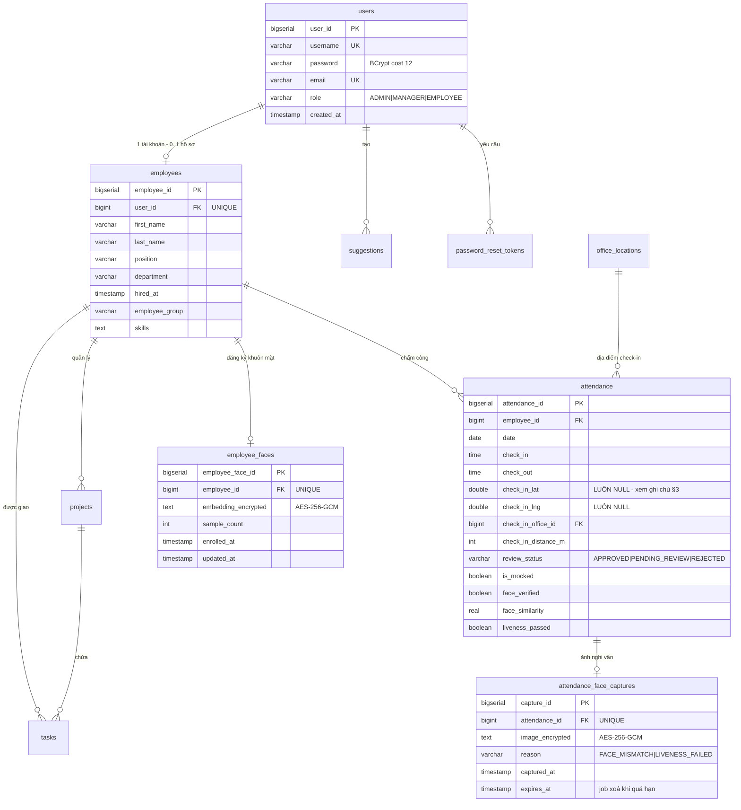

# Lược đồ Cơ sở dữ liệu — TaskHub

PostgreSQL 16. Schema được quản lý bằng **Flyway migration** (`backend/src/main/resources/db/migration/`), không dùng `ddl-auto=update` ở production để Hibernate không tự ý đổi cấu trúc bảng.

| Migration | Nội dung |
|---|---|
| `V1__baseline_schema.sql` | Schema gốc: users, employees, projects, tasks, attendance, suggestions, office_locations |
| `V2__password_reset_tokens.sql` | Bảng token đặt lại mật khẩu |
| `V3__password_reset_otp.sql` | Đổi từ link sang OTP 6 số, thêm cột `attempts` chống brute-force |
| `V4__employee_faces.sql` | Đăng ký khuôn mặt + 3 cột kết quả nhận diện trong `attendance` |
| `V5__attendance_face_captures.sql` | Ảnh check-in nghi vấn (có hạn lưu trữ) |

---

## 1. Sơ đồ quan hệ thực thể (ERD)

---

## 2. Mô tả các bảng

### `users` — Tài khoản đăng nhập

| Cột | Kiểu | Ghi chú |
|---|---|---|
| `user_id` | BIGSERIAL | Khoá chính |
| `username` | VARCHAR(50) | Duy nhất |
| `password` | VARCHAR(255) | Băm BCrypt **cost factor 12** — chậm có chủ đích để chống dò mật khẩu |
| `email` | VARCHAR(100) | Duy nhất, dùng để đăng nhập và nhận OTP |
| `role` | VARCHAR(20) | `ADMIN` / `MANAGER` / `EMPLOYEE` |

### `employees` — Hồ sơ nhân viên

Tách khỏi `users` vì không phải tài khoản nào cũng là nhân viên, và ngược lại có thể tạo hồ sơ nhân viên mẫu không kèm tài khoản đăng nhập.

**Không chứa** CCCD, số điện thoại, địa chỉ, ngày sinh, lương hay tài khoản ngân hàng — kiểm tra lại trong đợt audit bảo mật 8/2026 và xác nhận phạm vi dữ liệu cá nhân được giữ ở mức tối thiểu.

### `attendance` — Chấm công

| Cột | Ghi chú |
|---|---|
| `check_in_distance_m` | Khoảng cách (mét) tới văn phòng gần nhất lúc check-in |
| `review_status` | `APPROVED` khi trong bán kính; `PENDING_REVIEW` khi ngoài bán kính, GPS giả, hoặc nhận diện khuôn mặt thất bại |
| `face_verified` | `null` = lần đó không dùng nhận diện khuôn mặt |
| `face_similarity` | Cosine similarity với khuôn mặt đã đăng ký (0–1) |
| `liveness_passed` | Có phát hiện chớp mắt hay không |

### `employee_faces` — Khuôn mặt đã đăng ký

Mỗi nhân viên tối đa **một** bản ghi (`UNIQUE` trên `employee_id`), đăng ký lại thì ghi đè.

### `attendance_face_captures` — Ảnh nghi vấn

Chỉ tạo khi lần check-in **bị nghi vấn**. `ON DELETE CASCADE` theo `attendance`.

---

## 3. Ba quyết định thiết kế về dữ liệu nhạy cảm

Phần này ghi lại lý do đằng sau các lựa chọn, vì chúng là kết quả của một đợt tự audit bảo mật chứ không phải thiết kế ban đầu.

### 3.1. Không lưu toạ độ GPS thô

Bốn cột `check_in_lat`, `check_in_lng`, `check_out_lat`, `check_out_lng` **vẫn còn trong schema nhưng luôn là `NULL`** kể từ 8/2026.

Lý do: nghiệp vụ chỉ cần biết nhân viên **trong hay ngoài bán kính** (đã có `check_in_distance_m` + `review_status`), không cần toạ độ chính xác. Trong khi đó lịch sử vị trí chi tiết, giữ vĩnh viễn, mọi quản lý đều xem được là dữ liệu nhạy cảm bậc nhất nếu cơ sở dữ liệu bị rò rỉ.

Chọn giữ cột thay vì migration xoá cột: rủi ro thấp hơn, và giữ được khả năng khôi phục nếu sau này có nhu cầu nghiệp vụ hợp lệ.

### 3.2. Mã hoá hai chiều thay vì băm một chiều

Mật khẩu dùng **hash** (BCrypt) vì chỉ cần so sánh bằng/không bằng. Embedding khuôn mặt bắt buộc dùng **mã hoá** (AES-256-GCM) vì xác thực phải tính khoảng cách cosine giữa hai vector — cần đọc lại giá trị gốc.

Hệ quả: khoá `BIOMETRIC_KEY` trở thành điểm trọng yếu. Mất khoá = toàn bộ nhân viên phải đăng ký lại khuôn mặt. Lộ khoá + lộ DB = lộ dữ liệu sinh trắc học. Khoá được lấy từ biến môi trường, không nằm trong code và không commit lên git.

Khác biệt căn bản với mật khẩu: mật khẩu lộ thì đổi được, khuôn mặt thì không.

### 3.3. Lưu ảnh có điều kiện và có hạn

| | Quyết định |
|---|---|
| Check-in hợp lệ | **Không lưu ảnh** — lần đúng không cần bằng chứng |
| Check-in nghi vấn | Lưu ảnh đã mã hoá để quản lý đối chiếu bằng mắt |
| Hạn lưu | Mặc định 30 ngày, job chạy 03:00 hằng ngày tự xoá |
| Tắt hoàn toàn | Đặt `FACE_CAPTURE_RETENTION_DAYS=0` |

Nếu lưu ảnh của mọi lần check-in, hệ thống sẽ tích luỹ hàng nghìn ảnh khuôn mặt nhân viên. Rủi ro khi rò rỉ lớn hơn nhiều so với giá trị nghiệp vụ thu được. Dữ liệu sinh trắc học thuộc nhóm dữ liệu cá nhân nhạy cảm theo Nghị định 13/2023/NĐ-CP, trong đó có nguyên tắc chỉ lưu trong thời gian cần thiết cho mục đích đã nêu.

---

## 4. Chỉ mục và ràng buộc đáng chú ý

| Bảng | Ràng buộc | Lý do |
|---|---|---|
| `employees.user_id` | UNIQUE | Một tài khoản chỉ gắn tối đa một hồ sơ nhân viên |
| `employee_faces.employee_id` | UNIQUE + CASCADE | Mỗi người một khuôn mặt; xoá nhân viên là xoá dữ liệu sinh trắc học |
| `attendance_face_captures.attendance_id` | UNIQUE + CASCADE | Mỗi lần chấm công tối đa một ảnh |
| `attendance_face_captures.expires_at` | INDEX | Job dọn dẹp quét theo cột này mỗi ngày |
| `password_reset_tokens.token_hash` | **Không** UNIQUE | OTP 6 số có thể trùng giữa các user — xem `V3` |

---

## 5. Xem thêm

- [Sơ đồ UML](UML_DIAGRAMS.md) — Use Case, Class, Sequence, Activity
- [Hướng dẫn deploy](../DEPLOY.md) — biến môi trường và lưu ý production
- [Biến môi trường đầy đủ](../.env.example)
