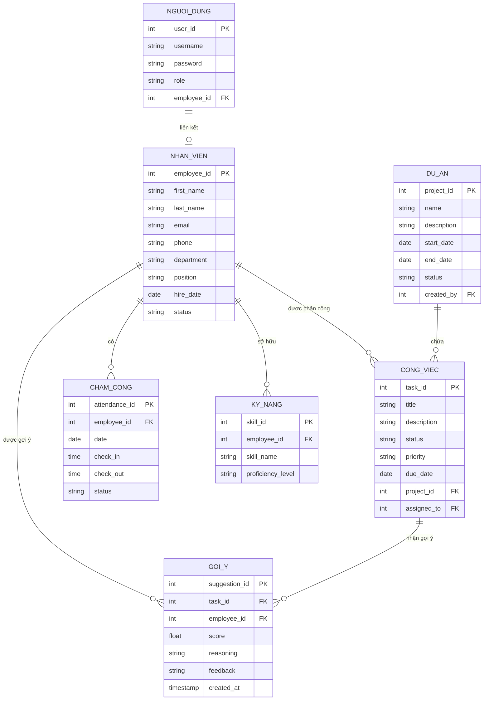

# 🗄️ Lược đồ Cơ sở dữ liệu — Hệ thống Quản lý Công việc

---

## 📊 Sơ đồ Quan hệ Thực thể (ERD)

---

## 📋 Mô tả Chi tiết Các Bảng

### 1. Bảng `users` — Người dùng hệ thống

| Cột | Kiểu dữ liệu | Ràng buộc | Mô tả |
|---|---|---|---|
| `user_id` | SERIAL | PRIMARY KEY | Mã định danh người dùng |
| `username` | VARCHAR(50) | NOT NULL, UNIQUE | Tên đăng nhập |
| `password` | VARCHAR(255) | NOT NULL | Mật khẩu đã mã hóa (BCrypt) |
| `role` | VARCHAR(20) | NOT NULL | Vai trò: `ADMIN`, `MANAGER`, `EMPLOYEE` |
| `employee_id` | INTEGER | FOREIGN KEY | Liên kết với bảng nhân viên |

---

### 2. Bảng `employees` — Nhân viên

| Cột | Kiểu dữ liệu | Ràng buộc | Mô tả |
|---|---|---|---|
| `employee_id` | SERIAL | PRIMARY KEY | Mã nhân viên |
| `first_name` | VARCHAR(50) | NOT NULL | Tên nhân viên |
| `last_name` | VARCHAR(50) | NOT NULL | Họ nhân viên |
| `email` | VARCHAR(100) | NOT NULL, UNIQUE | Địa chỉ email |
| `phone` | VARCHAR(15) | | Số điện thoại |
| `department` | VARCHAR(100) | | Phòng ban |
| `position` | VARCHAR(100) | | Chức vụ |
| `hire_date` | DATE | | Ngày bắt đầu làm việc |
| `status` | VARCHAR(20) | | Trạng thái: `ACTIVE`, `INACTIVE` |

---

### 3. Bảng `projects` — Dự án

| Cột | Kiểu dữ liệu | Ràng buộc | Mô tả |
|---|---|---|---|
| `project_id` | SERIAL | PRIMARY KEY | Mã dự án |
| `name` | VARCHAR(100) | NOT NULL | Tên dự án |
| `description` | TEXT | | Mô tả chi tiết |
| `start_date` | DATE | | Ngày bắt đầu |
| `end_date` | DATE | | Ngày kết thúc dự kiến |
| `status` | VARCHAR(20) | | Trạng thái: `PENDING`, `IN_PROGRESS`, `COMPLETED` |
| `created_by` | INTEGER | FOREIGN KEY | Người tạo dự án (mã người dùng) |

---

### 4. Bảng `tasks` — Công việc

| Cột | Kiểu dữ liệu | Ràng buộc | Mô tả |
|---|---|---|---|
| `task_id` | SERIAL | PRIMARY KEY | Mã công việc |
| `title` | VARCHAR(200) | NOT NULL | Tiêu đề công việc |
| `description` | TEXT | | Mô tả chi tiết |
| `status` | VARCHAR(20) | | Trạng thái: `PENDING`, `IN_PROGRESS`, `COMPLETED` |
| `priority` | VARCHAR(20) | | Độ ưu tiên: `LOW`, `MEDIUM`, `HIGH` |
| `due_date` | DATE | | Hạn hoàn thành |
| `project_id` | INTEGER | FOREIGN KEY | Thuộc dự án nào |
| `assigned_to` | INTEGER | FOREIGN KEY | Nhân viên được phân công |

---

### 5. Bảng `attendance` — Chấm công

| Cột | Kiểu dữ liệu | Ràng buộc | Mô tả |
|---|---|---|---|
| `attendance_id` | SERIAL | PRIMARY KEY | Mã bản ghi chấm công |
| `employee_id` | INTEGER | FOREIGN KEY, NOT NULL | Mã nhân viên |
| `date` | DATE | NOT NULL | Ngày chấm công |
| `check_in` | TIME | NOT NULL | Giờ vào |
| `check_out` | TIME | | Giờ ra (NULL nếu chưa chấm ra) |
| `status` | VARCHAR(20) | | Trạng thái: `PRESENT`, `ABSENT`, `LATE` |

---

### 6. Bảng `skills` — Kỹ năng nhân viên

| Cột | Kiểu dữ liệu | Ràng buộc | Mô tả |
|---|---|---|---|
| `skill_id` | SERIAL | PRIMARY KEY | Mã kỹ năng |
| `employee_id` | INTEGER | FOREIGN KEY, NOT NULL | Mã nhân viên |
| `skill_name` | VARCHAR(100) | NOT NULL | Tên kỹ năng (VD: Java, Python) |
| `proficiency_level` | VARCHAR(20) | | Mức độ thành thạo: `BEGINNER`, `INTERMEDIATE`, `ADVANCED` |

---

### 7. Bảng `suggestions` — Gợi ý AI

| Cột | Kiểu dữ liệu | Ràng buộc | Mô tả |
|---|---|---|---|
| `suggestion_id` | SERIAL | PRIMARY KEY | Mã gợi ý |
| `task_id` | INTEGER | FOREIGN KEY | Công việc cần gợi ý nhân viên |
| `employee_id` | INTEGER | FOREIGN KEY | Nhân viên được gợi ý |
| `score` | FLOAT | | Điểm tổng hợp (0.0 – 1.0) |
| `reasoning` | TEXT | | Lý do gợi ý chi tiết |
| `feedback` | VARCHAR(20) | | Phản hồi: `ACCEPTED`, `REJECTED`, `PENDING` |
| `created_at` | TIMESTAMP | DEFAULT NOW() | Thời điểm tạo gợi ý |

---

## 🔗 Quan hệ giữa các bảng

| Bảng nguồn | Cột khóa ngoại | Tham chiếu đến | Loại quan hệ |
|---|---|---|---|
| `users` | `employee_id` | `employees.employee_id` | Một - Một |
| `projects` | `created_by` | `users.user_id` | Nhiều - Một |
| `tasks` | `project_id` | `projects.project_id` | Nhiều - Một |
| `tasks` | `assigned_to` | `employees.employee_id` | Nhiều - Một |
| `attendance` | `employee_id` | `employees.employee_id` | Nhiều - Một |
| `skills` | `employee_id` | `employees.employee_id` | Nhiều - Một |
| `suggestions` | `task_id` | `tasks.task_id` | Nhiều - Một |
| `suggestions` | `employee_id` | `employees.employee_id` | Nhiều - Một |
