# Sơ đồ UML — Hệ thống Quản lý Công việc

Tài liệu này chứa các sơ đồ Use Case, Class Diagram, Sequence và Activity mô tả kiến trúc và luồng hoạt động chính của hệ thống. Tất cả sơ đồ được sinh bằng **PlantUML** từ source code (`docs/uml/src/*.puml`) và render ra PNG ở `docs/uml/png/` — phong cách trình bày tương đương StarUML.

Tái tạo PNG: `java -jar docs/uml/plantuml.jar -charset UTF-8 -tpng -o "../png" "docs/uml/src/*.puml"`.

---

## 1. Sơ đồ Use Case

### 1.1. Use Case tổng thể

Sơ đồ tổng thể gồm 14 use case chia thành 5 nhóm chức năng (Xác thực, Nhân viên & Dự án, Công việc & Chấm công, AI Gợi ý, Quản trị). Ba actor là EMPLOYEE → MANAGER → ADMIN có quan hệ kế thừa (generalization): vai trò cấp trên kế thừa mọi use case của vai trò cấp dưới.

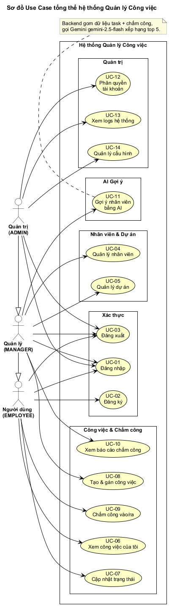

### 1.2. Use Case — Xác thực

Đăng ký, đăng nhập, đăng xuất — tất cả đều `<<include>>` use case "Kiểm tra JWT". Token có hiệu lực 24 giờ, chứa username + role.

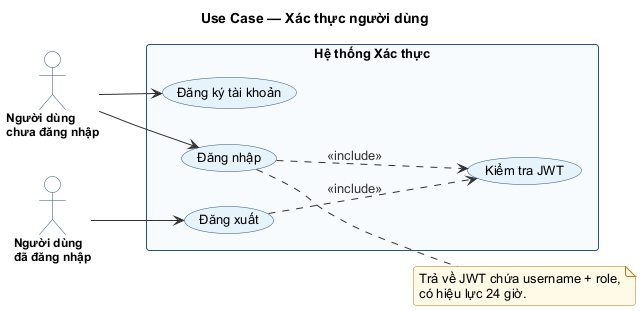

### 1.3. Use Case — Chấm công

Nhân viên check-in / check-out / xem lịch sử của mình; Quản lý xem báo cáo tổng hợp và có thể `<<extend>>` để xuất Excel. Mỗi nhân viên chỉ được chấm công một lần mỗi ngày.

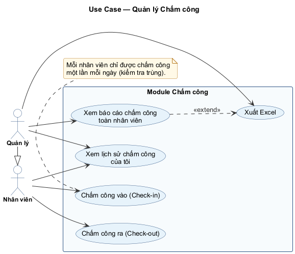

### 1.4. Use Case — Quản lý Dự án & Công việc

CRUD đầy đủ cho dự án và công việc. Backend kiểm tra ownership: nhân viên chỉ sửa được task của chính mình. Quan hệ `<<include>>` giữa "Tạo công việc" và "Xem danh sách dự án".

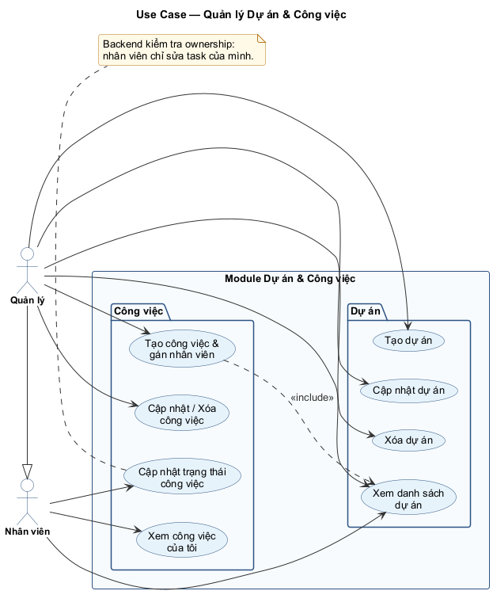

### 1.5. Use Case — AI Gợi ý Nhân viên

Google Gemini (gemini-2.5-flash) là một system actor bên ngoài. Backend gom số liệu thô và xây prompt tiếng Việt rồi gọi AI; kết quả được cache 5 phút bằng Redis.

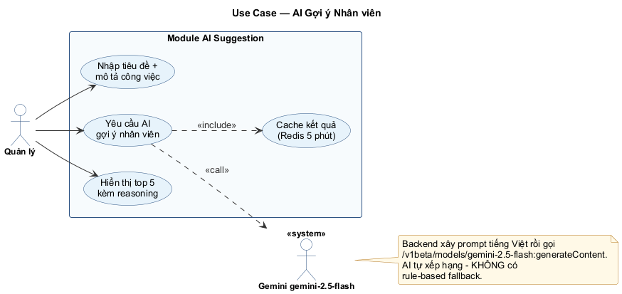

---

## 2. Class Diagram

### 2.1. Sơ đồ lớp Entity (Domain Model)

6 entity chính: `User`, `Employee`, `Project`, `Task`, `Attendance`, `Suggestion`. `User` 1:0..1 `Employee`. `Employee` quản lý nhiều `Project`, được gán nhiều `Task`, có nhiều bản ghi `Attendance`.

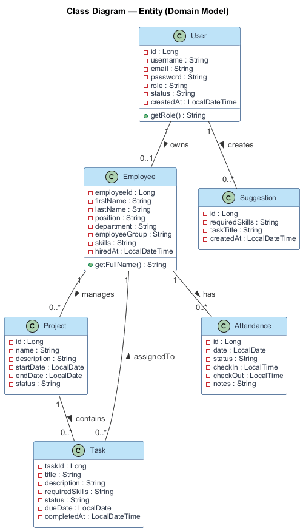

### 2.2. Sơ đồ lớp Kiến trúc (Controller / Service / Repository)

Sơ đồ phân tầng Spring Boot 3 lớp: Controller → Service → Repository, kèm hai thành phần ngoài (`GeminiClient`, `RedisCache`). `AiSuggestionService` là service đặc biệt – truy vấn 3 repository và gọi Gemini.

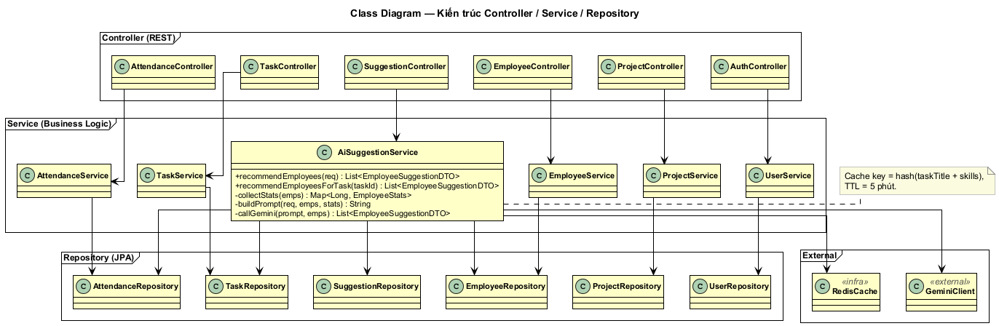

---

## 3. Sequence Diagram

### 3.1. Đăng nhập (JWT)

Luồng xác thực: Client → AuthController → AuthenticationManager → UserDetailsService → PostgreSQL → BCrypt → JwtTokenProvider. Hai nhánh: 200 OK + token hoặc 401 Unauthorized.

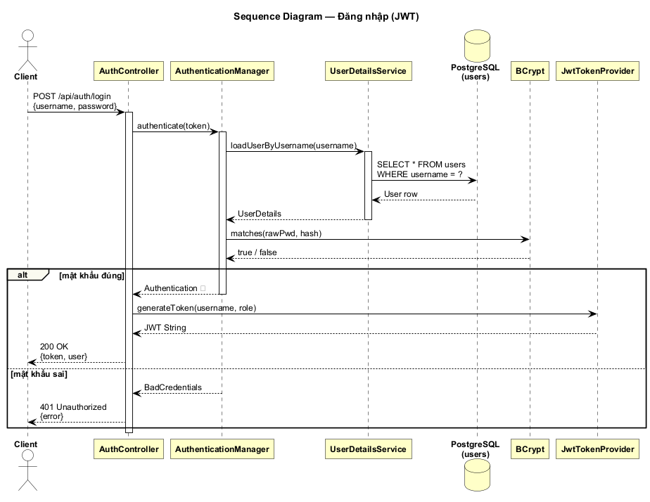

### 3.2. Chấm công Check-in / Check-out

Hai luồng tách rời: Check-in (kiểm tra trùng → INSERT) và Check-out (kiểm tra có bản ghi vào → UPDATE). Mỗi luồng có nhánh lỗi: 409 Conflict (đã chấm rồi) và 404 Not Found (chưa check-in).

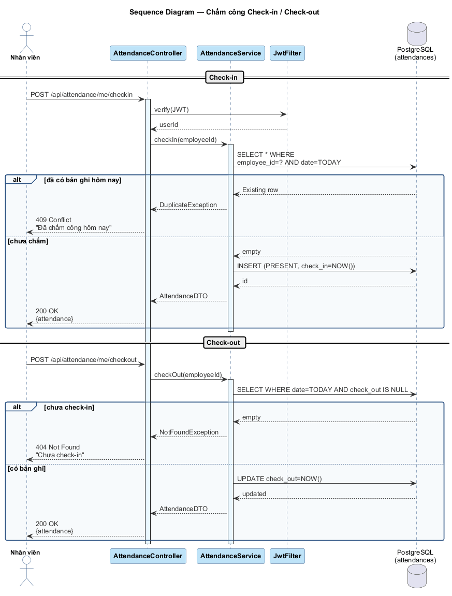

### 3.3. AI Gợi ý Nhân viên

Luồng đầy đủ: cache lookup → MISS → batch query song song (Task + Attendance) → collectStats → buildPrompt → POST Gemini → parse JSON → cache 5m → trả top 5. Nhánh HIT trả ngay từ cache.

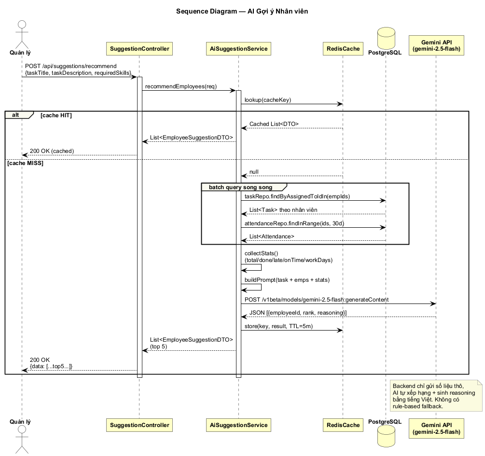

### 3.4. Tạo công việc và Phân công nhân viên

POST /api/tasks với `@PreAuthorize` cho MANAGER/ADMIN. Service kiểm tra project + employee tồn tại trước khi INSERT. Trả 404 nếu thiếu, 201 nếu thành công.

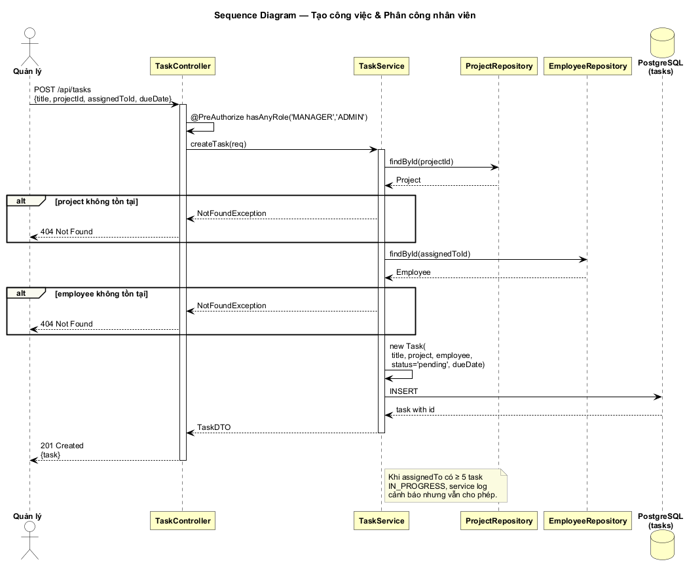

---

## 4. Activity Diagram

### 4.1. Đăng nhập

Hai lần kiểm tra: username có tồn tại + BCrypt khớp password. Cả hai nhánh lỗi quay về form, nhánh thành công tạo JWT và chuyển đến `/dashboard`.

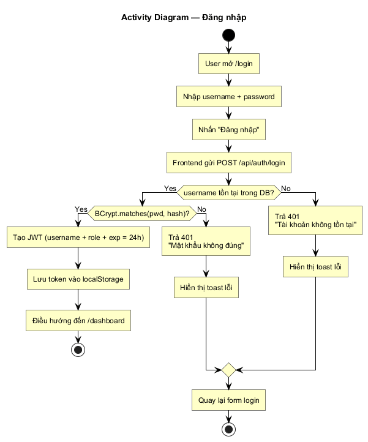

### 4.2. Đăng ký

Validate form (client-side), sau đó backend kiểm tra trùng username và email. Mật khẩu được mã hoá BCrypt, user mới có role mặc định EMPLOYEE.

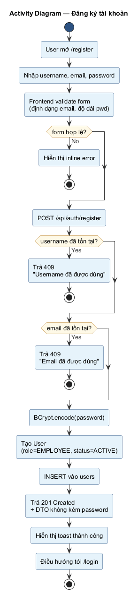

### 4.3. Quản lý Nhân viên (CRUD)

Bốn nhánh CRUD: Xem chi tiết, Thêm (kèm validate trùng email), Sửa, Xóa (kèm kiểm tra ràng buộc — không cho xóa nếu còn task gán).

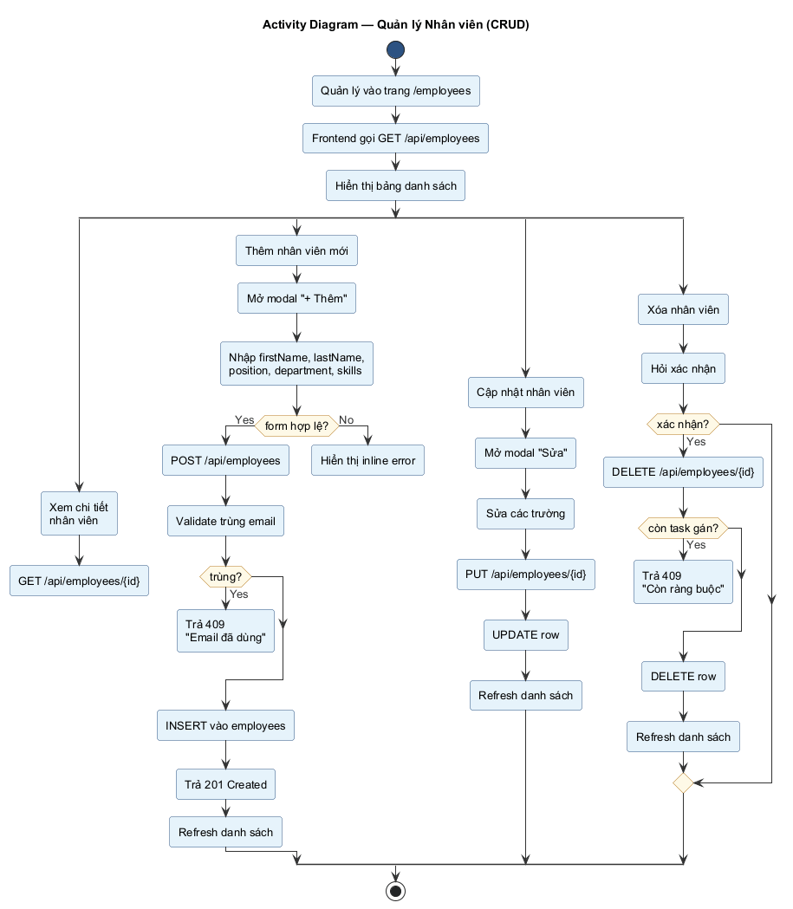

### 4.4. Chấm công

Swimlane 3 tầng (Nhân viên / Frontend / Backend). Backend tự quyết định check-in hay check-out dựa trên bản ghi đã có hôm nay.

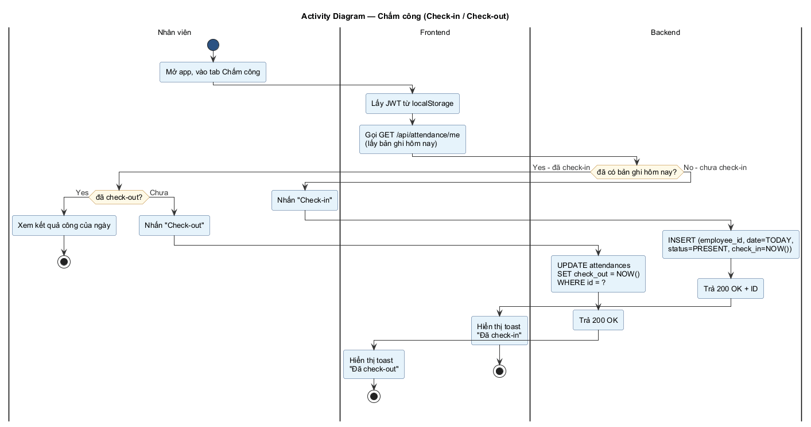

### 4.5. AI Gợi ý Nhân viên

Swimlane 4 tầng (Quản lý / Frontend / Backend / Gemini). Khối parallel mô tả 3 batch query trên 3 repository. Nhánh cache HIT trả ngay không gọi AI.

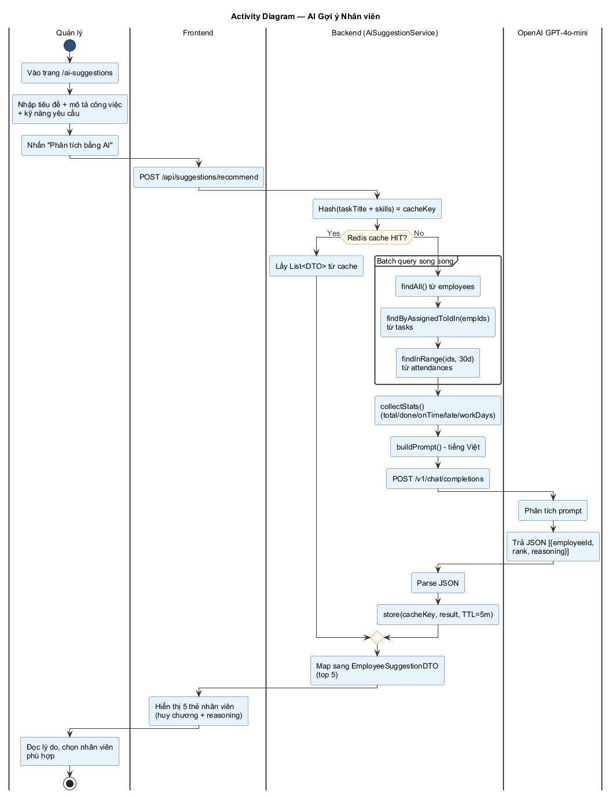

### 4.6. Quản lý Dự án (CRUD)

Tương tự CRUD Nhân viên: tạo / sửa / xóa với ràng buộc "không xóa được nếu còn task thuộc dự án".

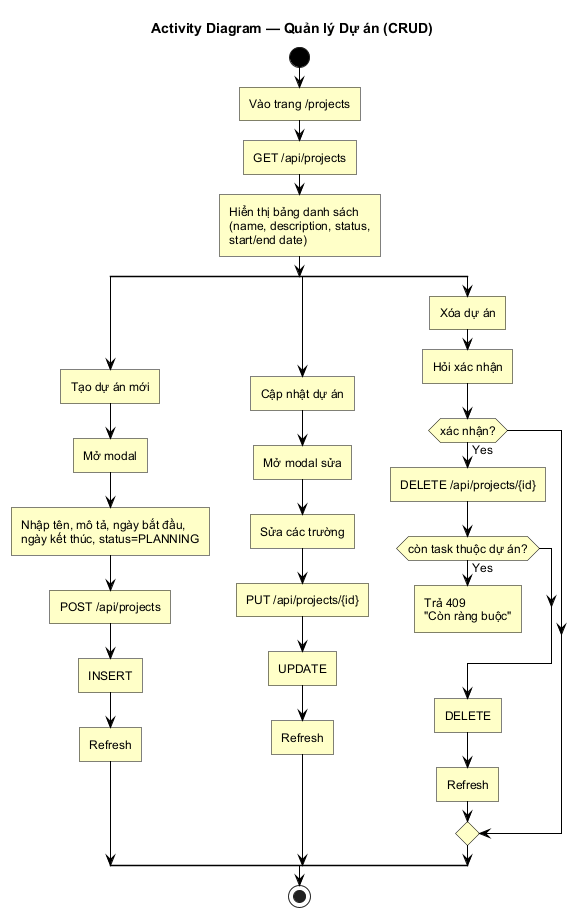

### 4.7. Quản lý Công việc (CRUD + cập nhật trạng thái)

Tạo, sửa, xóa (quyền MANAGER) và cập nhật trạng thái (mọi nhân viên với task của mình). Backend kiểm tra ownership, set `completed_at = NOW()` khi trạng thái chuyển sang completed.

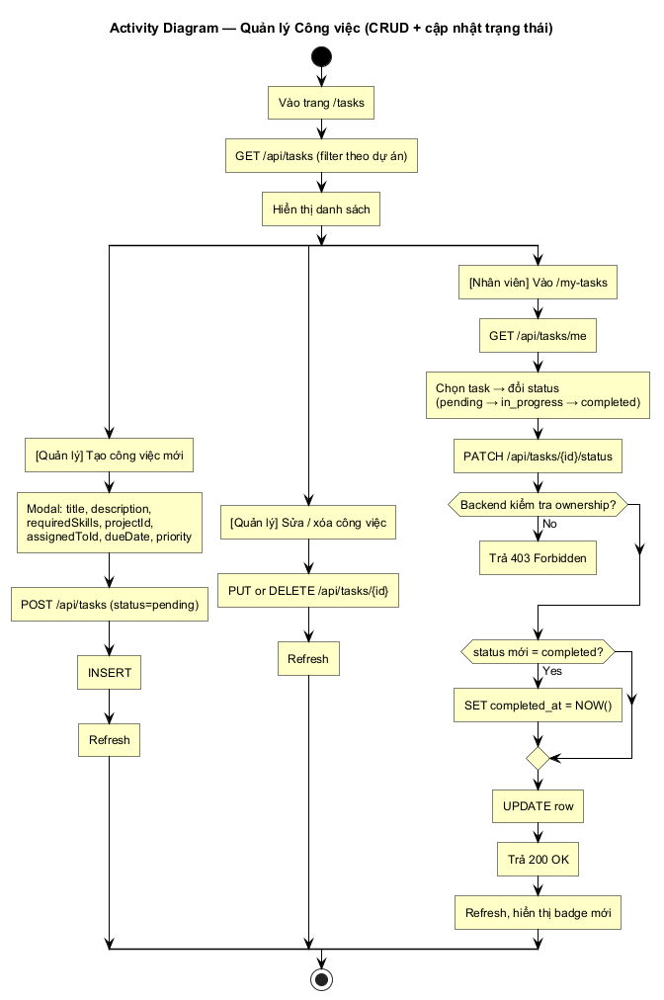

---

## 5. Kiến trúc tổng thể

Sơ đồ component-style mô tả 3 tier (Client / Application / Data) và các kết nối: Web/Mobile/Tools → Spring Boot (JWT) → PostgreSQL + Redis + Gemini. Tất cả container chạy chung Docker network `taskmgmt_net`.

