# 📊 Sơ đồ UML — Hệ thống Quản lý Công việc

Tài liệu này chứa các sơ đồ Use Case, Class Diagram, Sequence và Activity mô tả kiến trúc và luồng hoạt động chính của hệ thống.

---

## 1. Sơ đồ Use Case

### 1.1. Use Case — Xác thực

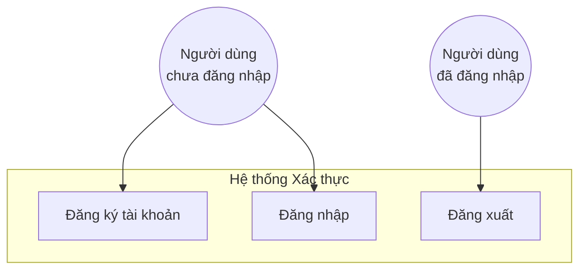

---

### 1.2. Use Case — Quản lý Chấm công

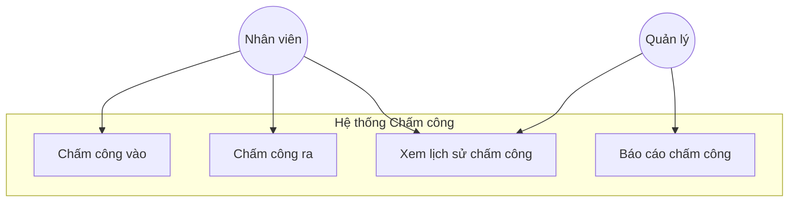

---

### 1.3. Use Case — Quản lý Dự án & Công việc

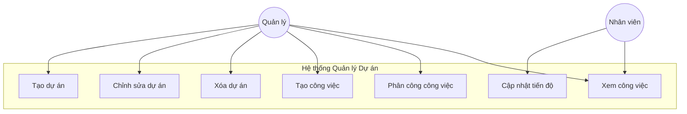

---

### 1.4. Use Case — AI Gợi ý Nhân viên

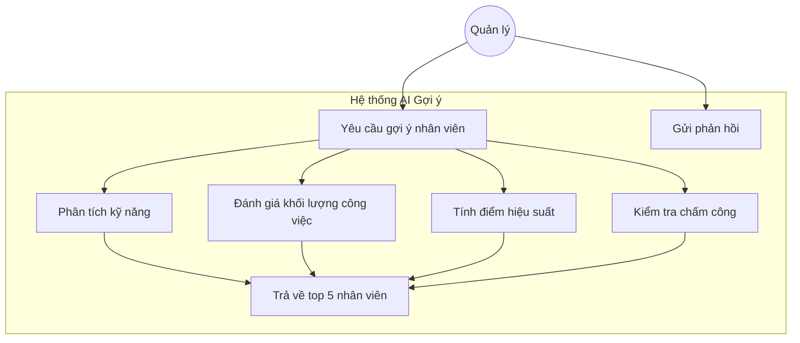

---

## 2. Sơ đồ lớp — Class Diagram

### 2.1. Sơ đồ lớp thực thể (Entity)

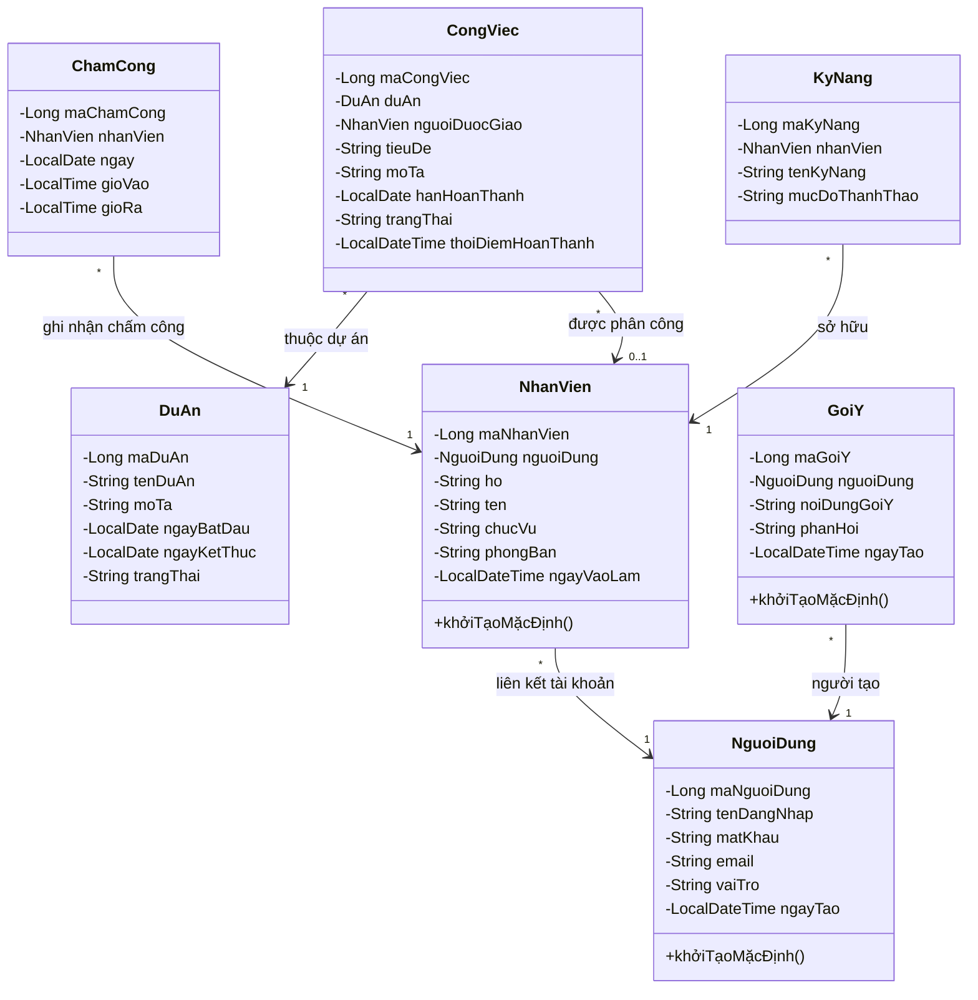

### 2.2. Sơ đồ lớp kiến trúc (Controller — Service — Repository)

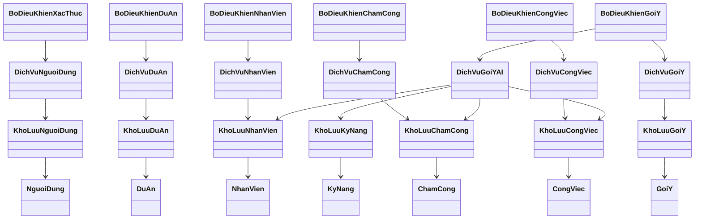

---

## 3. Sơ đồ tuần tự — Sequence Diagram

### 3.1. Đăng nhập

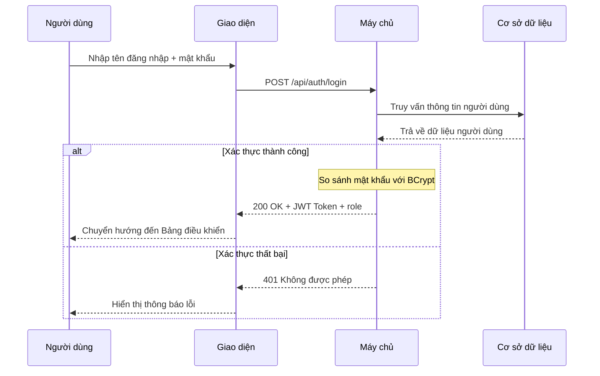

---

### 3.2. Chấm công

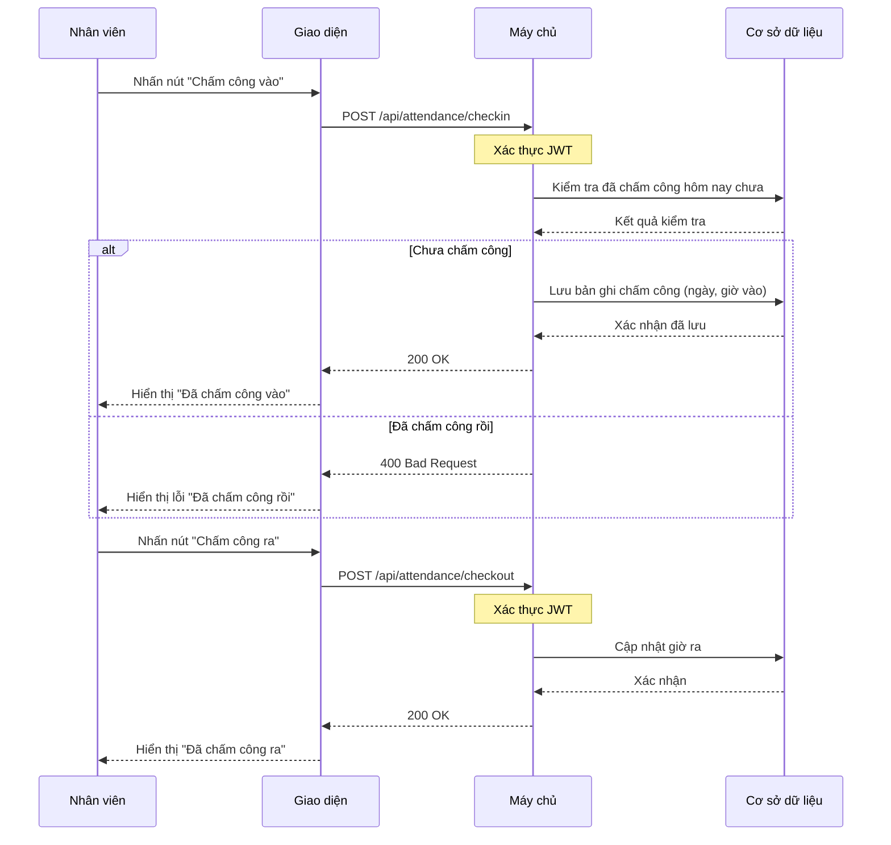

---

### 3.3. AI Gợi ý Nhân viên

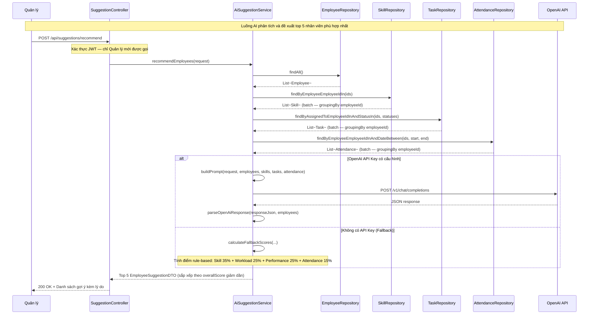

---

### 3.4. Quản lý Công việc (Tạo + Phân công)

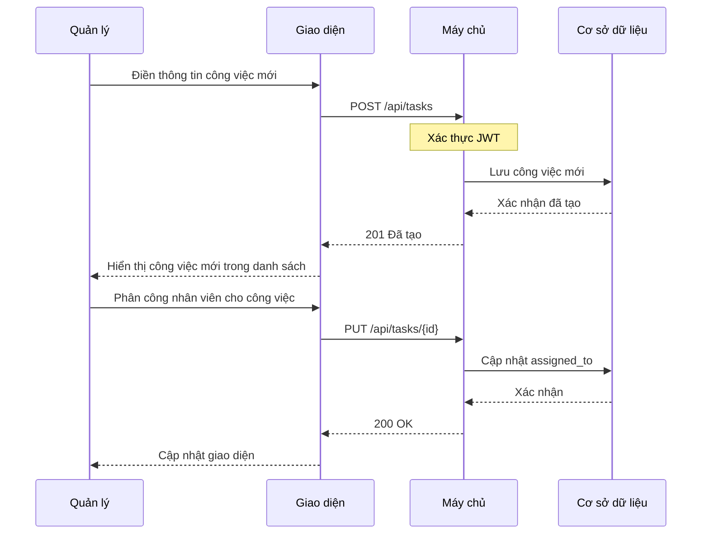

---

## 4. Sơ đồ hoạt động — Activity Diagram

### 4.1. Đăng nhập

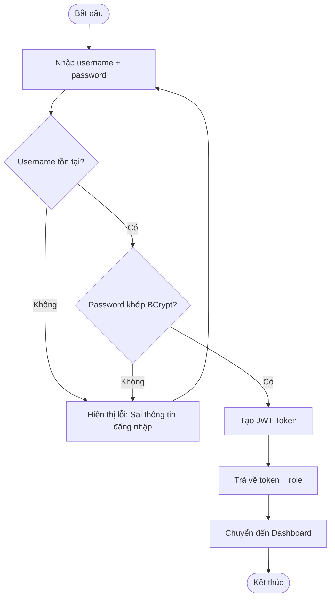

---

### 4.2. Đăng ký

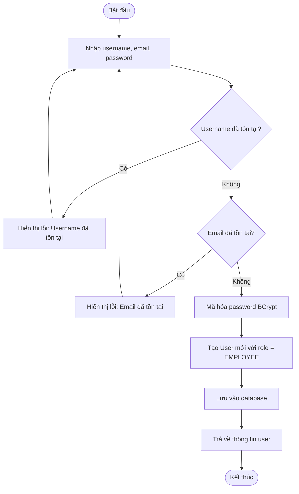

---

### 4.3. Quản lý Nhân viên

```mermaid
flowchart TD
    A([Bắt đầu]) --> B{Chọn thao tác?}
    B -- Xem --> C[GET /api/employees]
    C --> D[Hiển thị danh sách nhân viên]
    B -- Thêm --> E[Nhập thông tin nhân viên]
    E --> F[POST /api/employees]
    F --> G{Dữ liệu hợp lệ?}
    G -- Không --> H[Hiển thị lỗi validation]
    H --> E
    G -- Có --> I[Lưu nhân viên mới]
    I --> D
    B -- Sửa --> J[Chọn nhân viên cần sửa]
    J --> K[PUT /api/employees/{id}]
    K --> D
    B -- Xóa --> L[Chọn nhân viên cần xóa]
    L --> M[DELETE /api/employees/{id}]
    M --> D
    D --> N([Kết thúc])
```

---

### 4.4. Chấm công

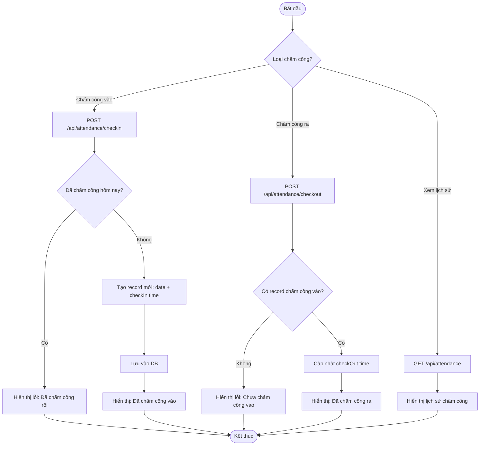

---

### 4.5. AI Gợi ý Nhân viên

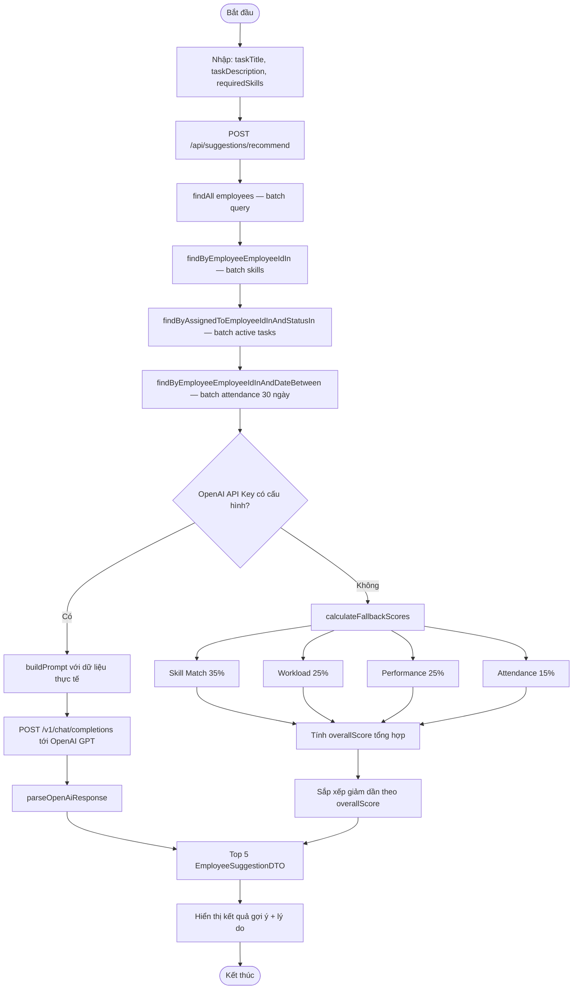

---

### 4.6. Quản lý Dự án

```mermaid
flowchart TD
    A([Bắt đầu]) --> B{Chọn thao tác?}
    B -- Xem --> C[GET /api/projects]
    C --> D[Hiển thị danh sách dự án]
    B -- Tạo mới --> E[Nhập: name, description, startDate, endDate]
    E --> F[POST /api/projects]
    F --> G[Lưu dự án mới, status = ongoing]
    G --> D
    B -- Cập nhật --> H[Chọn dự án cần sửa]
    H --> I[PUT /api/projects/{id}]
    I --> D
    B -- Xóa --> J[DELETE /api/projects/{id}]
    J --> D
    D --> K([Kết thúc])
```

---

### 4.7. Quản lý Công việc

```mermaid
flowchart TD
    A([Bắt đầu]) --> B{Chọn thao tác?}
    B -- Xem --> C[GET /api/tasks]
    C --> D[Hiển thị danh sách công việc]
    B -- Tạo --> E[Nhập: title, description, dueDate, projectId]
    E --> F[POST /api/tasks]
    F --> G[Tạo task, status = pending]
    G --> D
    B -- Phân công --> H[Chọn task + chọn nhân viên]
    H --> I[PUT /api/tasks/{id} với assignedTo]
    I --> D
    B -- Cập nhật trạng thái --> J[Chọn task]
    J --> K{Status mới?}
    K -- COMPLETED --> L[Cập nhật completedAt = now]
    K -- IN_PROGRESS --> M[Cập nhật status]
    L --> D
    M --> D
    B -- Xóa --> N[DELETE /api/tasks/{id}]
    N --> D
    D --> O([Kết thúc])
```
