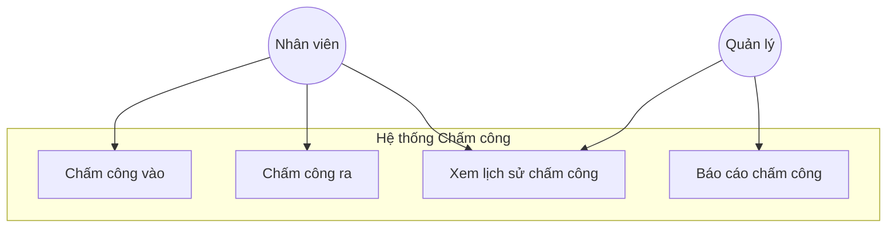
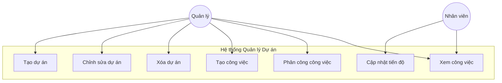
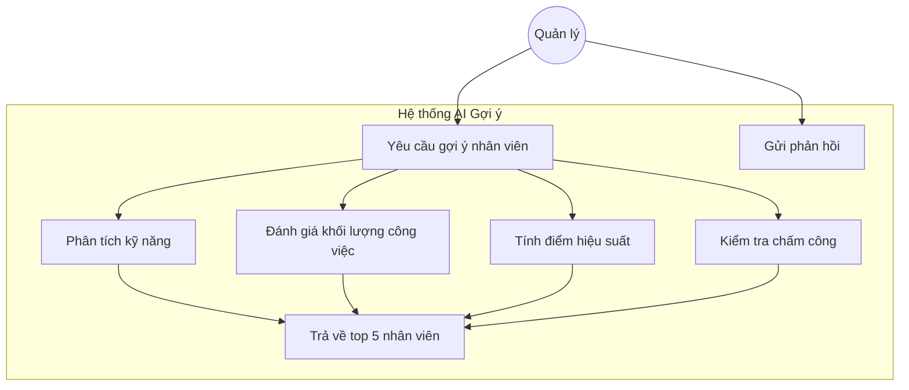
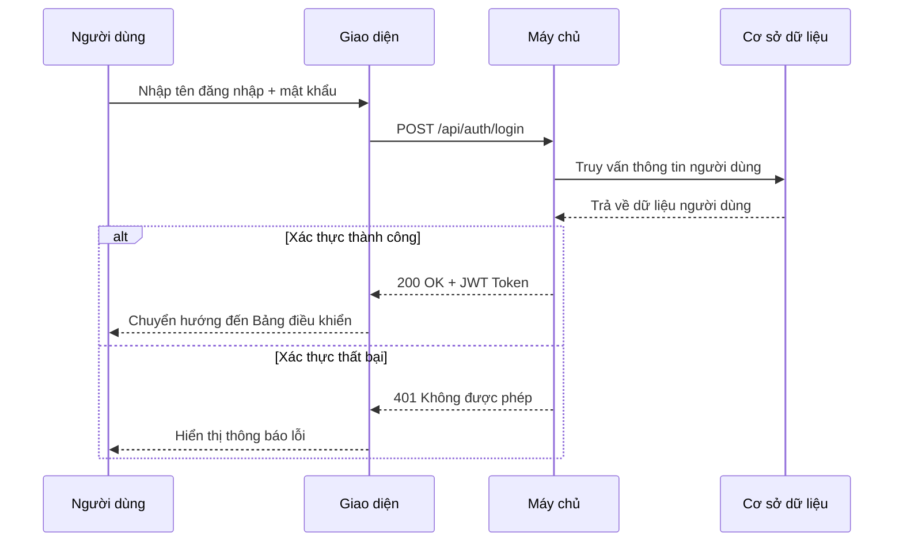
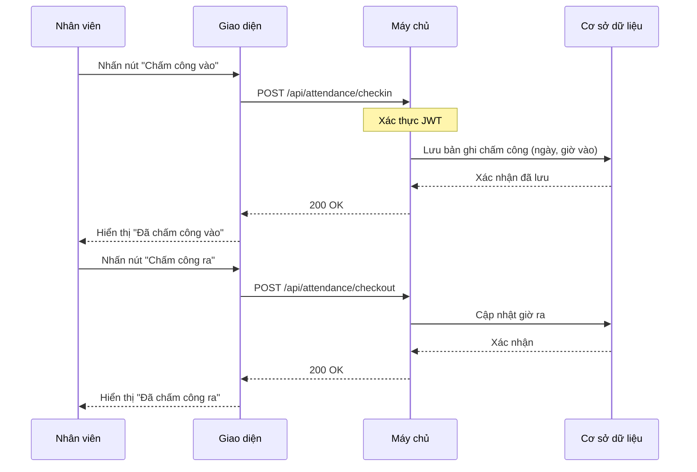
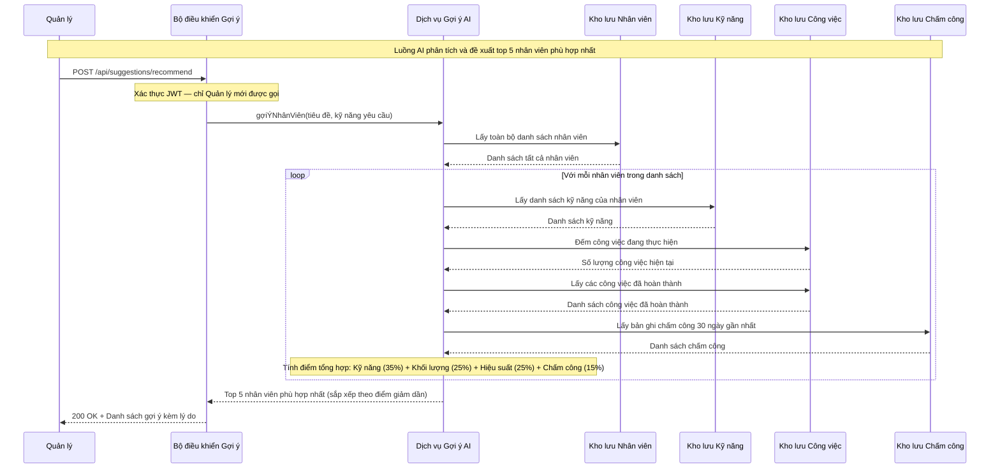
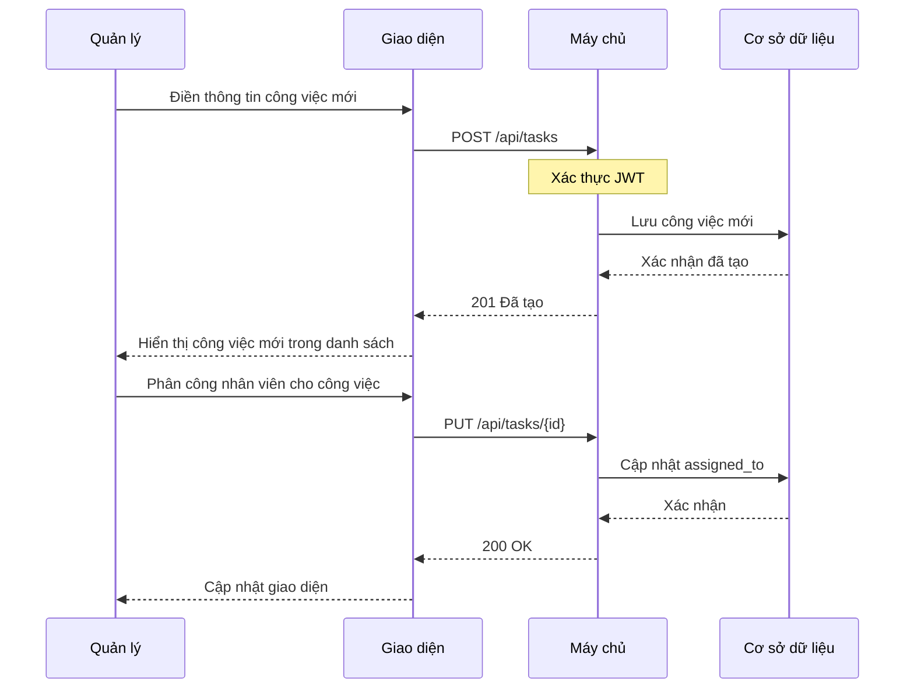

# 📊 Sơ đồ UML — Hệ thống Quản lý Công việc

Tài liệu này chứa các sơ đồ Use Case và Sequence mô tả luồng hoạt động chính của hệ thống.

---

## 1. Sơ đồ Use Case — Quản lý Chấm công

---

## 2. Sơ đồ Use Case — Quản lý Dự án & Công việc

---

## 3. Sơ đồ Use Case — AI Gợi ý Nhân viên

---

## 4. Sơ đồ Sequence — Đăng nhập

---

## 5. Sơ đồ Sequence — Chấm công

---

## 6. Sơ đồ Sequence — AI Gợi ý Nhân viên

---

## 7. Sơ đồ Sequence — Quản lý Công việc (Tạo + Phân công)

