# Sơ đồ UML — Hệ thống Quản lý Công việc

Tài liệu này chứa các sơ đồ Use Case, Class Diagram, Sequence và Activity mô tả kiến trúc và luồng hoạt động chính của hệ thống. Sơ đồ viết bằng **Mermaid** — GitHub render trực tiếp trong Markdown, không cần build ra ảnh. Source PlantUML cũ vẫn còn ở `docs/uml/src/*.puml` (dùng cho PNG nhúng trong file .docx).

> Mermaid stable chưa có kiểu *use-case diagram* riêng, nên các sơ đồ Use Case dưới đây dựng bằng `flowchart`: actor = hình chữ nhật, use-case = hình bo tròn (stadium), ranh giới hệ thống = `subgraph`, quan hệ `«include»/«extend»/kế thừa` = mũi tên nét đứt.

---

## 1. Sơ đồ Use Case

### 1.1. Use Case tổng thể

Sơ đồ tổng thể gồm 14 use case chia thành 5 nhóm chức năng (Xác thực, Nhân viên & Dự án, Công việc & Chấm công, AI Gợi ý, Quản trị). Ba actor là EMPLOYEE → MANAGER → ADMIN có quan hệ kế thừa (generalization): vai trò cấp trên kế thừa mọi use case của vai trò cấp dưới.

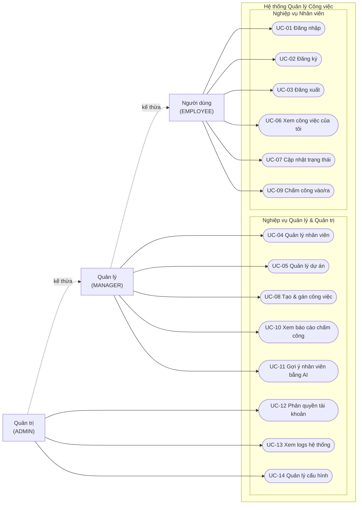
```mermaid
flowchart LR
  User["Người dùng<br/>(EMPLOYEE)"]
  Manager["Quản lý<br/>(MANAGER)"]
  Admin["Quản trị<br/>(ADMIN)"]
  Admin -. kế thừa .-> Manager
  Manager -. kế thừa .-> User
  subgraph SYS["Hệ thống Quản lý Công việc"]
    subgraph P1["Nghiệp vụ Nhân viên"]
      UC01(["UC-01 Đăng nhập"])
      UC02(["UC-02 Đăng ký"])
      UC03(["UC-03 Đăng xuất"])
      UC06(["UC-06 Xem công việc của tôi"])
      UC07(["UC-07 Cập nhật trạng thái"])
      UC09(["UC-09 Chấm công vào/ra"])
    end
    subgraph P2["Nghiệp vụ Quản lý & Quản trị"]
      UC04(["UC-04 Quản lý nhân viên"])
      UC05(["UC-05 Quản lý dự án"])
      UC08(["UC-08 Tạo & gán công việc"])
      UC10(["UC-10 Xem báo cáo chấm công"])
      UC11(["UC-11 Gợi ý nhân viên bằng AI"])
      UC12(["UC-12 Phân quyền tài khoản"])
      UC13(["UC-13 Xem logs hệ thống"])
      UC14(["UC-14 Quản lý cấu hình"])
    end
  end
  User --> UC01 & UC02 & UC03 & UC06 & UC07 & UC09
  Manager --> UC04 & UC05 & UC08 & UC10 & UC11
  Admin --> UC12 & UC13 & UC14
```

### 1.2. Use Case — Xác thực

Đăng ký, đăng nhập, đăng xuất — tất cả đều `<<include>>` use case "Kiểm tra JWT". Token có hiệu lực 2 giờ, chứa username + role.

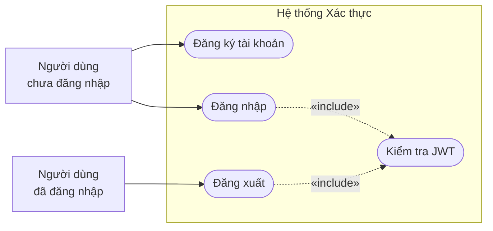
```mermaid
flowchart LR
  Guest["Người dùng<br/>chưa đăng nhập"]
  Member["Người dùng<br/>đã đăng nhập"]
  subgraph SYS["Hệ thống Xác thực"]
    UC_Reg(["Đăng ký tài khoản"])
    UC_Login(["Đăng nhập"])
    UC_Logout(["Đăng xuất"])
    UC_Verify(["Kiểm tra JWT"])
  end
  Guest --> UC_Reg
  Guest --> UC_Login
  Member --> UC_Logout
  UC_Login -. «include» .-> UC_Verify
  UC_Logout -. «include» .-> UC_Verify
```

### 1.3. Use Case — Chấm công

Nhân viên check-in / check-out / xem lịch sử của mình; Quản lý xem báo cáo tổng hợp và có thể `<<extend>>` để xuất Excel. Mỗi nhân viên chỉ được chấm công một lần mỗi ngày.

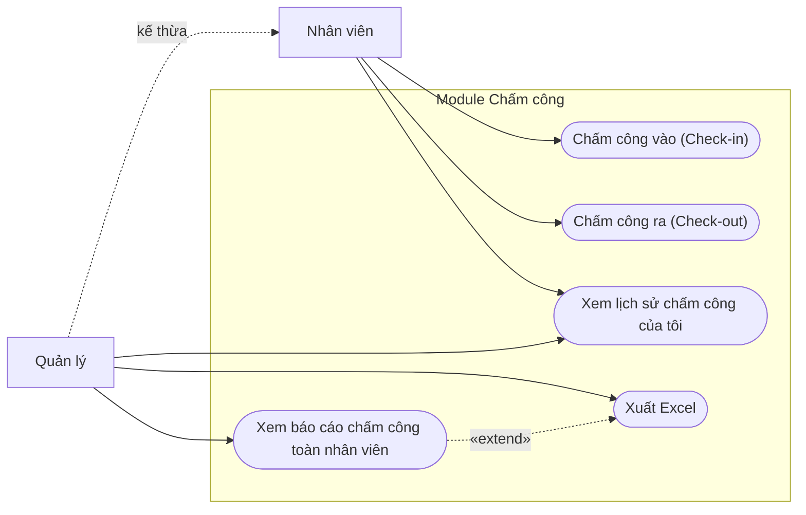
```mermaid
flowchart LR
  Emp["Nhân viên"]
  Mgr["Quản lý"]
  Mgr -. kế thừa .-> Emp
  subgraph SYS["Module Chấm công"]
    UC_In(["Chấm công vào (Check-in)"])
    UC_Out(["Chấm công ra (Check-out)"])
    UC_My(["Xem lịch sử chấm công của tôi"])
    UC_Rep(["Xem báo cáo chấm công toàn nhân viên"])
    UC_Exp(["Xuất Excel"])
  end
  Emp --> UC_In & UC_Out & UC_My
  Mgr --> UC_Rep & UC_Exp & UC_My
  UC_Rep -. «extend» .-> UC_Exp
```

### 1.4. Use Case — Quản lý Dự án & Công việc

CRUD đầy đủ cho dự án và công việc. Backend kiểm tra ownership: nhân viên chỉ sửa được task của chính mình. Quan hệ `<<include>>` giữa "Tạo công việc" và "Xem danh sách dự án".

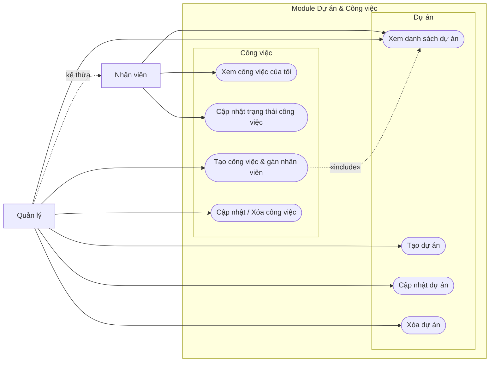
```mermaid
flowchart LR
  Emp["Nhân viên"]
  Mgr["Quản lý"]
  Mgr -. kế thừa .-> Emp
  subgraph SYS["Module Dự án & Công việc"]
    subgraph PRJ["Dự án"]
      UC_PrjList(["Xem danh sách dự án"])
      UC_PrjAdd(["Tạo dự án"])
      UC_PrjUpd(["Cập nhật dự án"])
      UC_PrjDel(["Xóa dự án"])
    end
    subgraph TSK["Công việc"]
      UC_MyTask(["Xem công việc của tôi"])
      UC_UpdStatus(["Cập nhật trạng thái công việc"])
      UC_Create(["Tạo công việc & gán nhân viên"])
      UC_Edit(["Cập nhật / Xóa công việc"])
    end
  end
  Emp --> UC_PrjList & UC_MyTask & UC_UpdStatus
  Mgr --> UC_PrjList & UC_PrjAdd & UC_PrjUpd & UC_PrjDel & UC_Create & UC_Edit
  UC_Create -. «include» .-> UC_PrjList
```

### 1.5. Use Case — AI Gợi ý Nhân viên

Google Gemini (gemini-2.5-flash) là một system actor bên ngoài. Backend gom số liệu thô và xây prompt tiếng Việt rồi gọi AI; kết quả được cache 5 phút bằng Redis.

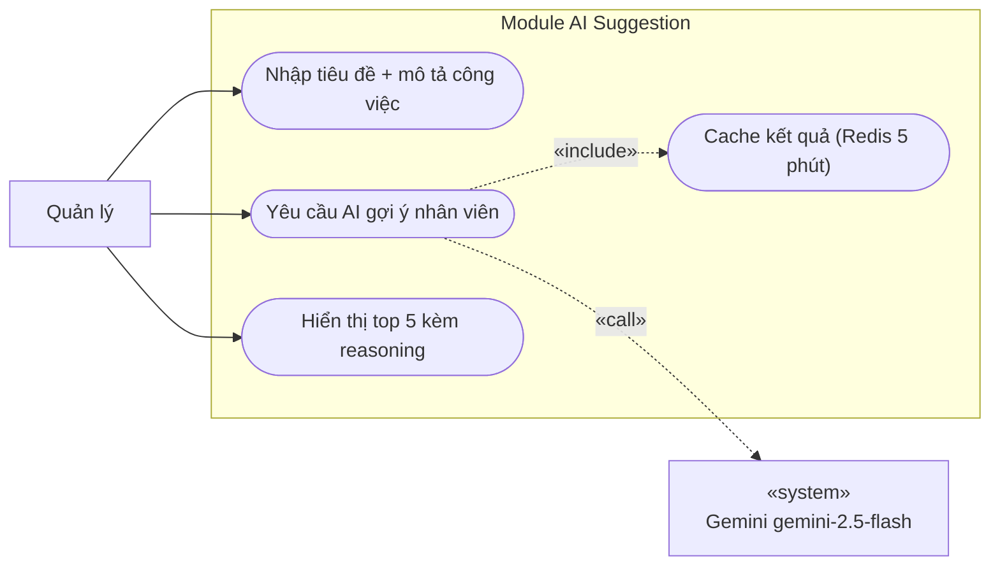
```mermaid
flowchart LR
  Mgr["Quản lý"]
  AI["«system»<br/>Gemini gemini-2.5-flash"]
  subgraph SYS["Module AI Suggestion"]
    UC_Input(["Nhập tiêu đề + mô tả công việc"])
    UC_Req(["Yêu cầu AI gợi ý nhân viên"])
    UC_Show(["Hiển thị top 5 kèm reasoning"])
    UC_Cache(["Cache kết quả (Redis 5 phút)"])
  end
  Mgr --> UC_Input & UC_Req & UC_Show
  UC_Req -. «include» .-> UC_Cache
  UC_Req -. «call» .-> AI
```

---

## 2. Class Diagram

### 2.1. Sơ đồ lớp Entity (Domain Model)

6 entity chính: `User`, `Employee`, `Project`, `Task`, `Attendance`, `Suggestion`. `User` 1:0..1 `Employee`. `Employee` quản lý nhiều `Project`, được gán nhiều `Task`, có nhiều bản ghi `Attendance`.

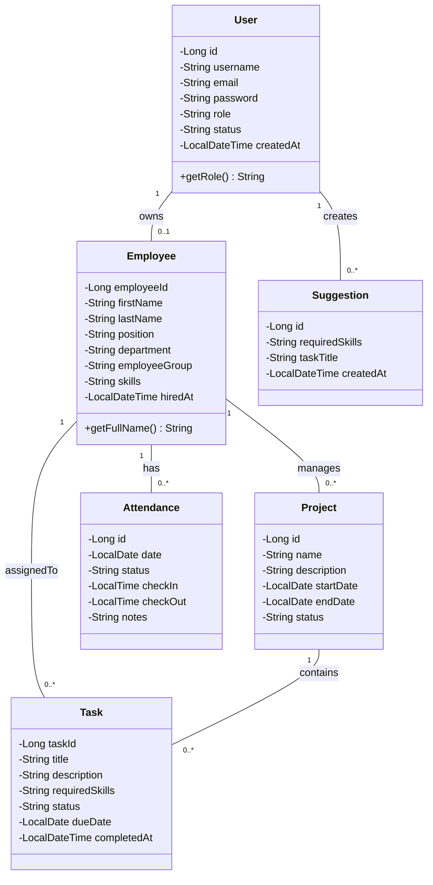
```mermaid
classDiagram
  class User {
    -Long id
    -String username
    -String email
    -String password
    -String role
    -String status
    -LocalDateTime createdAt
    +getRole() String
  }
  class Employee {
    -Long employeeId
    -String firstName
    -String lastName
    -String position
    -String department
    -String employeeGroup
    -String skills
    -LocalDateTime hiredAt
    +getFullName() String
  }
  class Project {
    -Long id
    -String name
    -String description
    -LocalDate startDate
    -LocalDate endDate
    -String status
  }
  class Task {
    -Long taskId
    -String title
    -String description
    -String requiredSkills
    -String status
    -LocalDate dueDate
    -LocalDateTime completedAt
  }
  class Attendance {
    -Long id
    -LocalDate date
    -String status
    -LocalTime checkIn
    -LocalTime checkOut
    -String notes
  }
  class Suggestion {
    -Long id
    -String requiredSkills
    -String taskTitle
    -LocalDateTime createdAt
  }
  User "1" -- "0..1" Employee : owns
  Employee "1" -- "0..*" Task : assignedTo
  Employee "1" -- "0..*" Attendance : has
  Employee "1" -- "0..*" Project : manages
  Project "1" -- "0..*" Task : contains
  User "1" -- "0..*" Suggestion : creates
```

### 2.2. Sơ đồ lớp Kiến trúc (Controller / Service / Repository)

Sơ đồ phân tầng Spring Boot 3 lớp: Controller → Service → Repository, kèm hai thành phần ngoài (`GeminiClient`, `RedisCache`). `AiSuggestionService` là service đặc biệt – truy vấn 3 repository và gọi Gemini.

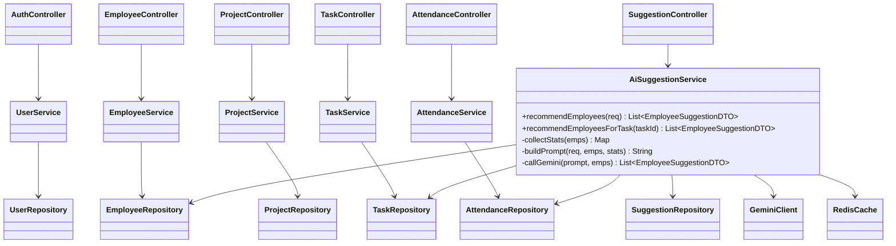
```mermaid
classDiagram
  class AuthController
  class EmployeeController
  class ProjectController
  class TaskController
  class AttendanceController
  class SuggestionController
  class UserService
  class EmployeeService
  class ProjectService
  class TaskService
  class AttendanceService
  class AiSuggestionService {
    +recommendEmployees(req) List~EmployeeSuggestionDTO~
    +recommendEmployeesForTask(taskId) List~EmployeeSuggestionDTO~
    -collectStats(emps) Map
    -buildPrompt(req, emps, stats) String
    -callGemini(prompt, emps) List~EmployeeSuggestionDTO~
  }
  class UserRepository
  class EmployeeRepository
  class ProjectRepository
  class TaskRepository
  class AttendanceRepository
  class SuggestionRepository
  class GeminiClient
  class RedisCache
  AuthController --> UserService
  EmployeeController --> EmployeeService
  ProjectController --> ProjectService
  TaskController --> TaskService
  AttendanceController --> AttendanceService
  SuggestionController --> AiSuggestionService
  UserService --> UserRepository
  EmployeeService --> EmployeeRepository
  ProjectService --> ProjectRepository
  TaskService --> TaskRepository
  AttendanceService --> AttendanceRepository
  AiSuggestionService --> EmployeeRepository
  AiSuggestionService --> TaskRepository
  AiSuggestionService --> AttendanceRepository
  AiSuggestionService --> SuggestionRepository
  AiSuggestionService --> GeminiClient
  AiSuggestionService --> RedisCache
```

### 2.3. Sơ đồ lớp Kiến trúc Frontend (React + i18n song ngữ)

Sơ đồ cấu trúc giao diện React: `App` bọc các Provider (`AuthProvider`, `LanguageProvider`) rồi định tuyến tới các Page. Tầng **i18n** gồm từ điển `translations`, hook `useTranslation` và nút cờ `LanguageSwitcher` — cho phép chuyển ngôn ngữ Việt/Anh tức thì phía client (lưu lựa chọn ở `localStorage`, không dùng dịch vụ dịch ngoài). Mọi Page và component dùng chung đều lấy chuỗi hiển thị qua hàm `t()`.

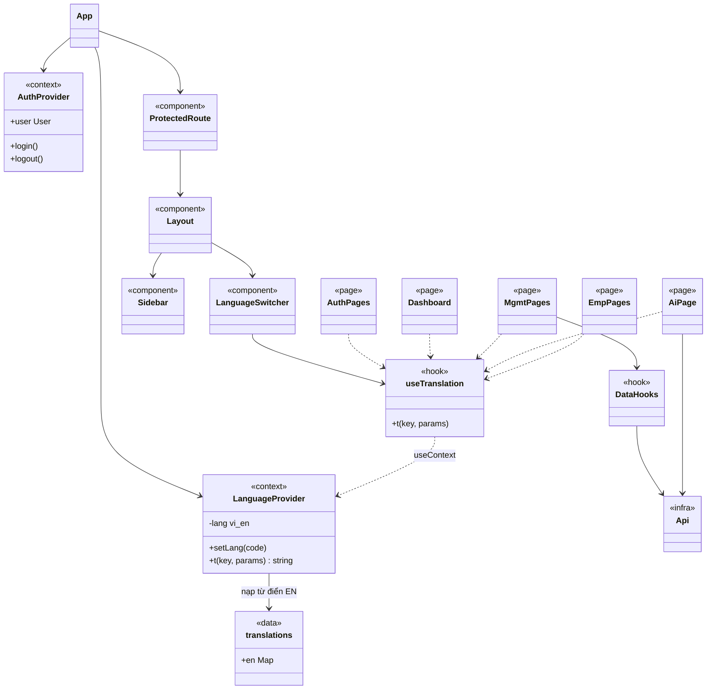
```mermaid
classDiagram
  class App
  class AuthProvider {
    <<context>>
    +user User
    +login()
    +logout()
  }
  class LanguageProvider {
    <<context>>
    -lang vi_en
    +setLang(code)
    +t(key, params) string
  }
  class translations {
    <<data>>
    +en Map
  }
  class useTranslation {
    <<hook>>
    +t(key, params)
  }
  class LanguageSwitcher {
    <<component>>
  }
  class ProtectedRoute {
    <<component>>
  }
  class Layout {
    <<component>>
  }
  class Sidebar {
    <<component>>
  }
  class AuthPages {
    <<page>>
  }
  class Dashboard {
    <<page>>
  }
  class MgmtPages {
    <<page>>
  }
  class AiPage {
    <<page>>
  }
  class EmpPages {
    <<page>>
  }
  class DataHooks {
    <<hook>>
  }
  class Api {
    <<infra>>
  }
  App --> AuthProvider
  App --> LanguageProvider
  App --> ProtectedRoute
  LanguageProvider --> translations : nạp từ điển EN
  useTranslation ..> LanguageProvider : useContext
  LanguageSwitcher --> useTranslation
  ProtectedRoute --> Layout
  Layout --> Sidebar
  Layout --> LanguageSwitcher
  AuthPages ..> useTranslation
  Dashboard ..> useTranslation
  MgmtPages ..> useTranslation
  AiPage ..> useTranslation
  EmpPages ..> useTranslation
  MgmtPages --> DataHooks
  DataHooks --> Api
  AiPage --> Api
```

---

## 3. Sequence Diagram

### 3.1. Đăng nhập (JWT)

Luồng xác thực: Client → AuthController → AuthenticationManager → UserDetailsService → PostgreSQL → BCrypt → JwtTokenProvider. Hai nhánh: 200 OK + token hoặc 401 Unauthorized.

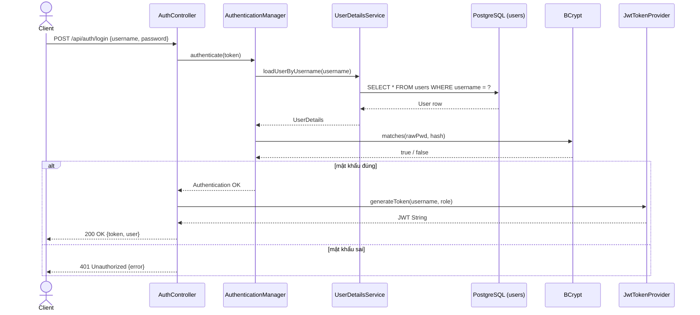
```mermaid
sequenceDiagram
  actor C as Client
  participant AC as AuthController
  participant AM as AuthenticationManager
  participant UDS as UserDetailsService
  participant DB as PostgreSQL (users)
  participant BC as BCrypt
  participant JWT as JwtTokenProvider
  C->>AC: POST /api/auth/login {username, password}
  AC->>AM: authenticate(token)
  AM->>UDS: loadUserByUsername(username)
  UDS->>DB: SELECT * FROM users WHERE username = ?
  DB-->>UDS: User row
  UDS-->>AM: UserDetails
  AM->>BC: matches(rawPwd, hash)
  BC-->>AM: true / false
  alt mật khẩu đúng
    AM-->>AC: Authentication OK
    AC->>JWT: generateToken(username, role)
    JWT-->>AC: JWT String
    AC-->>C: 200 OK {token, user}
  else mật khẩu sai
    AC-->>C: 401 Unauthorized {error}
  end
```

### 3.2. Chấm công Check-in / Check-out

Hai luồng tách rời: Check-in (kiểm tra trùng → INSERT) và Check-out (kiểm tra có bản ghi vào → UPDATE). Mỗi luồng có nhánh lỗi: 409 Conflict (đã chấm rồi) và 404 Not Found (chưa check-in).

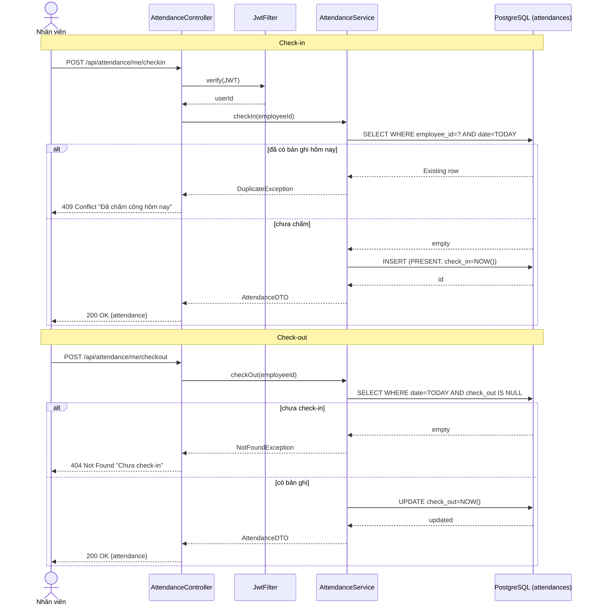
```mermaid
sequenceDiagram
  actor Emp as Nhân viên
  participant AC as AttendanceController
  participant JF as JwtFilter
  participant AS as AttendanceService
  participant DB as PostgreSQL (attendances)
  Note over Emp,DB: Check-in
  Emp->>AC: POST /api/attendance/me/checkin
  AC->>JF: verify(JWT)
  JF-->>AC: userId
  AC->>AS: checkIn(employeeId)
  AS->>DB: SELECT WHERE employee_id=? AND date=TODAY
  alt đã có bản ghi hôm nay
    DB-->>AS: Existing row
    AS-->>AC: DuplicateException
    AC-->>Emp: 409 Conflict "Đã chấm công hôm nay"
  else chưa chấm
    DB-->>AS: empty
    AS->>DB: INSERT (PRESENT, check_in=NOW())
    DB-->>AS: id
    AS-->>AC: AttendanceDTO
    AC-->>Emp: 200 OK {attendance}
  end
  Note over Emp,DB: Check-out
  Emp->>AC: POST /api/attendance/me/checkout
  AC->>AS: checkOut(employeeId)
  AS->>DB: SELECT WHERE date=TODAY AND check_out IS NULL
  alt chưa check-in
    DB-->>AS: empty
    AS-->>AC: NotFoundException
    AC-->>Emp: 404 Not Found "Chưa check-in"
  else có bản ghi
    AS->>DB: UPDATE check_out=NOW()
    DB-->>AS: updated
    AS-->>AC: AttendanceDTO
    AC-->>Emp: 200 OK {attendance}
  end
```

### 3.3. AI Gợi ý Nhân viên

Luồng đầy đủ: cache lookup → MISS → batch query song song (Task + Attendance) → collectStats → buildPrompt → POST Gemini → parse JSON → cache 5m → trả top 5. Nhánh HIT trả ngay từ cache.

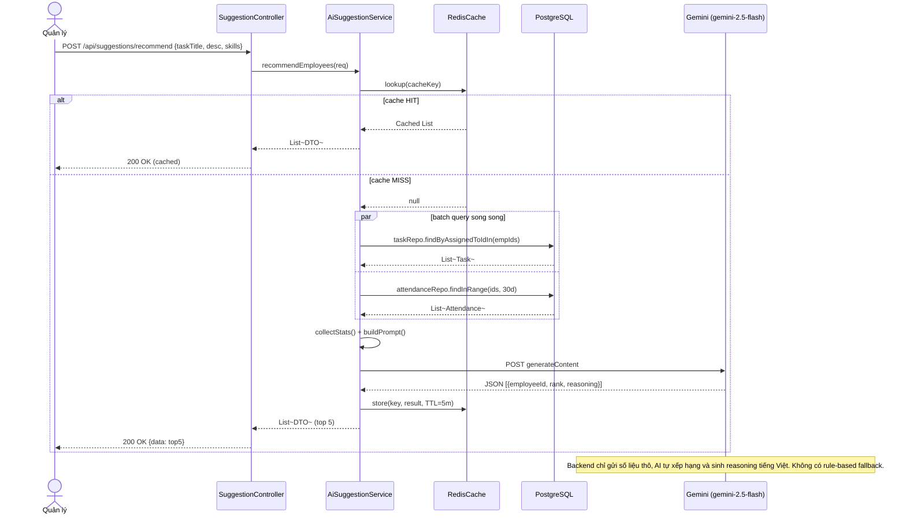
```mermaid
sequenceDiagram
  actor Mgr as Quản lý
  participant SC as SuggestionController
  participant AS as AiSuggestionService
  participant Cache as RedisCache
  participant DB as PostgreSQL
  participant AI as Gemini (gemini-2.5-flash)
  Mgr->>SC: POST /api/suggestions/recommend {taskTitle, desc, skills}
  SC->>AS: recommendEmployees(req)
  AS->>Cache: lookup(cacheKey)
  alt cache HIT
    Cache-->>AS: Cached List
    AS-->>SC: List~DTO~
    SC-->>Mgr: 200 OK (cached)
  else cache MISS
    Cache-->>AS: null
    par batch query song song
      AS->>DB: taskRepo.findByAssignedToIdIn(empIds)
      DB-->>AS: List~Task~
    and
      AS->>DB: attendanceRepo.findInRange(ids, 30d)
      DB-->>AS: List~Attendance~
    end
    AS->>AS: collectStats() + buildPrompt()
    AS->>AI: POST generateContent
    AI-->>AS: JSON [{employeeId, rank, reasoning}]
    AS->>Cache: store(key, result, TTL=5m)
    AS-->>SC: List~DTO~ (top 5)
    SC-->>Mgr: 200 OK {data: top5}
  end
  Note over AI: Backend chỉ gửi số liệu thô, AI tự xếp hạng và sinh reasoning tiếng Việt. Không có rule-based fallback.
```

### 3.4. Tạo công việc và Phân công nhân viên

POST /api/tasks với `@PreAuthorize` cho MANAGER/ADMIN. Service kiểm tra project + employee tồn tại trước khi INSERT. Trả 404 nếu thiếu, 201 nếu thành công.

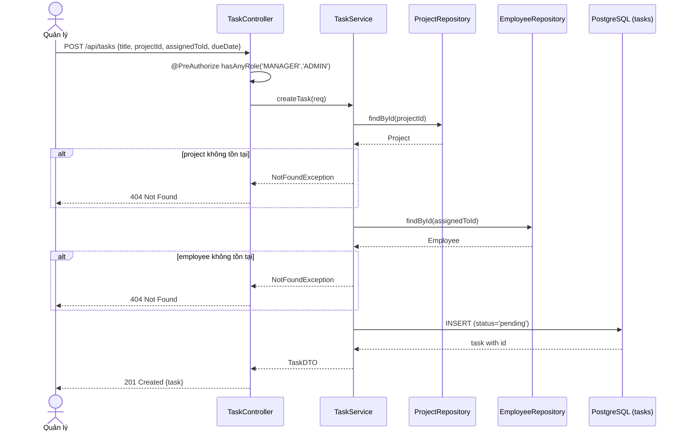
```mermaid
sequenceDiagram
  actor Mgr as Quản lý
  participant TC as TaskController
  participant TS as TaskService
  participant PR as ProjectRepository
  participant ER as EmployeeRepository
  participant DB as PostgreSQL (tasks)
  Mgr->>TC: POST /api/tasks {title, projectId, assignedToId, dueDate}
  TC->>TC: @PreAuthorize hasAnyRole('MANAGER','ADMIN')
  TC->>TS: createTask(req)
  TS->>PR: findById(projectId)
  PR-->>TS: Project
  alt project không tồn tại
    TS-->>TC: NotFoundException
    TC-->>Mgr: 404 Not Found
  end
  TS->>ER: findById(assignedToId)
  ER-->>TS: Employee
  alt employee không tồn tại
    TS-->>TC: NotFoundException
    TC-->>Mgr: 404 Not Found
  end
  TS->>DB: INSERT (status='pending')
  DB-->>TS: task with id
  TS-->>TC: TaskDTO
  TC-->>Mgr: 201 Created {task}
```

---

## 4. Activity Diagram

### 4.1. Đăng nhập

Hai lần kiểm tra: username có tồn tại + BCrypt khớp password. Cả hai nhánh lỗi quay về form, nhánh thành công tạo JWT và chuyển đến `/dashboard`.

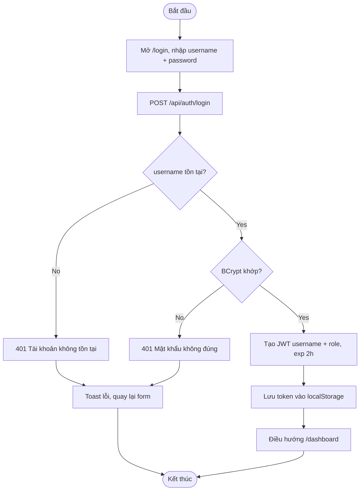
```mermaid
flowchart TD
  A([Bắt đầu]) --> B[Mở /login, nhập username + password]
  B --> C[POST /api/auth/login]
  C --> D{username tồn tại?}
  D -- No --> E[401 Tài khoản không tồn tại]
  D -- Yes --> F{BCrypt khớp?}
  F -- No --> G[401 Mật khẩu không đúng]
  F -- Yes --> H[Tạo JWT username + role, exp 2h]
  H --> I[Lưu token vào localStorage]
  I --> J[Điều hướng /dashboard]
  J --> K([Kết thúc])
  E --> L[Toast lỗi, quay lại form]
  G --> L
  L --> K
```

### 4.2. Đăng ký

Validate form (client-side), sau đó backend kiểm tra trùng username và email. Mật khẩu được mã hoá BCrypt, user mới có role mặc định EMPLOYEE.

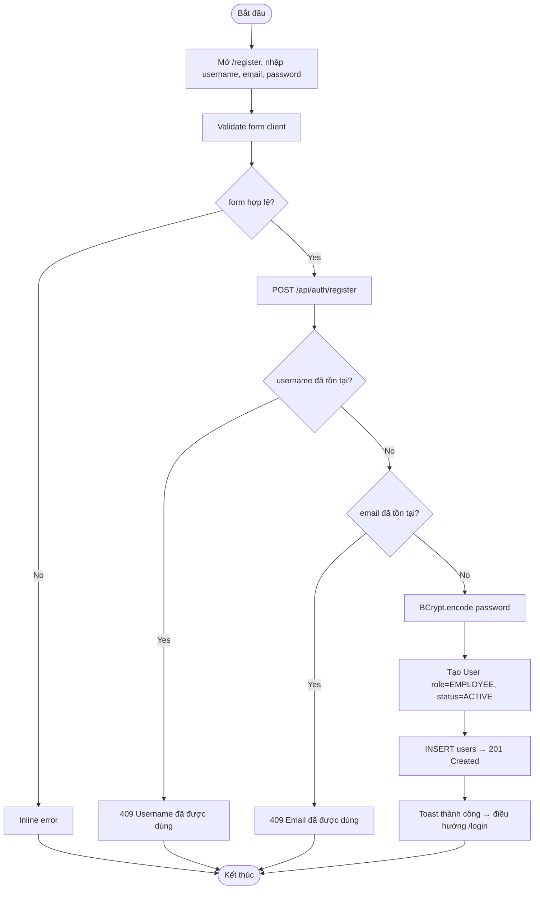
```mermaid
flowchart TD
  A([Bắt đầu]) --> B[Mở /register, nhập username, email, password]
  B --> C[Validate form client]
  C --> D{form hợp lệ?}
  D -- No --> E[Inline error] --> Z([Kết thúc])
  D -- Yes --> F[POST /api/auth/register]
  F --> G{username đã tồn tại?}
  G -- Yes --> H[409 Username đã được dùng] --> Z
  G -- No --> I{email đã tồn tại?}
  I -- Yes --> J[409 Email đã được dùng] --> Z
  I -- No --> K[BCrypt.encode password]
  K --> L[Tạo User role=EMPLOYEE, status=ACTIVE]
  L --> M[INSERT users → 201 Created]
  M --> N[Toast thành công → điều hướng /login] --> Z
```

### 4.3. Quản lý Nhân viên (CRUD)

Bốn nhánh CRUD: Xem chi tiết, Thêm (kèm validate trùng email), Sửa, Xóa (kèm kiểm tra ràng buộc — không cho xóa nếu còn task gán).

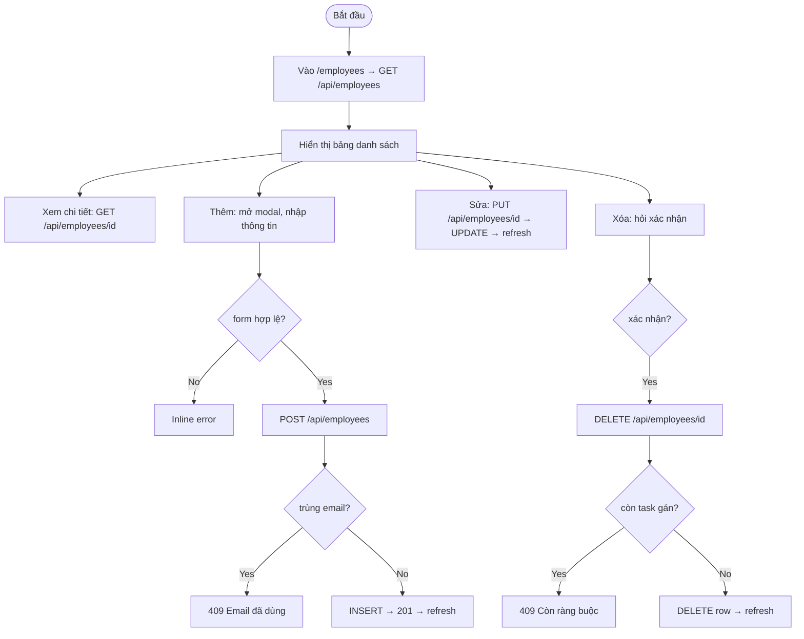
```mermaid
flowchart TD
  A([Bắt đầu]) --> B[Vào /employees → GET /api/employees]
  B --> C[Hiển thị bảng danh sách]
  C --> V[Xem chi tiết: GET /api/employees/id]
  C --> ADD[Thêm: mở modal, nhập thông tin]
  ADD --> ADDV{form hợp lệ?}
  ADDV -- No --> ADDE[Inline error]
  ADDV -- Yes --> POST[POST /api/employees]
  POST --> DUP{trùng email?}
  DUP -- Yes --> DUPE[409 Email đã dùng]
  DUP -- No --> INS[INSERT → 201 → refresh]
  C --> UPD[Sửa: PUT /api/employees/id → UPDATE → refresh]
  C --> DEL[Xóa: hỏi xác nhận]
  DEL --> DELC{xác nhận?}
  DELC -- Yes --> DELR[DELETE /api/employees/id]
  DELR --> DELB{còn task gán?}
  DELB -- Yes --> DELBE[409 Còn ràng buộc]
  DELB -- No --> DELOK[DELETE row → refresh]
```

### 4.4. Chấm công

Backend tự quyết định check-in hay check-out dựa trên bản ghi đã có hôm nay.

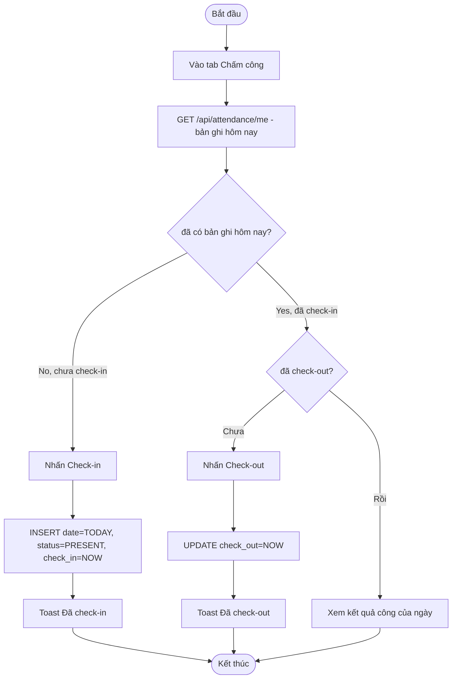
```mermaid
flowchart TD
  A([Bắt đầu]) --> B[Vào tab Chấm công]
  B --> C[GET /api/attendance/me - bản ghi hôm nay]
  C --> D{đã có bản ghi hôm nay?}
  D -- No, chưa check-in --> E[Nhấn Check-in]
  E --> F[INSERT date=TODAY, status=PRESENT, check_in=NOW]
  F --> G[Toast Đã check-in] --> Z([Kết thúc])
  D -- Yes, đã check-in --> H{đã check-out?}
  H -- Chưa --> I[Nhấn Check-out]
  I --> J[UPDATE check_out=NOW]
  J --> K[Toast Đã check-out] --> Z
  H -- Rồi --> L[Xem kết quả công của ngày] --> Z
```

### 4.5. AI Gợi ý Nhân viên

Khối parallel mô tả 3 batch query trên 3 repository. Nhánh cache HIT trả ngay không gọi AI.

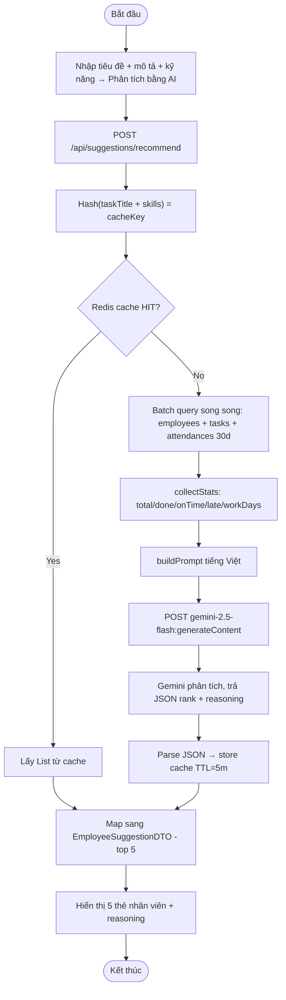
```mermaid
flowchart TD
  A([Bắt đầu]) --> B[Nhập tiêu đề + mô tả + kỹ năng → Phân tích bằng AI]
  B --> C[POST /api/suggestions/recommend]
  C --> D["Hash(taskTitle + skills) = cacheKey"]
  D --> E{Redis cache HIT?}
  E -- Yes --> F[Lấy List từ cache]
  E -- No --> G[Batch query song song: employees + tasks + attendances 30d]
  G --> H[collectStats: total/done/onTime/late/workDays]
  H --> I[buildPrompt tiếng Việt]
  I --> J[POST gemini-2.5-flash:generateContent]
  J --> K[Gemini phân tích, trả JSON rank + reasoning]
  K --> L[Parse JSON → store cache TTL=5m]
  F --> M[Map sang EmployeeSuggestionDTO - top 5]
  L --> M
  M --> N[Hiển thị 5 thẻ nhân viên + reasoning]
  N --> O([Kết thúc])
```

### 4.6. Quản lý Dự án (CRUD)

Tương tự CRUD Nhân viên: tạo / sửa / xóa với ràng buộc "không xóa được nếu còn task thuộc dự án".

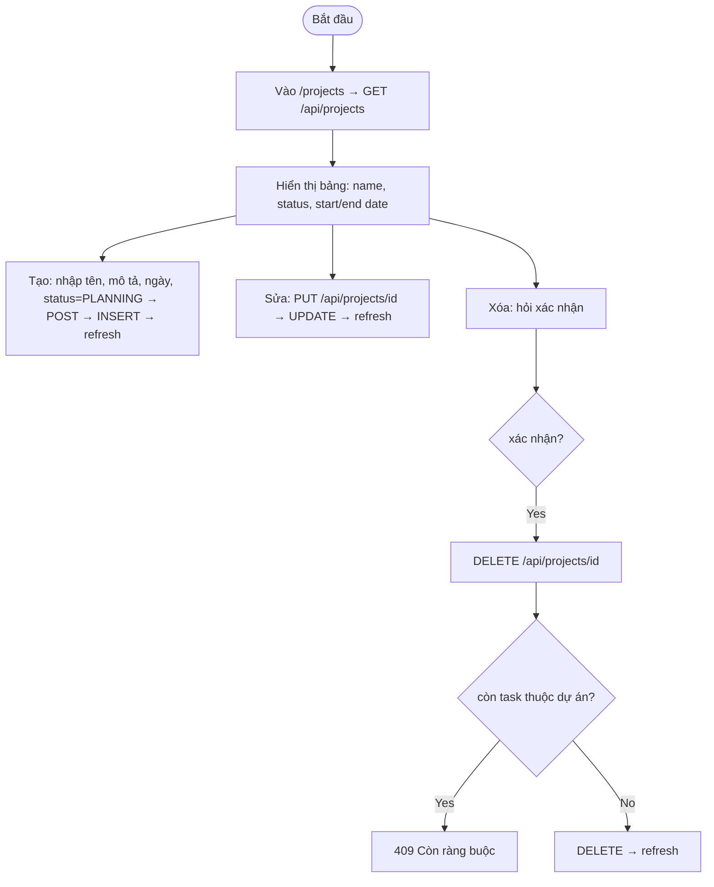
```mermaid
flowchart TD
  A([Bắt đầu]) --> B[Vào /projects → GET /api/projects]
  B --> C[Hiển thị bảng: name, status, start/end date]
  C --> ADD[Tạo: nhập tên, mô tả, ngày, status=PLANNING → POST → INSERT → refresh]
  C --> UPD[Sửa: PUT /api/projects/id → UPDATE → refresh]
  C --> DEL[Xóa: hỏi xác nhận]
  DEL --> DELC{xác nhận?}
  DELC -- Yes --> DELR[DELETE /api/projects/id]
  DELR --> DELB{còn task thuộc dự án?}
  DELB -- Yes --> DELBE[409 Còn ràng buộc]
  DELB -- No --> DELOK[DELETE → refresh]
```

### 4.7. Quản lý Công việc (CRUD + cập nhật trạng thái)

Tạo, sửa, xóa (quyền MANAGER) và cập nhật trạng thái (mọi nhân viên với task của mình). Backend kiểm tra ownership, set `completed_at = NOW()` khi trạng thái chuyển sang completed.

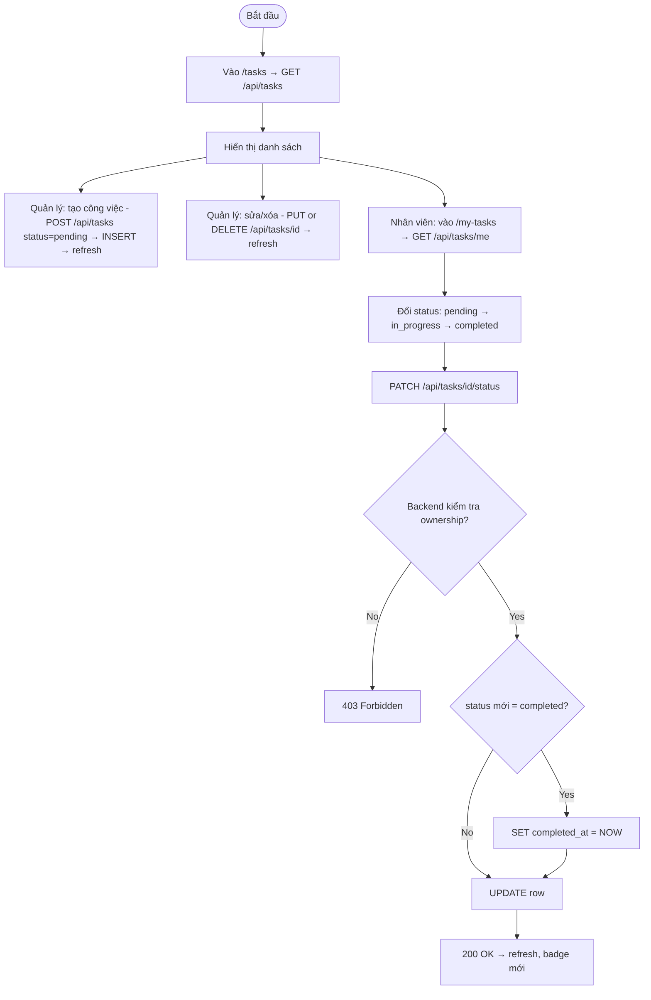
```mermaid
flowchart TD
  A([Bắt đầu]) --> B[Vào /tasks → GET /api/tasks]
  B --> C[Hiển thị danh sách]
  C --> MGR1[Quản lý: tạo công việc - POST /api/tasks status=pending → INSERT → refresh]
  C --> MGR2[Quản lý: sửa/xóa - PUT or DELETE /api/tasks/id → refresh]
  C --> EMP[Nhân viên: vào /my-tasks → GET /api/tasks/me]
  EMP --> CH[Đổi status: pending → in_progress → completed]
  CH --> PA[PATCH /api/tasks/id/status]
  PA --> OWN{Backend kiểm tra ownership?}
  OWN -- No --> F403[403 Forbidden]
  OWN -- Yes --> DONE{status mới = completed?}
  DONE -- Yes --> CA[SET completed_at = NOW]
  DONE -- No --> UPD[UPDATE row]
  CA --> UPD
  UPD --> OK[200 OK → refresh, badge mới]
```

---

## 5. Kiến trúc tổng thể

Sơ đồ mô tả 3 tier (Client / Application / Data) và các kết nối: Web/Mobile → Spring Boot (JWT) → PostgreSQL + Redis + Gemini. Web App hỗ trợ giao diện song ngữ Việt/Anh (i18n) ngay tại tầng Client. Tất cả container chạy chung Docker network `taskmgmt_net`.

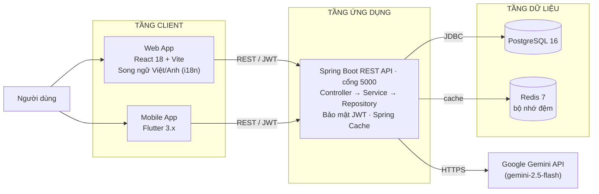
```mermaid
flowchart LR
  User["Người dùng"]
  subgraph CLIENT["TẦNG CLIENT"]
    Web["Web App<br/>React 18 + Vite<br/>Song ngữ Việt/Anh (i18n)"]
    Mobile["Mobile App<br/>Flutter 3.x"]
  end
  subgraph APP["TẦNG ỨNG DỤNG"]
    Backend["Spring Boot REST API · cổng 5000<br/>Controller → Service → Repository<br/>Bảo mật JWT · Spring Cache"]
  end
  subgraph DATA["TẦNG DỮ LIỆU"]
    PG[("PostgreSQL 16")]
    Redis[("Redis 7<br/>bộ nhớ đệm")]
  end
  Gemini["Google Gemini API<br/>(gemini-2.5-flash)"]
  User --> Web & Mobile
  Web -->|REST / JWT| Backend
  Mobile -->|REST / JWT| Backend
  Backend -->|JDBC| PG
  Backend -->|cache| Redis
  Backend -->|HTTPS| Gemini
```
