# 📊 Sơ đồ UML — Hệ thống Quản lý Công việc

Tài liệu này chứa các sơ đồ Use Case, Class Diagram, Sequence và Activity mô tả kiến trúc và luồng hoạt động chính của hệ thống. Tất cả sơ đồ được vẽ bằng SVG thuần tiếng Việt, phù hợp để đưa vào báo cáo đồ án.

---

## 1. Sơ đồ Use Case

### 1.1. Use Case — Xác thực

Mô tả các chức năng xác thực của hệ thống: đăng ký tài khoản, đăng nhập và đăng xuất. Hệ thống sử dụng JWT Token để xác thực phiên làm việc, token có hiệu lực 24 giờ.

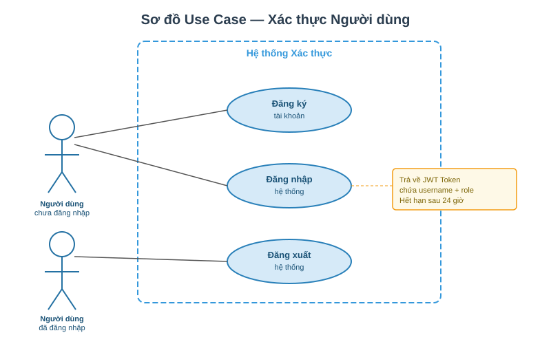

---

### 1.2. Use Case — Quản lý Chấm công

Mô tả luồng chấm công của nhân viên: chấm công vào (check-in), chấm công ra (check-out), xem lịch sử và báo cáo. Quản lý có thêm quyền xem báo cáo tổng hợp. Mỗi nhân viên chỉ được chấm công một lần mỗi ngày.

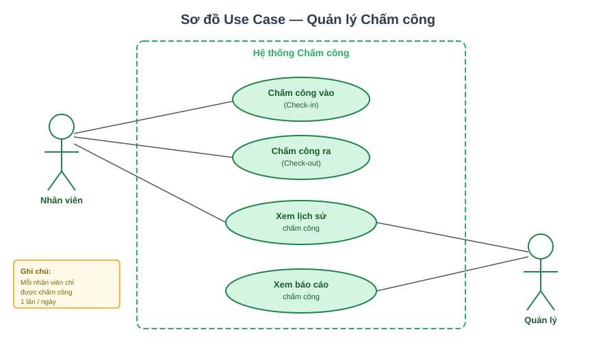

---

### 1.3. Use Case — Quản lý Dự án & Công việc

Mô tả đầy đủ các chức năng CRUD dự án và công việc. Quản lý có toàn quyền tạo/sửa/xóa dự án và công việc, đồng thời phân công nhân viên. Nhân viên có thể xem và cập nhật tiến độ công việc được giao.

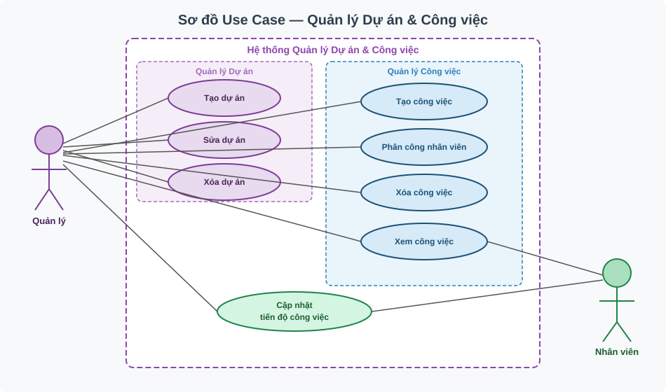

---

### 1.4. Use Case — AI Gợi ý Nhân viên

Mô tả quy trình AI gợi ý nhân viên phù hợp. Backend thu thập dữ liệu thô của 3 tiêu chí (tiến độ task trước, thời gian hoàn thành, chấm công) rồi giao cho OpenAI GPT tự xếp hạng. Không còn rule-based fallback — không có API key thì trả 422.

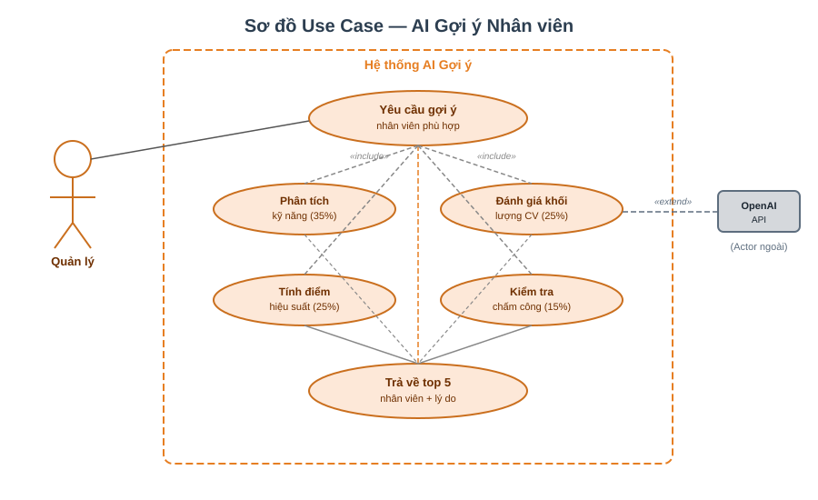

---

## 2. Sơ đồ lớp — Class Diagram

### 2.1. Sơ đồ lớp thực thể (Entity)

Mô tả 6 thực thể chính của hệ thống và mối quan hệ giữa chúng. `NhanVien` liên kết với `NguoiDung` (ManyToOne), `CongViec` thuộc về `DuAn` và được phân công cho `NhanVien`. `ChamCong` gắn với `NhanVien`. `GoiY` thuộc về `NguoiDung`.

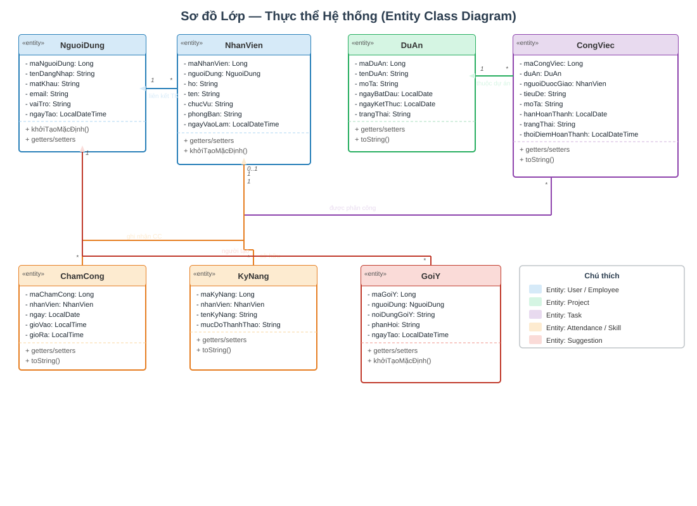

---

### 2.2. Sơ đồ lớp kiến trúc (Controller — Service — Repository)

Mô tả kiến trúc phân tầng của ứng dụng Spring Boot: Controller nhận request HTTP và xác thực JWT, Service xử lý nghiệp vụ, Repository truy vấn database thông qua JPA, Entity ánh xạ bảng MySQL. `AiSuggestionService` là service đặc biệt truy vấn nhiều repository.

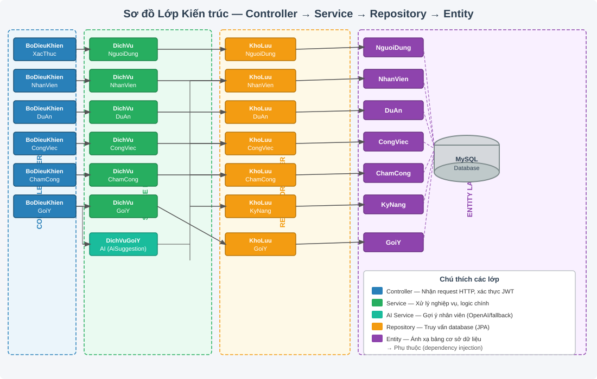

---

## 3. Sơ đồ tuần tự — Sequence Diagram

### 3.1. Đăng nhập

Mô tả luồng xác thực JWT đầy đủ: từ Client → AuthController → AuthenticationManager → UserDetailsService → Database → BCrypt comparison → JWT generation. Phân nhánh rõ ràng: thành công (200 OK + token) hoặc thất bại (401 Unauthorized).

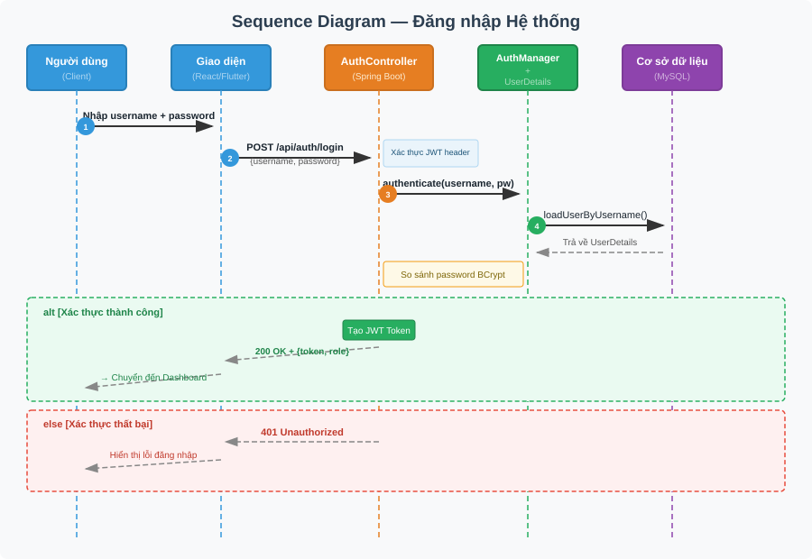

---

### 3.2. Chấm công

Mô tả luồng check-in và check-out: xác thực JWT, kiểm tra trùng lặp (đã chấm công hôm nay chưa), lưu bản ghi với timestamp. Check-out cập nhật giờ ra. Có xử lý lỗi cho từng trường hợp.

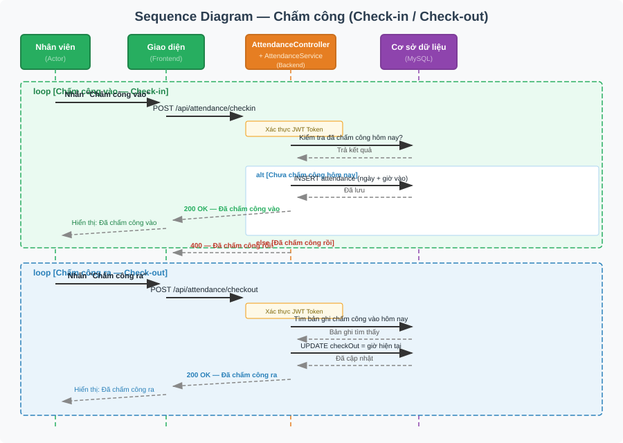

---

### 3.3. AI Gợi ý Nhân viên

Mô tả luồng AI gợi ý dựa trên code thực tế của `AiSuggestionService`: 2 batch query song song (Task, Attendance), tổng hợp raw stats (tổng/hoàn thành/đang xử lý/đúng hạn/trễ ngày, ngày làm việc 30 ngày), build prompt tiếng Việt rồi gọi OpenAI Chat Completions. AI tự xếp hạng top 5 + reasoning. Không có API key → throw `BusinessException` (HTTP 422).

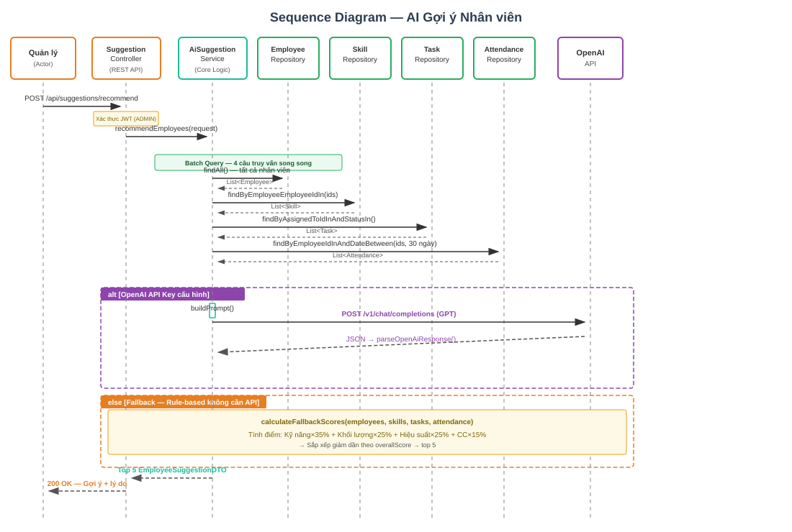

---

### 3.4. Quản lý Công việc (Tạo + Phân công)

Mô tả luồng tạo công việc mới (POST /api/tasks, status = PENDING) và phân công nhân viên (PUT /api/tasks/{id}, cập nhật assigned_to). Cả hai luồng yêu cầu role MANAGER hoặc ADMIN. Nhân viên chỉ được PATCH /api/tasks/{id}/status cho task của chính mình.

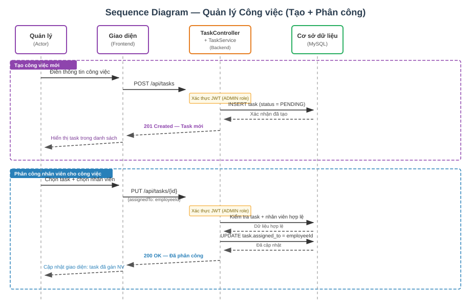

---

## 4. Sơ đồ hoạt động — Activity Diagram

### 4.1. Đăng nhập

Mô tả luồng đăng nhập với 2 lần kiểm tra: username có tồn tại không, sau đó password có khớp BCrypt không. Cả hai nhánh lỗi đều quay về form nhập liệu. Thành công thì tạo JWT và chuyển đến Dashboard.

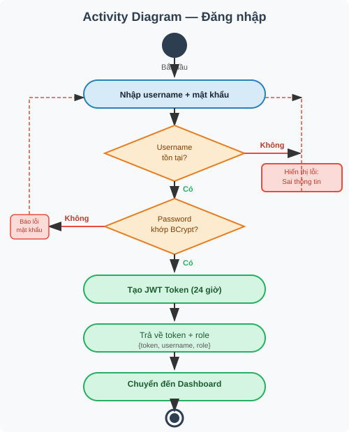

---

### 4.2. Đăng ký

Mô tả luồng đăng ký với 2 lần kiểm tra trùng: username và email. Nếu hợp lệ, mã hóa mật khẩu bằng BCrypt, tạo User với role = EMPLOYEE (mặc định), lưu vào database.

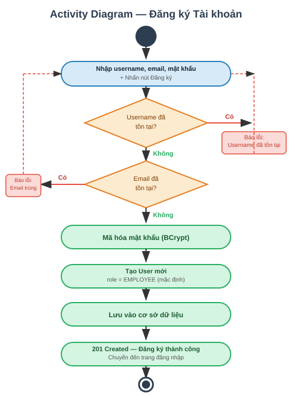

---

### 4.3. Quản lý Nhân viên

Mô tả 4 thao tác CRUD nhân viên: Xem danh sách (GET), Thêm mới (POST với validation), Sửa (PUT), Xóa (DELETE). Tất cả thao tác đều trở về màn hình danh sách nhân viên sau khi hoàn tất.

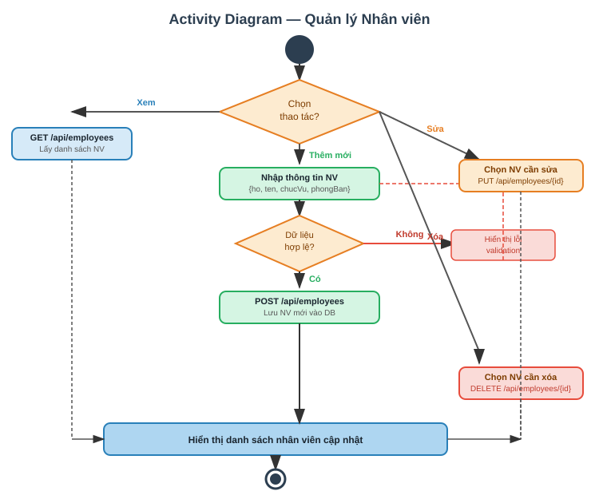

---

### 4.4. Chấm công

Mô tả 3 luồng: Chấm công vào (kiểm tra trùng → tạo bản ghi mới), Chấm công ra (kiểm tra có bản ghi vào → cập nhật giờ ra), Xem lịch sử (GET danh sách). Mỗi luồng có xử lý lỗi riêng.

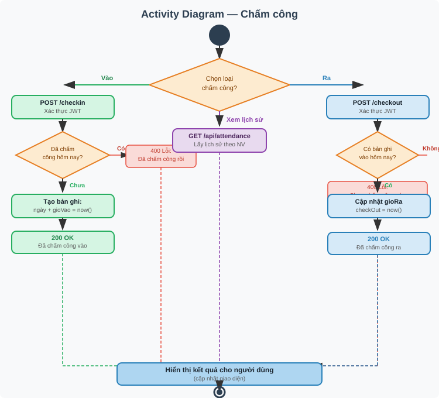

---

### 4.5. AI Gợi ý Nhân viên

Mô tả luồng AI đầy đủ: nhập tiêu đề + mô tả task → batch query Task & Attendance → tổng hợp raw stats (tiến độ / thời gian hoàn thành / chấm công) → build prompt tiếng Việt → gọi OpenAI → parse JSON response → trả top 5 với rank + reasoning. Backend KHÔNG tự tính điểm.

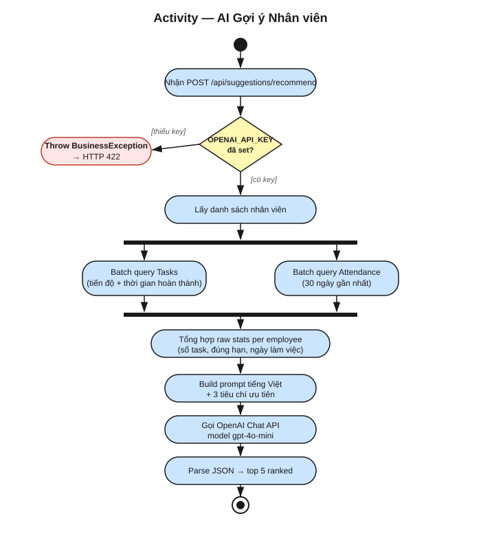

---

### 4.6. Quản lý Dự án

Mô tả 4 thao tác CRUD dự án: Xem danh sách, Tạo mới (với ngày bắt đầu/kết thúc, status = ongoing), Cập nhật, Xóa. Tất cả đều trả về danh sách dự án sau khi thực hiện.

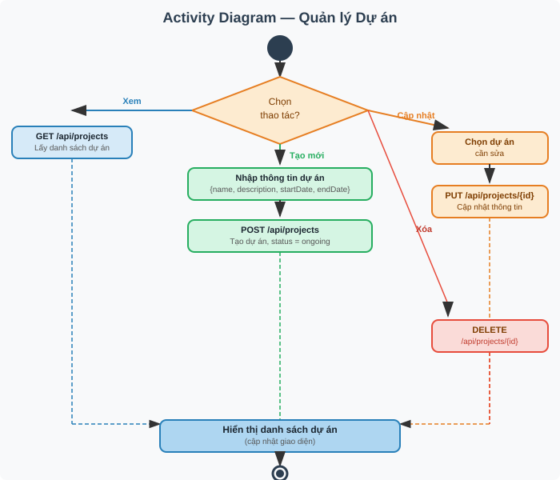

---

### 4.7. Quản lý Công việc

Mô tả 5 thao tác: Xem, Tạo mới (status = PENDING), Phân công nhân viên, Cập nhật trạng thái (nếu COMPLETED thì set completedAt = now()), Xóa. Trường `completedAt` được dùng bởi AI để tính hiệu suất.

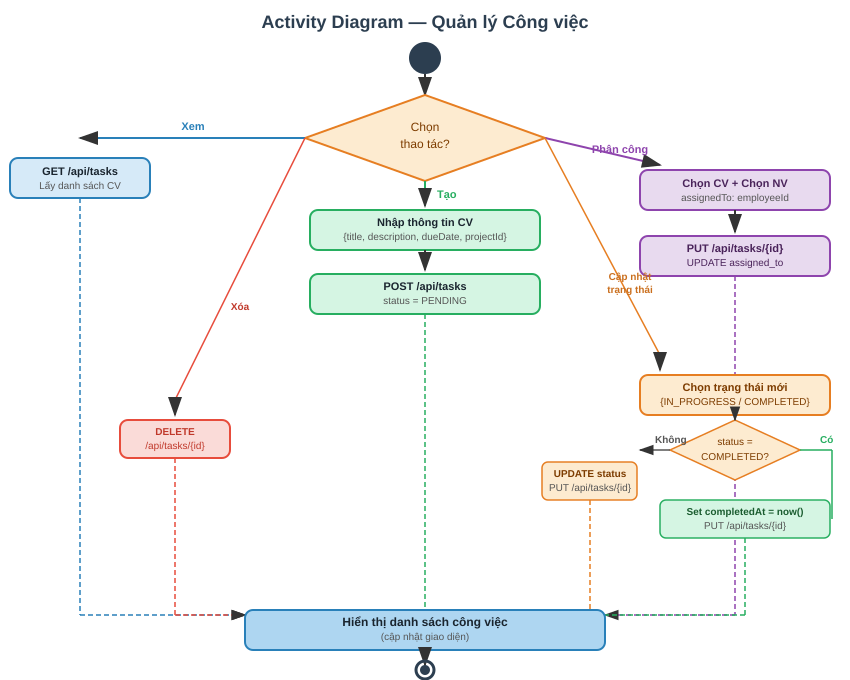
