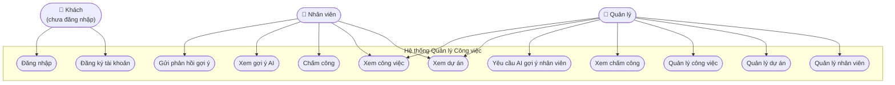
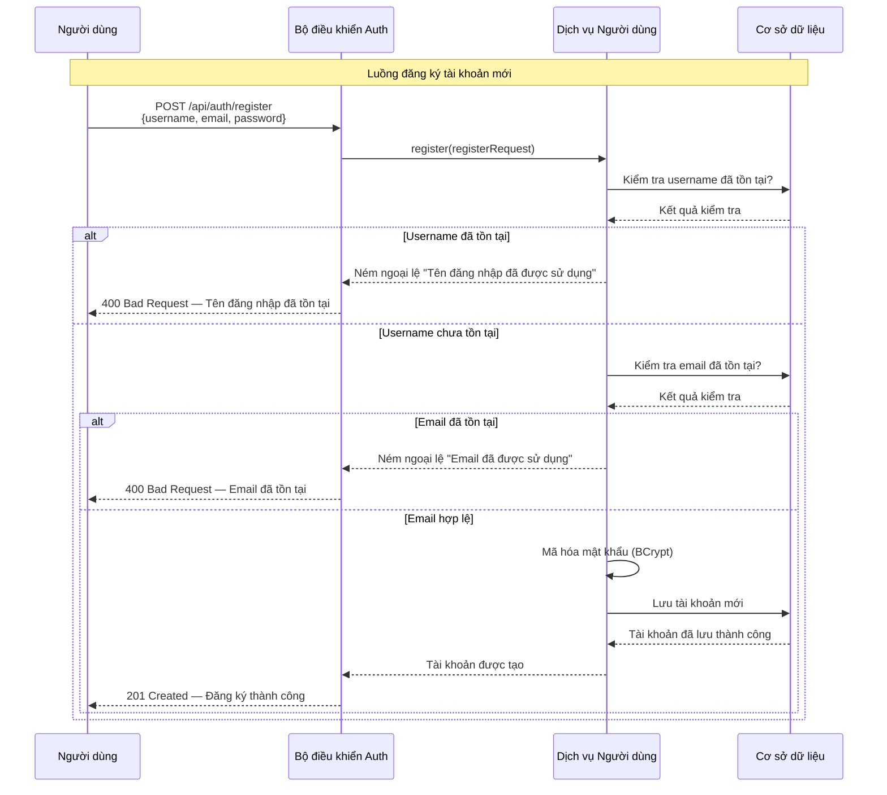
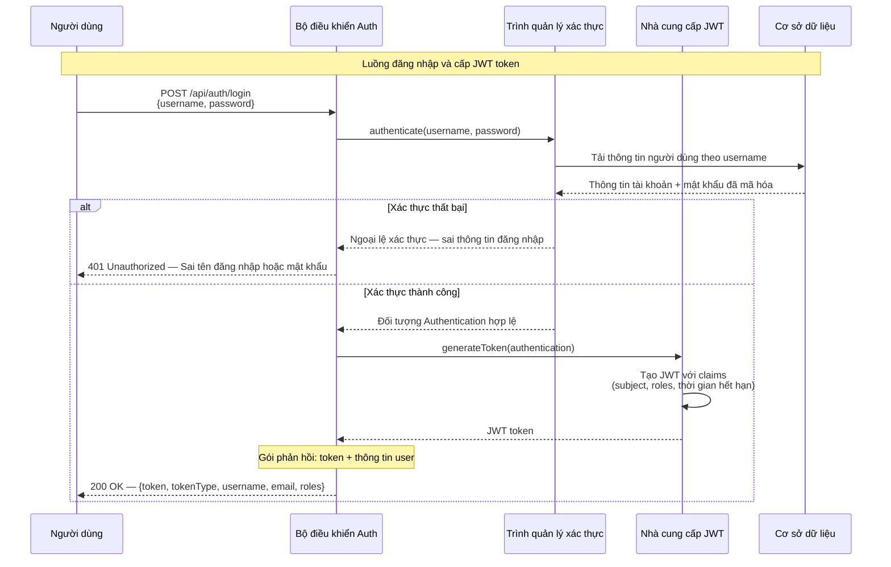
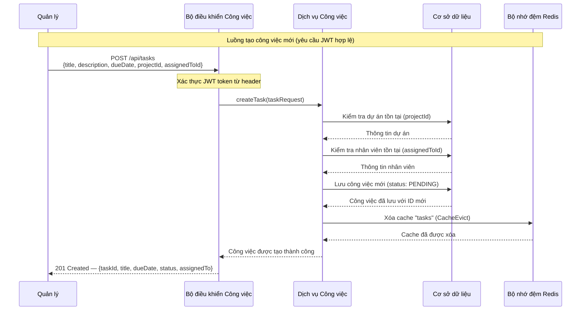
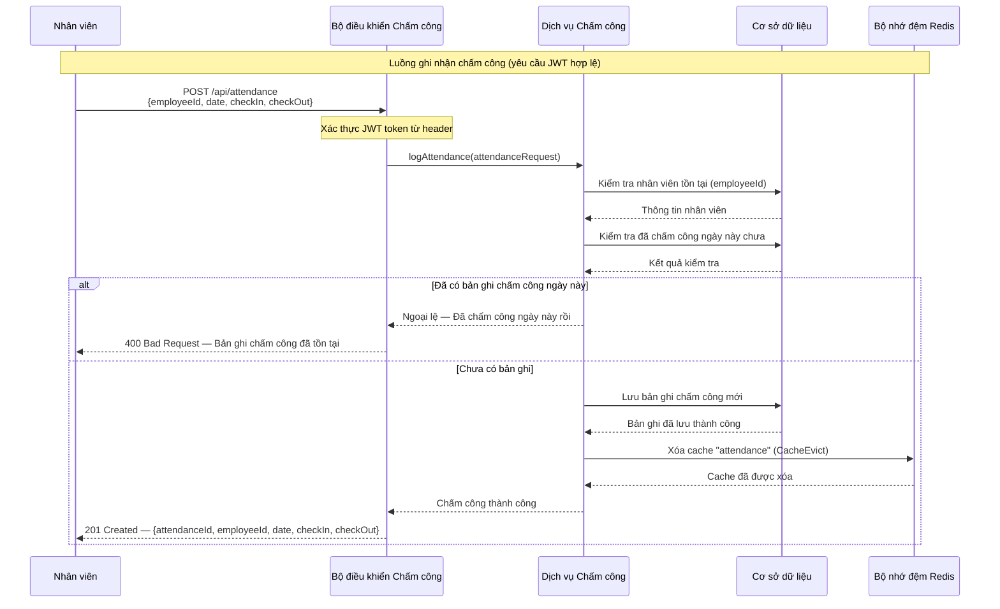
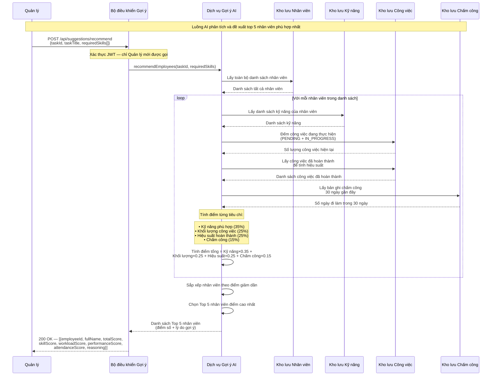
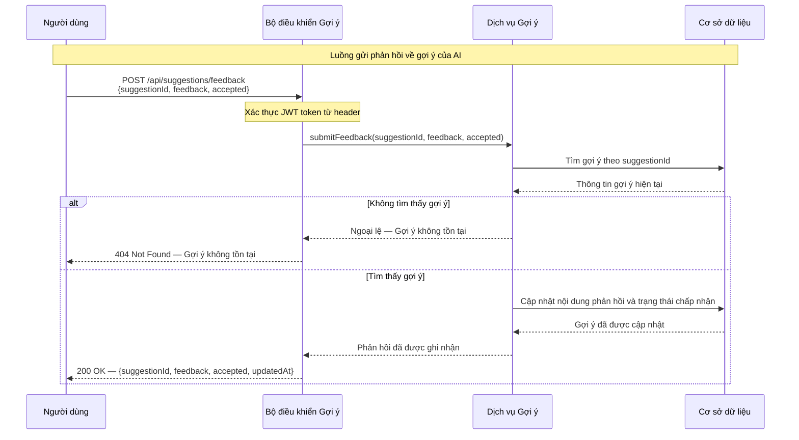

# Tài liệu UML — Hệ thống Quản lý Công việc

## Mục lục

- [Mục đích tài liệu](#mục-đích-tài-liệu)
- [1. Sơ đồ Use Case](#1-sơ-đồ-use-case)
- [2. Bảng tóm tắt Use Case](#2-bảng-tóm-tắt-use-case)
- [3. Các Sequence Diagram](#3-các-sequence-diagram)
  - [3.1 Đăng ký tài khoản](#31-đăng-ký-tài-khoản)
  - [3.2 Đăng nhập và cấp JWT](#32-đăng-nhập-và-cấp-jwt)
  - [3.3 Tạo công việc mới](#33-tạo-công-việc-mới)
  - [3.4 Chấm công](#34-chấm-công)
  - [3.5 AI gợi ý nhân viên phù hợp](#35-ai-gợi-ý-nhân-viên-phù-hợp)
  - [3.6 Gửi phản hồi gợi ý](#36-gửi-phản-hồi-gợi-ý)
- [4. Giải thích thuật toán AI Gợi ý Nhân viên](#4-giải-thích-thuật-toán-ai-gợi-ý-nhân-viên)

---

## Mục đích tài liệu

Tài liệu này mô tả kiến trúc và các luồng hoạt động chính của **Hệ thống Quản lý Công việc cho Doanh nghiệp Nhỏ Đa ngành** thông qua các sơ đồ UML được vẽ bằng cú pháp Mermaid (GitHub render trực tiếp).

### Chức năng chính của hệ thống

| Chức năng | Mô tả |
|-----------|-------|
| Quản lý chấm công | Ghi nhận và báo cáo giờ vào/ra của nhân viên |
| Quản lý dự án | Tạo, phân công và theo dõi tiến độ dự án |
| Quản lý công việc | Theo dõi trạng thái, tiến độ và thời hạn hoàn thành |
| Gợi ý nhân viên bằng AI | AI đề xuất nhân viên phù hợp nhất cho từng công việc dựa trên kỹ năng, khối lượng và hiệu suất |

### Công nghệ sử dụng

- **Backend:** Java 25, Spring Boot 3.5.0, Maven
- **Cơ sở dữ liệu:** PostgreSQL
- **Xác thực:** Spring Security + JWT
- **Bộ nhớ đệm:** Redis
- **Frontend:** React 18, Vite, Tailwind CSS, Redux Toolkit
- **Mobile:** Flutter 3.x

---

## 1. Sơ đồ Use Case



---

## 2. Bảng tóm tắt Use Case

| Mã UC | Tên Use Case | Actor | Mô tả ngắn |
|-------|-------------|-------|------------|
| UC01 | Đăng ký tài khoản | Khách | Khách tạo tài khoản mới với tên đăng nhập, email và mật khẩu |
| UC02 | Đăng nhập | Khách | Khách xác thực danh tính và nhận JWT token |
| UC03 | Xem dự án | Nhân viên, Quản lý | Xem danh sách và chi tiết các dự án đang hoạt động |
| UC04 | Xem công việc | Nhân viên, Quản lý | Xem danh sách công việc được giao và trạng thái tiến độ |
| UC05 | Chấm công | Nhân viên | Nhân viên ghi nhận giờ vào/ra làm việc |
| UC06 | Xem gợi ý AI | Nhân viên | Xem danh sách gợi ý nhân viên phù hợp do AI đề xuất |
| UC07 | Gửi phản hồi gợi ý | Nhân viên | Gửi phản hồi (đồng ý/không đồng ý) về gợi ý của AI |
| UC08 | Quản lý nhân viên | Quản lý | Thêm, xem, sửa, xóa thông tin nhân viên (CRUD) |
| UC09 | Quản lý dự án | Quản lý | Thêm, xem, sửa, xóa dự án (CRUD) |
| UC10 | Quản lý công việc | Quản lý | Thêm, xem, sửa, xóa công việc; phân công cho nhân viên (CRUD) |
| UC11 | Xem chấm công | Quản lý | Xem lịch sử chấm công của tất cả nhân viên |
| UC12 | Yêu cầu AI gợi ý nhân viên | Quản lý | Gửi yêu cầu để AI phân tích và đề xuất top 5 nhân viên phù hợp nhất |

---

## 3. Các Sequence Diagram

### 3.1 Đăng ký tài khoản



### 3.2 Đăng nhập và cấp JWT



### 3.3 Tạo công việc mới



### 3.4 Chấm công



### 3.5 AI gợi ý nhân viên phù hợp



### 3.6 Gửi phản hồi gợi ý



---

## 4. Giải thích thuật toán AI Gợi ý Nhân viên

### 4.1 Tổng quan

`AiSuggestionService` tự động phân tích và đề xuất **top 5 nhân viên phù hợp nhất** cho một công việc cụ thể. Thuật toán tính điểm tổng hợp từ 4 tiêu chí dựa trên dữ liệu thực tế trong hệ thống.

### 4.2 Công thức tính điểm

```
Điểm tổng = (Điểm kỹ năng × 0.35)
           + (Điểm khối lượng × 0.25)
           + (Điểm hiệu suất × 0.25)
           + (Điểm chấm công × 0.15)
```

### 4.3 Chi tiết 4 tiêu chí

| Tiêu chí | Trọng số | Cách tính | Ý nghĩa |
|----------|----------|-----------|---------|
| **Kỹ năng phù hợp** | 35% | `Số kỹ năng trùng khớp / Tổng số kỹ năng yêu cầu` | Nhân viên có kỹ năng phù hợp với công việc |
| **Khối lượng công việc** | 25% | `1 - (Số task đang làm / 5)` (tối thiểu 0) | Nhân viên ít việc hơn = điểm cao hơn |
| **Hiệu suất** | 25% | `Số task hoàn thành đúng hạn / Tổng task đã hoàn thành` | Tỷ lệ hoàn thành công việc đúng thời hạn |
| **Chấm công** | 15% | `Số ngày đi làm trong 30 ngày gần đây / 22` (tối đa 1.0) | Mức độ chuyên cần và đáng tin cậy |

### 4.4 Ví dụ minh họa

**Tình huống:** Quản lý cần gợi ý nhân viên cho công việc *"Xây dựng giao diện Dashboard"* với kỹ năng yêu cầu: `[React, JavaScript, CSS]`

| Nhân viên | Kỹ năng khớp | Điểm KN (×0.35) | Task đang làm | Điểm KL (×0.25) | Hoàn thành đúng hạn | Điểm HP (×0.25) | Ngày đi làm/30 | Điểm CC (×0.15) | **Điểm tổng** |
|-----------|-------------|-----------------|--------------|-----------------|---------------------|-----------------|----------------|-----------------|--------------|
| Nguyễn Văn A | React, JS, CSS (3/3) | 1.00 × 0.35 = **0.350** | 1 task | 0.80 × 0.25 = **0.200** | 8/10 | 0.80 × 0.25 = **0.200** | 20 ngày | 0.91 × 0.15 = **0.136** | **0.886** |
| Trần Thị B | React, JS (2/3) | 0.67 × 0.35 = **0.233** | 2 task | 0.60 × 0.25 = **0.150** | 9/10 | 0.90 × 0.25 = **0.225** | 22 ngày | 1.00 × 0.15 = **0.150** | **0.758** |
| Lê Văn C | JS, CSS (2/3) | 0.67 × 0.35 = **0.233** | 3 task | 0.40 × 0.25 = **0.100** | 5/10 | 0.50 × 0.25 = **0.125** | 18 ngày | 0.82 × 0.15 = **0.123** | **0.581** |

→ **Kết quả:** AI đề xuất Nguyễn Văn A (0.886 điểm) là ứng viên phù hợp nhất.

### 4.5 Kết quả trả về

```json
[
  {
    "employeeId": 1,
    "fullName": "Nguyễn Văn A",
    "totalScore": 0.886,
    "skillScore": 0.350,
    "workloadScore": 0.200,
    "performanceScore": 0.200,
    "attendanceScore": 0.136,
    "reasoning": "Kỹ năng phù hợp 100%; Đang có 1 task đang thực hiện; Tỷ lệ hoàn thành đúng hạn 80%; Đi làm 20/30 ngày gần đây"
  }
]
```
