__BỘ GIÁO DỤC VÀ ĐÀO TẠO__

__TRƯỜNG ĐẠI HỌC CÔNG NGHỆ TP\. HỒ CHÍ MINH__

__KHOA CÔNG NGHỆ THÔNG TIN__

──────────────────────────────────────────────────

__ĐỒ ÁN MÔN HỌC:__

__ĐỒ ÁN CƠ SỞ__

__TÊN ĐỀ TÀI:__

__HỆ THỐNG QUẢN LÝ CÔNG VIỆC__

__CHO DOANH NGHIỆP NHỎ ĐA NGÀNH TÍCH HỢP AI__

__Ngành:                      CÔNG NGHỆ THÔNG TIN__

__Chuyên ngành:              CÔNG NGHỆ THÔNG TIN__

__Lớp:                        23DTHC1__

__Giảng viên hướng dẫn:       ThS\. DƯƠNG THÀNH PHẾT__

__Sinh viên thực hiện:        NGUYỄN NHẬT HẢO__

__Mã số sinh viên:            2380612688__

__*TP\. Hồ Chí Minh, tháng 5 năm 2026*__

__BỘ GIÁO DỤC VÀ ĐÀO TẠO__

__TRƯỜNG ĐẠI HỌC CÔNG NGHỆ TP\. HỒ CHÍ MINH__

__KHOA CÔNG NGHỆ THÔNG TIN__

──────────────────────────────────────────────────

__ĐỒ ÁN MÔN HỌC:__

__ĐỒ ÁN CƠ SỞ__

__TÊN ĐỀ TÀI:__

__HỆ THỐNG QUẢN LÝ CÔNG VIỆC__

__CHO DOANH NGHIỆP NHỎ ĐA NGÀNH TÍCH HỢP AI__

__Ngành:                      CÔNG NGHỆ THÔNG TIN__

__Chuyên ngành:              CÔNG NGHỆ THÔNG TIN__

__Lớp:                        23DTHC1__

__Giảng viên hướng dẫn:       ThS\. DƯƠNG THÀNH PHẾT__

__Sinh viên thực hiện:        NGUYỄN NHẬT HẢO__

__Mã số sinh viên:            2380612688__

__*TP\. Hồ Chí Minh, tháng 5 năm 2026*__

# LỜI CẢM ƠN

Lời đầu tiên, em xin gửi lời cảm ơn chân thành và sâu sắc nhất đến ThS\. Dương Thành Phết – giảng viên hướng dẫn đồ án môn Đồ án cơ sở\. Trong suốt quá trình thực hiện đề tài, thầy đã tận tình hướng dẫn, định hướng giải pháp, giải đáp thắc mắc, cung cấp tài liệu tham khảo có giá trị và đưa ra những góp ý sắc bén giúp em hoàn thành đồ án một cách tốt nhất\. Sự hướng dẫn tận tâm, kiên nhẫn của thầy là nguồn động lực lớn giúp em vượt qua những khó khăn trong quá trình nghiên cứu và triển khai hệ thống\.

Em xin gửi lời cảm ơn đến Ban Giám hiệu Trường Đại học Công nghệ TP\.HCM và Khoa Công nghệ Thông tin đã tạo điều kiện thuận lợi, cung cấp cơ sở vật chất, phòng thực hành, thư viện và môi trường học tập hiện đại trong suốt quá trình học tập tại trường\. Chương trình đào tạo bài bản và các môn học chuyên ngành của Khoa đã trang bị cho em nền tảng kiến thức vững chắc để thực hiện đề tài này\.

Em cũng xin gửi lời cảm ơn đến toàn thể quý thầy cô trong Khoa Công nghệ Thông tin đã truyền đạt kiến thức trong suốt những năm học vừa qua\. Những kiến thức về Lập trình hướng đối tượng, Cấu trúc dữ liệu và giải thuật, Cơ sở dữ liệu, Mạng máy tính, Kỹ thuật phần mềm, Lập trình Web, An toàn thông tin và Trí tuệ nhân tạo mà quý thầy cô đã giảng dạy là nền tảng trực tiếp để em xây dựng hệ thống trong đồ án này\.

Em xin chân thành cảm ơn các anh chị khóa trên, bạn bè cùng lớp đã chia sẻ tài liệu, kinh nghiệm và hỗ trợ kỹ thuật trong quá trình em thực hiện đồ án\. Sự trao đổi cởi mở trong các nhóm học tập đã giúp em có cái nhìn đa chiều và giải quyết nhiều vấn đề phát sinh trong quá trình phát triển hệ thống\.

Cuối cùng, em xin bày tỏ lòng biết ơn sâu sắc đến gia đình đã luôn động viên, ủng hộ và tạo mọi điều kiện tốt nhất để em học tập và hoàn thành đồ án\. Sự quan tâm và khích lệ của gia đình là nguồn sức mạnh tinh thần vô giá giúp em vượt qua mọi khó khăn trong suốt quá trình học tập và thực hiện đề tài\.

Do thời gian thực hiện và kinh nghiệm còn hạn chế, đồ án chắc chắn không tránh khỏi những thiếu sót về cả nội dung lẫn hình thức\. Em rất mong nhận được sự góp ý, nhận xét chân thành từ quý thầy cô để em có thể hoàn thiện hơn trong tương lai\.

Em xin chân thành cảm ơn\!

*TP\. Hồ Chí Minh, tháng 5 năm 2026*

*Sinh viên thực hiện*

__Nguyễn Nhật Hảo__

# LỜI CAM ĐOAN

Em xin cam đoan đây là công trình nghiên cứu của riêng em dưới sự hướng dẫn khoa học của ThS\. Dương Thành Phết\. Các nội dung nghiên cứu, kết quả trong đề tài này là trung thực và chưa từng được công bố trong bất kỳ công trình nào khác\. Những số liệu trong các bảng biểu phục vụ cho việc phân tích, nhận xét và đánh giá được chính em thu thập từ các nguồn khác nhau có ghi rõ trong phần tài liệu tham khảo\. Ngoài ra, trong đồ án còn sử dụng một số nhận xét, đánh giá cũng như số liệu của các tác giả khác, cơ quan tổ chức khác đều có trích dẫn và chú thích nguồn gốc\. Nếu phát hiện có bất kỳ sự gian lận nào em xin hoàn toàn chịu trách nhiệm về nội dung đồ án của mình\.

TP\. Hồ Chí Minh, tháng 5 năm 2026

Sinh viên thực hiện

Nguyễn Nhật Hảo

# MỤC LỤC

Nhấn F9 trong Word để cập nhật mục lục\.

# DANH MỤC CÁC TỪ VIẾT TẮT

__Viết tắt__

__Diễn giải__

API

Application Programming Interface

JWT

JSON Web Token

JPA

Java Persistence API

ORM

Object Relational Mapping

REST

Representational State Transfer

CRUD

Create – Read – Update – Delete

SPA

Single Page Application

MVC

Model – View – Controller

CSDL

Cơ sở dữ liệu

AI

Artificial Intelligence – Trí tuệ nhân tạo

LLM

Large Language Model

UI

User Interface

UX

User Experience

GPS

Global Positioning System

PWA

Progressive Web Application

VPS

Virtual Private Server

__Từ viết tắt__

__Diễn giải__

AI

Artificial Intelligence – Trí tuệ nhân tạo

API

Application Programming Interface – Giao diện lập trình ứng dụng

BCrypt

Thuật toán băm mật khẩu dựa trên Blowfish

CRUD

Create, Read, Update, Delete – Thao tác cơ bản với dữ liệu

CSDL

Cơ sở dữ liệu

DTO

Data Transfer Object – Đối tượng truyền dữ liệu

ERD

Entity Relationship Diagram – Sơ đồ quan hệ thực thể

GVHD

Giảng viên hướng dẫn

GVPB

Giảng viên phản biện

HTTP

HyperText Transfer Protocol – Giao thức truyền siêu văn bản

HTTPS

HTTP Secure – HTTP có mã hóa TLS/SSL

JPA

Java Persistence API

JSON

JavaScript Object Notation – Định dạng dữ liệu chuẩn

JWT

JSON Web Token – Chuẩn xác thực dạng token

LLM

Large Language Model – Mô hình ngôn ngữ lớn

MSSV

Mã số sinh viên

MVC

Model – View – Controller

ORM

Object–Relational Mapping – Ánh xạ đối tượng – quan hệ

REST

Representational State Transfer – Phong cách kiến trúc API

SDK

Software Development Kit – Bộ công cụ phát triển phần mềm

SME

Small and Medium\-sized Enterprise – Doanh nghiệp nhỏ và vừa

SPA

Single Page Application – Ứng dụng web một trang

SQL

Structured Query Language – Ngôn ngữ truy vấn cấu trúc

UML

Unified Modeling Language – Ngôn ngữ mô hình hóa thống nhất

UI

User Interface – Giao diện người dùng

UX

User Experience – Trải nghiệm người dùng

# DANH MỤC CÁC BẢNG

Nhấn F9 trong Word để cập nhật mục lục\.

__Số hiệu__

__Tên bảng__

__Trang__

Bảng 2\.1

So sánh các framework backend Java phổ biến

16

Bảng 2\.2

Cấu trúc 3 phần của JSON Web Token

21

Bảng 2\.3

So sánh PostgreSQL với một số RDBMS khác

27

Bảng 2\.4

So sánh Redis với các giải pháp cache khác

30

Bảng 3\.1

Bảng phân tích ưu/nhược điểm của phương pháp quản lý hiện hành

51

Bảng 3\.2

Danh sách yêu cầu chức năng của hệ thống

53

Bảng 3\.3

Danh sách yêu cầu phi chức năng

56

Bảng 3\.4

Đặc tả use case UC\-01: Đăng nhập

58

Bảng 3\.5

Đặc tả use case UC\-08: Tạo công việc và gán nhân viên

60

Bảng 3\.6

Đặc tả use case UC\-11: AI gợi ý nhân viên

61

Bảng 3\.7

Mô tả bảng users

65

Bảng 3\.8

Mô tả bảng employees

66

Bảng 3\.9

Mô tả bảng projects

67

Bảng 3\.10

Mô tả bảng tasks

68

Bảng 3\.11

Mô tả bảng attendances

69

Bảng 3\.12

Mô tả bảng suggestions

69

Bảng 4\.1

Yêu cầu phần cứng và phần mềm cần thiết

82

Bảng 4\.2

Danh sách các REST endpoint của backend

96

Bảng 4\.3

Tiêu chí xếp hạng AI gợi ý nhân viên

100

Bảng 5\.1

Ma trận test case theo module

115

Bảng 5\.2

Kịch bản kiểm thử module Auth

117

Bảng 5\.3

Kịch bản kiểm thử module Employee

118

Bảng 5\.4

Kịch bản kiểm thử module Task & Project

119

Bảng 5\.5

Kịch bản kiểm thử module AI Suggestion

120

Bảng 5\.6

Tổng hợp kết quả kiểm thử 42 test cases

122

Bảng 5\.7

Kịch bản kiểm thử module Geofence \(GPS chấm công\)

123

Bảng 5\.8

Lược đồ dữ liệu mở rộng cho xác thực chấm công GPS

125

Bảng 5\.9

Bộ test tự động trên 3 tầng \(backend \+ frontend \+ mobile\)

—

Bảng 5\.10

Kết quả security audit trước/sau hardening

—

# DANH MỤC CÁC HÌNH ẢNH, SƠ ĐỒ

Nhấn F9 trong Word để cập nhật mục lục\.

__Số hiệu__

__Tên hình__

__Trang__

Hình 2\.1

Mô hình kiến trúc Client–Server

11

Hình 2\.2

Mô hình 3 tầng \(3\-tier architecture\)

12

Hình 2\.3

Luồng xử lý request RESTful API

14

Hình 2\.4

Vòng đời Spring Bean trong Spring Boot

17

Hình 2\.5

Quy trình xác thực JWT trong hệ thống

22

Hình 2\.6

Ánh xạ Entity Java – Bảng PostgreSQL qua JPA

24

Hình 2\.7

Mô hình caching write\-through với Redis

30

Hình 2\.8

Vòng đời component React và Virtual DOM

32

Hình 2\.9

Mô hình widget tree của Flutter

37

Hình 2\.10

So sánh ứng dụng truyền thống và ứng dụng container hóa

40

Hình 2\.11

Quy trình gọi Google Gemini API

43

Hình 3\.1

Sơ đồ Use Case tổng thể của hệ thống

57

Hình 3\.2

Sơ đồ ERD của hệ thống

64

Hình 3\.3

Sơ đồ lớp \(Class Diagram\)

71

Hình 3\.4

Sơ đồ tuần tự – Đăng nhập

73

Hình 3\.5

Sơ đồ tuần tự – AI gợi ý nhân viên

74

Hình 3\.6

Sơ đồ tuần tự – Tạo công việc và gán nhân viên

75

Hình 3\.7

Sơ đồ hoạt động – Chấm công ngày

76

Hình 3\.8

Sơ đồ kiến trúc tổng thể hệ thống

79

Hình 3\.9

Wireframe trang Dashboard

80

Hình 3\.10

Wireframe trang AI Suggestion

81

Hình 4\.1

Cấu trúc thư mục backend Spring Boot

85

Hình 4\.2

Cấu trúc thư mục frontend React

85

Hình 4\.3

Sơ đồ luồng module AiSuggestionService

101

Hình 4\.4

Sơ đồ Docker Compose

110

Hình 5\.1

Màn hình Đăng nhập

124

Hình 5\.2

Màn hình Đăng ký tài khoản

125

Hình 5\.3

Màn hình Dashboard – tổng quan hệ thống

126

Hình 5\.4

Màn hình Quản lý nhân viên

127

Hình 5\.5

Màn hình Quản lý dự án

128

Hình 5\.6

Màn hình Quản lý công việc

129

Hình 5\.7

Màn hình Chấm công

130

Hình 5\.8

Màn hình AI gợi ý nhân viên – form nhập

131

Hình 5\.9

Màn hình AI gợi ý – kết quả top 5 nhân viên

132

Hình 5\.10

Dashboard cá nhân của nhân viên

133

Hình 5\.11

Trang Công việc của tôi \(My Tasks\)

133

Hình 5\.12

Trang Chấm công của tôi \(My Attendance\)

134

Hình 5\.13

Trang Dự án – góc nhìn nhân viên \(chỉ đọc\)

134

# CHƯƠNG 1\. TỔNG QUAN ĐỀ TÀI

## 1\.1\. Đặt vấn đề

Trong xu thế hội nhập kinh tế quốc tế và cuộc cách mạng công nghiệp lần thứ tư \(Industry 4\.0\), chuyển đổi số đã trở thành yêu cầu tất yếu đối với mọi doanh nghiệp, không phân biệt quy mô lớn nhỏ hay lĩnh vực kinh doanh\. Theo số liệu của Bộ Kế hoạch và Đầu tư, tính đến ngày 31/12/2024, cả nước có khoảng 940\.000 doanh nghiệp đang hoạt động, trong đó doanh nghiệp nhỏ và vừa \(Small and Medium\-sized Enterprise – SME\) chiếm gần 98%\. Khu vực này đóng góp khoảng 45% GDP và thu hút khoảng 5,5 triệu lao động, giữ vai trò quan trọng đối với nền kinh tế\.

Tuy đóng vai trò quan trọng như vậy, nhưng các doanh nghiệp nhỏ tại Việt Nam – đặc biệt là doanh nghiệp nhỏ đa ngành – vẫn đang gặp rất nhiều khó khăn trong việc ứng dụng công nghệ thông tin vào quản lý hoạt động nội bộ\. Khảo sát của Phòng Thương mại và Công nghiệp Việt Nam \(VCCI\) trên 1\.000 doanh nghiệp nhỏ và vừa cho thấy phần mềm kế toán là loại được ứng dụng phổ biến nhất với 748/1\.000 doanh nghiệp, trong khi phần mềm quản lý nhân sự chỉ có 146/1\.000 doanh nghiệp sử dụng, và gần như không doanh nghiệp nào dùng hệ thống quản lý công việc hay phê duyệt nội bộ\. Phần lớn doanh nghiệp nhỏ vẫn dựa vào bảng tính Excel, sổ ghi chép tay và các nhóm chat trên Zalo, Facebook Messenger để phân công công việc, theo dõi tiến độ và quản lý nhân sự\.

## 1\.2\. Lý do chọn đề tài

Đề tài “Hệ thống Quản lý Công việc cho Doanh nghiệp Nhỏ Đa ngành Tích hợp AI” được lựa chọn vì nhiều lý do thiết thực, vừa đáp ứng nhu cầu của xã hội, vừa phù hợp với mục tiêu học tập của môn Đồ án cơ sở:

Thứ nhất, đề tài có tính thực tiễn rất cao\. Khác với những đồ án nặng tính lý thuyết hoặc mô phỏng, hệ thống xây dựng trong đề tài này hoàn toàn có thể được triển khai và sử dụng thực tế cho các doanh nghiệp nhỏ với chi phí rất thấp \(chủ yếu là chi phí hạ tầng cloud và API Gemini\)\. Điều này tạo ra giá trị thực sự cho xã hội\.

## 1\.3\. Mục tiêu đề tài

### 1\.3\.1\. Mục tiêu tổng quát

Xây dựng một hệ thống phần mềm hoàn chỉnh giúp doanh nghiệp nhỏ đa ngành quản lý hiệu quả nhân sự, dự án, công việc và chấm công, đồng thời tích hợp trí tuệ nhân tạo để gợi ý nhân viên phù hợp cho từng công việc, nâng cao năng suất lao động và chất lượng ra quyết định của người quản lý\.

### 1\.3\.2\. Mục tiêu cụ thể

- Xây dựng kiến trúc backend RESTful API bằng Spring Boot 3\.5\.0 với bảo mật JWT và phân quyền theo 3 role \(ADMIN/MANAGER/EMPLOYEE\)\.
- Thiết kế cơ sở dữ liệu chuẩn hóa PostgreSQL 16 gồm 6 bảng chính: users, employees, projects, tasks, attendances, suggestions\.

## 1\.4\. Nội dung đề tài

Đề tài tập trung vào ba khối nội dung chính: \(1\) nghiên cứu cơ sở lý thuyết và công nghệ, \(2\) phân tích – thiết kế hệ thống, \(3\) triển khai – kiểm thử sản phẩm\. Cụ thể các nội dung được thực hiện như sau:

## 1\.5\. Phương pháp nghiên cứu

Để hoàn thành các mục tiêu đề ra, đề tài sử dụng kết hợp nhiều phương pháp nghiên cứu, vừa định tính vừa định lượng, vừa lý thuyết vừa thực nghiệm:

# CHƯƠNG 2\. CƠ SỞ LÝ THUYẾT

## 2\.1\. Kiến trúc Client–Server và mô hình 3 tầng

## 2\.2\. RESTful API và HTTP

## 2\.3\. Ngôn ngữ Java và Spring Boot Framework

__Framework__

__Năm ra mắt__

__Đặc điểm nổi bật__

Spring Boot

2014

Cấu hình tự động, hệ sinh thái lớn, được dùng rộng rãi\.

Quarkus

2019

Tối ưu cho cloud\-native, native image với GraalVM\.

Micronaut

2018

Khởi động nhanh, ít tốn RAM, compile\-time DI\.

Helidon

2018

Do Oracle phát triển, hỗ trợ cả MicroProfile và reactive\.

Play Framework

2007

Theo phong cách reactive, hỗ trợ Java và Scala\.

## 2\.4\. Spring Security và JSON Web Token \(JWT\)

__Phần__

__Mô tả__

Header

Chứa metadata: loại token \(typ=JWT\) và thuật toán ký \(alg=HS256, RS256\.\.\.\)\.

Payload

Chứa các claim – thông tin về user \(sub, iss, exp, iat, custom claims\)\.

Signature

Chữ ký số: HMAC\-SHA256\(base64\(Header\) \+ '\.' \+ base64\(Payload\), secret\)\.

## 2\.5\. Spring Data JPA và Hibernate ORM

## 2\.6\. Hệ quản trị cơ sở dữ liệu PostgreSQL 16

__Tiêu chí__

__PostgreSQL__

__MySQL__

__SQL Server__

License

Open source \(PostgreSQL License\)

Open source \(GPL\) \+ Commercial

Commercial \(Microsoft\)

Tuân thủ SQL

Rất nghiêm ngặt

Vừa phải

Nghiêm ngặt

Kiểu JSON

JSONB \(binary, index được\)

JSON \(text\-based\)

JSON \(text\-based\)

MVCC

Có \(mặc định\)

Có \(InnoDB\)

Có

Stored procedure

PL/pgSQL, PL/Python\.\.\.

MySQL stored procedure

T\-SQL

Mở rộng

Rất nhiều extension

Hạn chế

CLR, R, Python

Performance OLTP

Tốt

Rất tốt

Rất tốt

Performance OLAP

Rất tốt

Khá

Rất tốt

## 2\.7\. Redis và cơ chế caching

__Tiêu chí__

__Redis__

__Memcached__

__Caffeine__

Loại

Remote in\-memory store

Remote in\-memory store

Local \(in\-JVM\) cache

Kiểu dữ liệu

Phong phú \(10\+\)

Chỉ string

Chỉ object Java

Persistence

Có \(RDB/AOF\)

Không

Không

Cluster

Có \(Redis Cluster, Sentinel\)

Hỗ trợ partition cơ bản

Không

Replication

Có \(master\-replica\)

Không

Không

Sử dụng

Cache \+ queue \+ pub/sub

Cache đơn thuần

Cache local trong app

## 2\.8\. ReactJS, Vite và kiến trúc SPA

## 2\.9\. Tailwind CSS và Chart\.js

## 2\.10\. Flutter và ngôn ngữ Dart

## 2\.11\. Docker và Docker Compose

## 2\.12\. Gemini API và tích hợp LLM vào ứng dụng nội bộ

## 2\.13\. Mô hình MVC và kiến trúc phân tầng

## 2\.14\. Phương pháp phát triển phần mềm Agile

# CHƯƠNG 3\. PHÂN TÍCH VÀ THIẾT KẾ HỆ THỐNG

## 3\.2\. Yêu cầu chức năng

Dựa trên kết quả khảo sát, hệ thống được thiết kế đáp ứng 14 yêu cầu chức năng, chia thành 6 nhóm chính:

__Mã__

__Tên chức năng__

__Mô tả__

__Ưu tiên__

YC\-01

Đăng ký tài khoản

Người dùng tạo tài khoản với username, email, password\.

Cao

YC\-02

Đăng nhập

Xác thực username/password, trả về JWT token\.

Cao

YC\-03

Đăng xuất

Xóa token phía client\.

Cao

YC\-04

Đổi mật khẩu

Người dùng đã đăng nhập đổi mật khẩu của mình\.

Trung bình

YC\-05

Quản lý nhân viên \(CRUD\)

Thêm/sửa/xóa/xem nhân viên kèm thông tin liên hệ và phòng ban\.

Cao

YC\-06

Quản lý kỹ năng

Gán hoặc xóa kỹ năng cho nhân viên\.

Cao

YC\-07

Quản lý dự án \(CRUD\)

Tạo dự án, đặt trạng thái, gán nhân viên\.

Cao

YC\-08

Quản lý công việc \(CRUD\)

Tạo task, gán nhân viên, theo dõi tiến độ, mức ưu tiên, deadline\.

Cao

YC\-09

Chấm công ngày

Ghi nhận trạng thái PRESENT/ABSENT/LATE, giờ vào/ra\.

Cao

YC\-10

Xem lịch sử chấm công

Lọc theo nhân viên và khoảng thời gian\.

Trung bình

YC\-11

AI gợi ý nhân viên

Nhập danh sách kỹ năng → trả top 5 nhân viên phù hợp \+ tóm tắt Gemini\.

Cao

YC\-12

Xem lịch sử gợi ý

Lưu lịch sử các lần gợi ý AI để tham khảo sau\.

Thấp

YC\-13

Dashboard tổng quan

Biểu đồ số nhân viên, dự án, task, tỷ lệ task đúng hạn\.

Trung bình

YC\-14

Tài liệu API

Swagger UI tự sinh, hỗ trợ developer kiểm thử\.

Thấp

__*Bảng 3\.2: Danh sách yêu cầu chức năng của hệ thống*__

## 3\.3\. Yêu cầu phi chức năng

__Mã__

__Loại__

__Yêu cầu__

NF\-01

Hiệu năng

API thông thường phản hồi trong 500ms; API AI Gợi ý ≤ 2 giây với 100 nhân viên\.

NF\-02

Bảo mật

Mật khẩu băm BCrypt cost=10; JWT HS256 expires 2h; HTTPS cho production; CORS giới hạn; rate limiting theo IP chống spam/brute\-force\.

NF\-03

Khả dụng

Hệ thống hoạt động 99% thời gian; phục hồi sau lỗi container trong 1 phút\.

NF\-04

Khả năng mở rộng

Kiến trúc cho phép tăng số người dùng đến 1000 mà không cần thiết kế lại\.

NF\-05

Tính nhất quán

Dữ liệu đồng bộ giữa web và mobile do dùng chung backend\.

NF\-06

Tính sử dụng

Giao diện tiếng Việt, responsive trên desktop/mobile, tuân thủ một số tiêu chí WCAG\.

NF\-07

Khả năng bảo trì

Code có cấu trúc tầng rõ ràng; tuân thủ Java Code Conventions và Airbnb React Style Guide\.

NF\-08

Triển khai

Hệ thống đóng gói bằng Docker Compose, cài đặt được trên Linux/Windows/macOS với 1 lệnh\.

__*Bảng 3\.3: Danh sách yêu cầu phi chức năng*__

## 3\.5\. Thiết kế cơ sở dữ liệu – Sơ đồ ERD

Cơ sở dữ liệu được thiết kế gồm 6 bảng chính, đáp ứng đầy đủ các yêu cầu nghiệp vụ và đảm bảo nguyên tắc chuẩn hóa \(3NF\)\. Kỹ năng nhân viên được lưu dưới dạng cột TEXT do quản lý nhập tự do, không tách thành bảng riêng\. Sơ đồ ERD dưới đây thể hiện các thực thể \(entity\) và mối quan hệ\.

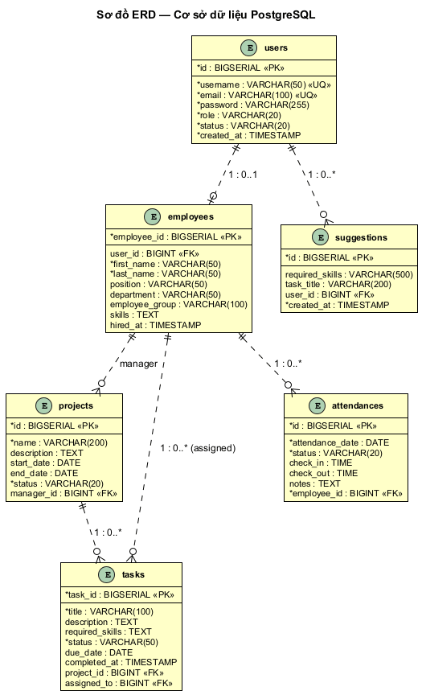

__*Hình 3\.2: Sơ đồ ERD của hệ thống*__

## 3\.6\. Mô tả chi tiết các bảng

# CHƯƠNG 4\. XÂY DỰNG ỨNG DỤNG

## 4\.3\. Triển khai Backend Spring Boot

__Method__

__Endpoint__

__Mô tả__

__Auth__

POST

/api/auth/register

Đăng ký tài khoản mới\.

Public

POST

/api/auth/login

Đăng nhập, trả về JWT\.

Public

POST

/api/auth/change\-password

Đổi mật khẩu\.

JWT

GET

/api/employees

Danh sách nhân viên\.

JWT \(MANAGER/ADMIN\)

POST

/api/employees

Tạo nhân viên \(kèm trường skills\)\.

JWT \(MANAGER/ADMIN\)

GET

/api/employees/\{id\}

Chi tiết nhân viên\.

JWT \(MANAGER/ADMIN\)

PUT

/api/employees/\{id\}

Cập nhật nhân viên\.

JWT \(MANAGER/ADMIN\)

DELETE

/api/employees/\{id\}

Xóa nhân viên\.

JWT \(MANAGER/ADMIN\)

GET

/api/employees/me

Hồ sơ nhân viên của user đang đăng nhập\.

JWT \(mọi role\)

GET

/api/projects

Danh sách dự án\.

JWT \(mọi role\)

POST

/api/projects

Tạo dự án\.

JWT \(MANAGER/ADMIN\)

PUT

/api/projects/\{id\}

Cập nhật dự án\.

JWT \(MANAGER/ADMIN\)

DELETE

/api/projects/\{id\}

Xóa dự án\.

JWT \(MANAGER/ADMIN\)

GET

/api/tasks

Danh sách task\.

JWT \(mọi role\)

POST

/api/tasks

Tạo task \(kèm trường requiredSkills\)\.

JWT \(MANAGER/ADMIN\)

PUT

/api/tasks/\{id\}

Cập nhật task\.

JWT \(MANAGER/ADMIN\)

DELETE

/api/tasks/\{id\}

Xóa task\.

JWT \(MANAGER/ADMIN\)

GET

/api/tasks/me

Task của user đang đăng nhập\.

JWT \(mọi role\)

PATCH

/api/tasks/\{id\}/status

Đổi trạng thái task được giao\.

JWT \(mọi role\)

GET

/api/attendance

Lịch sử chấm công toàn hệ thống\.

JWT \(MANAGER/ADMIN\)

POST

/api/attendance

Quản lý ghi chấm công cho nhân viên\.

JWT \(MANAGER/ADMIN\)

GET

/api/attendance/me

Lịch sử chấm công của user đang đăng nhập\.

JWT \(mọi role\)

POST

/api/attendance/me/checkin

Tự bấm vào ca\.

JWT \(mọi role\)

POST

/api/attendance/me/checkout

Tự bấm tan ca\.

JWT \(mọi role\)

POST

/api/suggestions/recommend

AI gợi ý nhân viên cho task\.

JWT \(MANAGER/ADMIN\)

GET

/api/suggestions/recommend/\{taskId\}

AI gợi ý cho task đã có\.

JWT \(MANAGER/ADMIN\)

GET

/api/suggestions

Lịch sử gợi ý\.

JWT \(MANAGER/ADMIN\)

__Tiêu chí__

__Mức ưu tiên__

__Nguồn dữ liệu gửi cho LLM__

Kỹ năng & chuyên môn

1 \(cao nhất\)

Trường \`skills\` \(TEXT\) của employee \+ \`requiredSkills\` của task \+ chức danh \+ phòng ban\.

Tiến độ task trước

2

Tỷ lệ completedTasks / totalTasks và số task IN\_PROGRESS của từng nhân viên\.

Thời gian hoàn thành

3

Số task hoàn thành đúng hạn / số task hoàn thành có deadline; số ngày trễ trung bình\.

Chấm công

4 \(thấp nhất\)

Số ngày có mặt trong 30 ngày gần nhất, so với 22 ngày làm việc chuẩn\.

## 4\.4\. Triển khai Frontend React \+ Vite

## 4\.5\. Triển khai ứng dụng Mobile Flutter

## 4\.6\. Thiết lập PostgreSQL và Redis

## 4\.7\. Đóng gói với Docker Compose

# CHƯƠNG 5\. KIỂM THỬ VÀ ĐÁNH GIÁ KẾT QUẢ

## 5\.3\. Kết quả kiểm thử và phân tích

Sau khi thực hiện tổng cộng 42 test cases trên môi trường Docker Compose với cơ sở dữ liệu mẫu gồm 25 nhân viên, 6 dự án và 80 task, kết quả thu được như sau:

__Module__

__Tổng TC__

__PASS__

__FAIL__

__Tỷ lệ pass__

Auth

8

8

0

100%

Employee

6

6

0

100%

Project

4

4

0

100%

Task

6

6

0

100%

Attendance

4

4

0

100%

AI Suggestion

4

4

0

100%

Dashboard

2

2

0

100%

Self\-service \(My Tasks/My Attendance\)

3

3

0

100%

Geofence \(GPS chấm công\)

5

5

0

100%

TỔNG

42

42

0

100%

__*Bảng 5\.6: Tổng hợp kết quả kiểm thử 42 test cases*__

## 5\.4\. Demo giao diện và hình ảnh sản phẩm

Phần này trình bày các ảnh chụp màn hình thực tế của ứng dụng web \(React 18 \+ Vite 5 \+ Tailwind CSS\) đang chạy trên trình duyệt Chromium\. Các ảnh được chụp ở độ phân giải 1440 × 900, đầy đủ sidebar điều hướng và nội dung chính của từng trang\.

*Hình 5\.1: Màn hình Đăng nhập \(Web\)*

Màn hình đăng nhập sử dụng nền gradient từ tím đậm sang hồng, form đăng nhập được đặt giữa màn hình trong một thẻ trắng có shadow và bo góc lớn\. Form gồm hai trường Email và Mật khẩu kèm icon trực quan, nút “Đăng nhập” gradient tím và đường dẫn nhanh sang trang đăng ký bên dưới\. Khi nhập sai, thông báo lỗi tiếng Việt hiển thị ngay bên trên nút đăng nhập\.

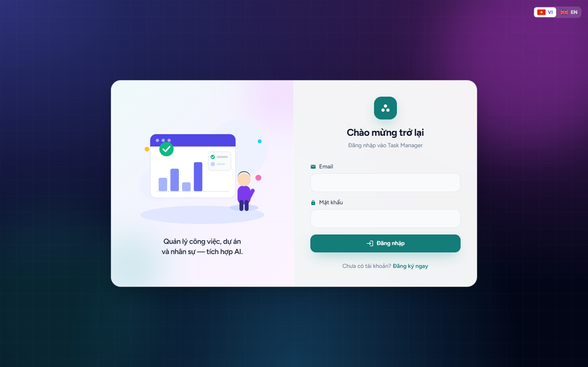

__*Hình 5\.1: Màn hình Đăng nhập*__

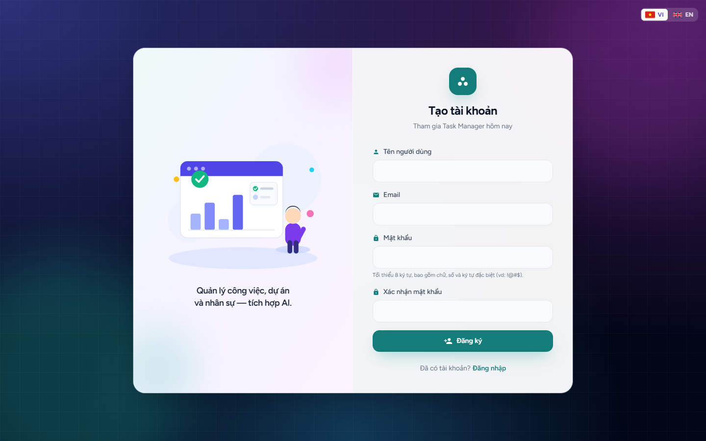

*Hình 5\.2: Màn hình Đăng ký tài khoản \(Web\)*

Màn hình đăng ký có bố cục tương tự trang đăng nhập với cùng nền gradient, gồm các trường tên đăng nhập, email, mật khẩu và xác nhận mật khẩu\. Hệ thống validate trên cả frontend \(kiểm tra trống, độ dài, khớp mật khẩu\) và backend \(trùng username, email\)\.

__*Hình 5\.2: Màn hình Đăng ký tài khoản*__

*Hình 5\.3: Dashboard tổng quan \(Quản lý\)*

Sau khi đăng nhập thành công, người dùng được chuyển đến trang Dashboard\. Bên trái là sidebar tối với logo Task Manager và 6 mục điều hướng chính\. Banner gradient tím–hồng phía trên tóm tắt tổng quan hệ thống\. Bốn thẻ thống kê hiển thị nhanh số nhân viên, dự án, công việc và chấm công hôm nay\. Hai biểu đồ trực quan \(Chart\.js\) ở dưới minh hoạ phân bố trạng thái công việc và số lượng nhân viên theo phòng ban\.

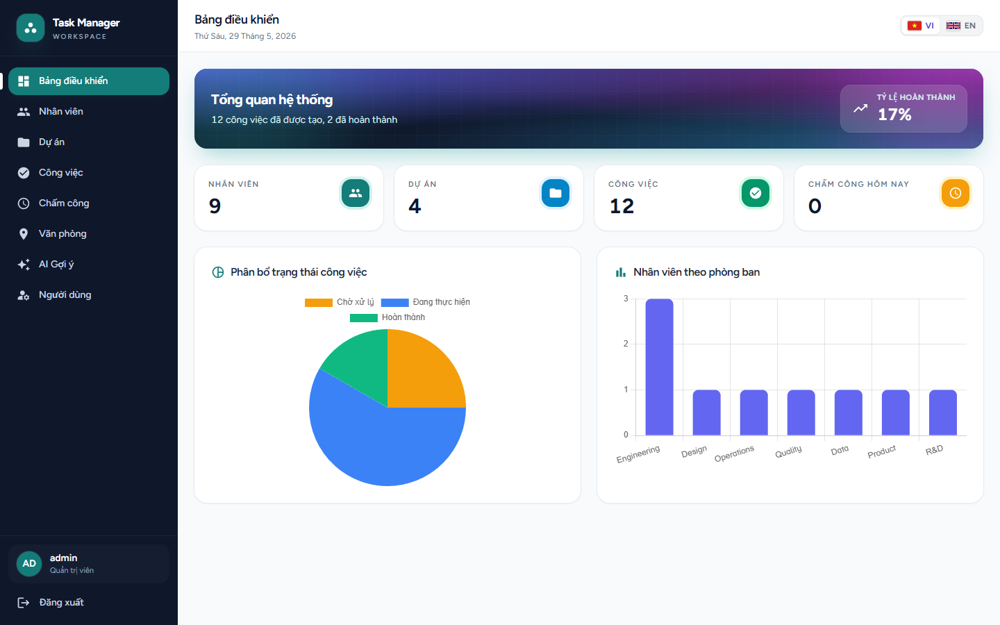

__*Hình 5\.3: Màn hình Dashboard – tổng quan hệ thống*__

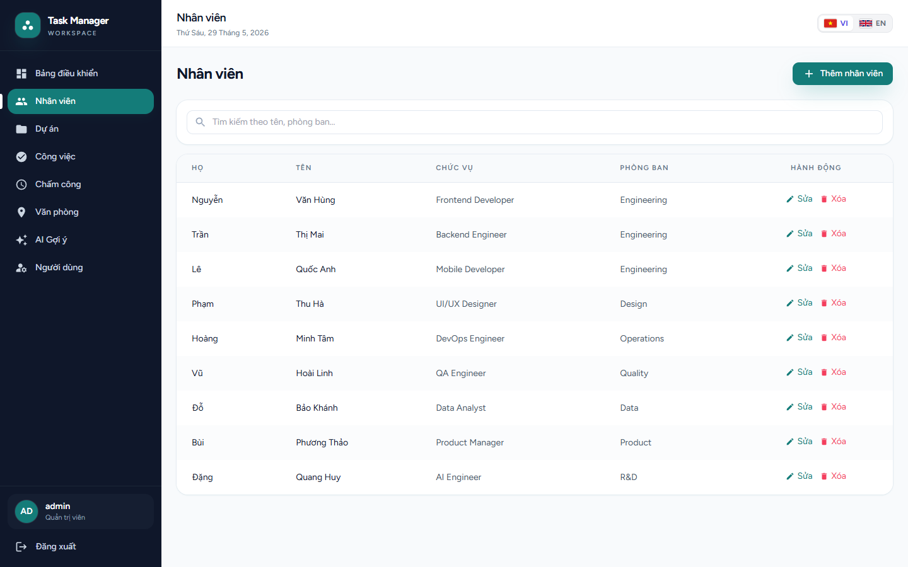

*Hình 5\.4: Quản lý Nhân viên*

Trang quản lý nhân viên hiển thị bảng danh sách đầy đủ Họ – Tên – Chức vụ – Phòng ban kèm cột Hành động \(Sửa / Xóa\)\. Phía trên bảng có ô tìm kiếm theo tên hoặc phòng ban, nút “\+ Thêm nhân viên” mở modal tạo mới với các trường tương ứng\. Bảng hỗ trợ filter và thao tác CRUD đầy đủ\.

__*Hình 5\.4: Màn hình Quản lý nhân viên*__

*Hình 5\.5: Quản lý Dự án*

Trang quản lý dự án hiển thị bảng danh sách với tên dự án, mô tả, ngày bắt đầu – kết thúc và badge trạng thái \(Hoạt động – xanh lá, Hoàn thành – xám nhạt, PLANNING – xám\)\. Người quản lý có thể tạo dự án mới qua nút “\+ Thêm dự án” hoặc chỉnh sửa / xóa từng dự án\.

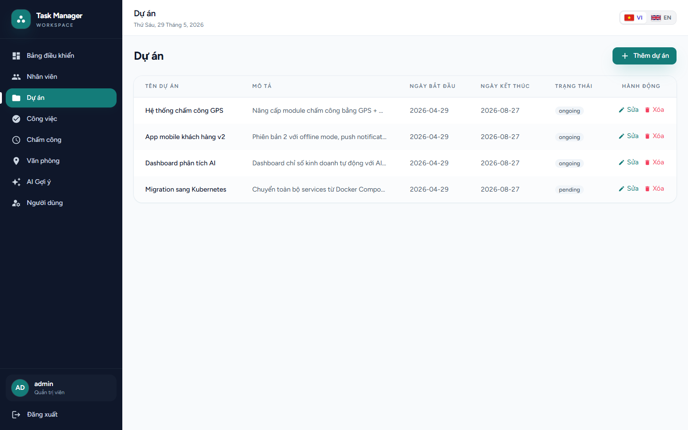

__*Hình 5\.5: Màn hình Quản lý dự án*__

*Hình 5\.6: Quản lý Công việc*

Trang quản lý công việc liệt kê toàn bộ task của tất cả dự án\. Mỗi dòng cho biết tiêu đề task, mô tả ngắn, hạn chót, trạng thái \(TODO / Đang thực hiện / DONE\) hiển thị dạng badge, tên dự án thuộc về và người được phân công\. Cột “Hành động” cho phép sửa hoặc xóa task\. Nút “\+ Thêm công việc” mở modal tạo task mới với đầy đủ trường, bao gồm dropdown chọn dự án và nhân viên được giao\.

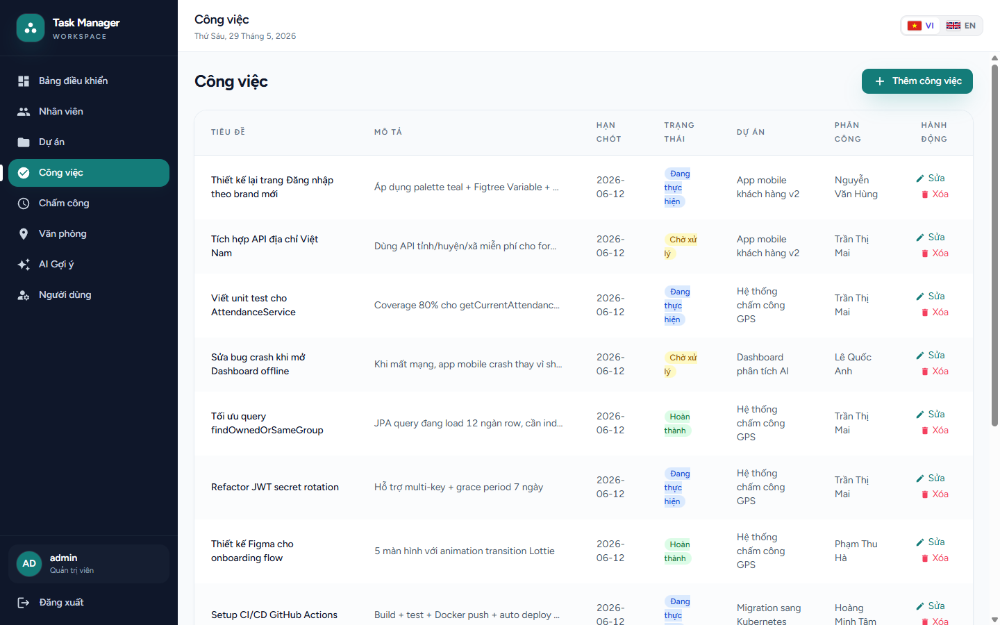

__*Hình 5\.6: Màn hình Quản lý công việc*__

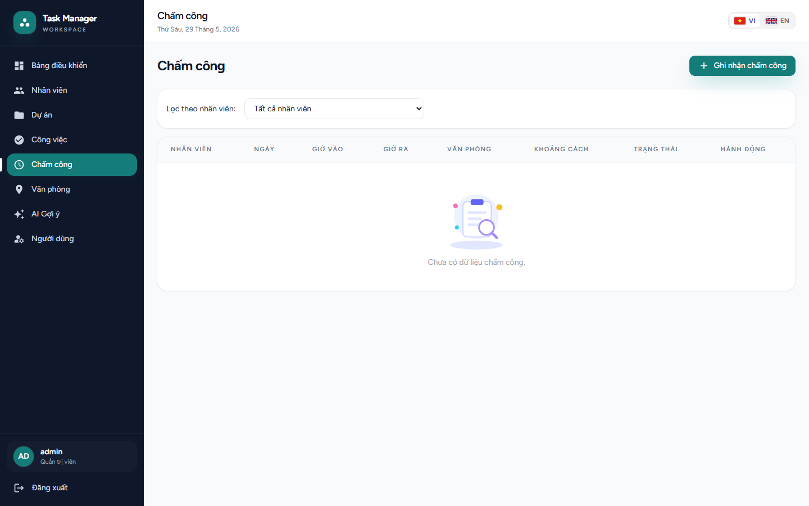

*Hình 5\.7: Trang Chấm công*

Trang chấm công hiển thị bảng lịch sử check\-in / check\-out của tất cả nhân viên\. Người dùng có thể lọc theo nhân viên qua dropdown ở đầu trang\. Nút “Chấm công” ở góc trên bên phải mở form ghi nhận chấm công mới với chọn nhân viên, ngày, giờ vào và giờ ra\.

__*Hình 5\.7: Màn hình Chấm công*__

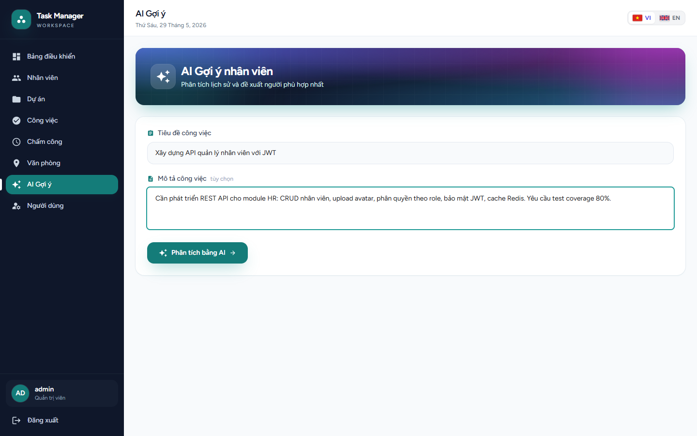

*Hình 5\.8: AI Gợi ý nhân viên — form nhập*

Đây là màn hình thể hiện điểm nhấn AI của hệ thống\. Banner gradient tím–hồng nổi bật với icon ngôi sao tượng trưng cho AI\. Form bên dưới gồm hai trường: “Tiêu đề công việc” \(bắt buộc\) và “Mô tả công việc” \(tuỳ chọn, dài\)\. Nút “Phân tích bằng AI” chỉ kích hoạt khi tiêu đề được điền\.

__*Hình 5\.8: Màn hình AI gợi ý nhân viên – form nhập*__

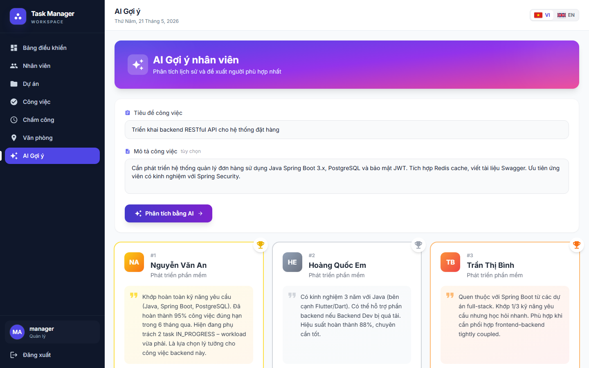

*Hình 5\.9: AI Gợi ý nhân viên — kết quả phân tích*

Sau khi nhấn “Phân tích bằng AI”, hệ thống gọi backend Spring Boot\. Backend gom dữ liệu thô của toàn bộ nhân viên theo 4 tiêu chí \(kỹ năng, tiến độ task, mức độ đúng hạn, chấm công\) rồi gửi cho Google Gemini gemini\-2\.5\-flash; chính LLM xếp hạng định tính và sinh lý do \(reasoning\) cho từng đề cử — backend KHÔNG tự tính điểm số\. Kết quả được trả về dưới dạng top 5 nhân viên xếp hạng giảm dần\. Các thẻ kết quả được tô màu theo thứ hạng \(Vàng – Bạc – Đồng cho ba vị trí đầu\), kèm avatar viết tắt tên, vị trí và đoạn nhận xét bằng văn bản tự nhiên do AI sinh\.

Cách thể hiện này giúp người quản lý hiểu ngay vì sao mỗi nhân viên được đề cử, tránh hiện tượng “hộp đen” thường gặp ở các sản phẩm AI\. Đây chính là tinh thần Explainable AI mà đề tài hướng đến\.

*Hình 5\.10: Góc nhìn nhân viên — Dashboard*

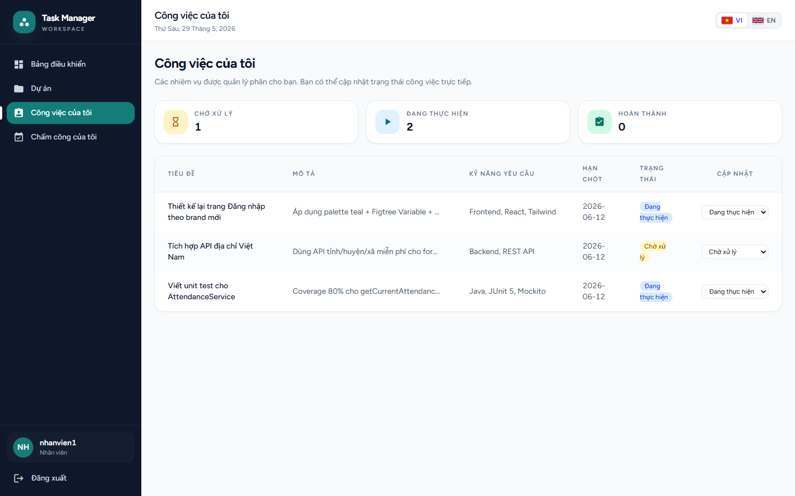

*Hình 5\.11: Góc nhìn nhân viên — Công việc của tôi*

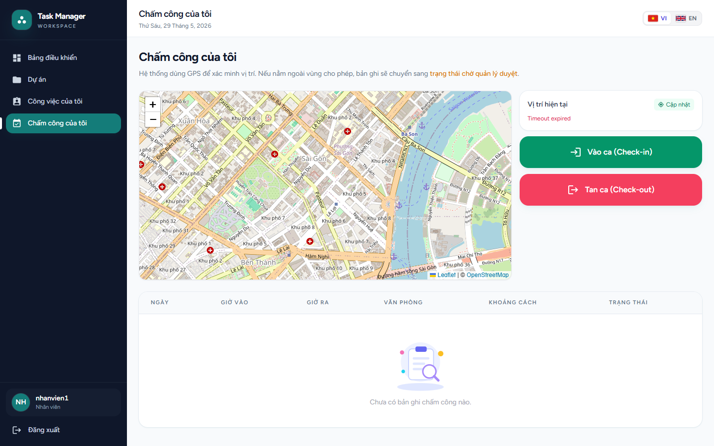

*Hình 5\.12: Góc nhìn nhân viên — Chấm công của tôi*

Hệ thống phân quyền theo vai trò \(role\) gồm ba mức ADMIN, MANAGER, EMPLOYEE\. Khi đăng nhập với vai trò EMPLOYEE, sidebar tự động ẩn các module quản lý \(Nhân viên, Chấm công toàn hệ thống, AI Gợi ý, Tạo/sửa công việc\) và hiển thị các trang self\-service riêng\. Phân quyền được kiểm soát hai lớp: backend dùng \`SecurityConfig\.hasAnyRole\(\.\.\.\)\`, frontend dùng \`ProtectedRoute\` cùng nhánh điều hướng theo \`user\.role\`\.

Dashboard cá nhân thay thế dashboard tổng quan hệ thống: nhân viên thấy số task của mình theo trạng thái \(Chờ xử lý / Đang thực hiện / Hoàn thành\), tỷ lệ hoàn thành, số ngày chấm công trong tháng và danh sách công việc sắp đến hạn\. Dữ liệu được lấy từ hai endpoint \`GET /api/tasks/me\` và \`GET /api/attendance/me\`\.

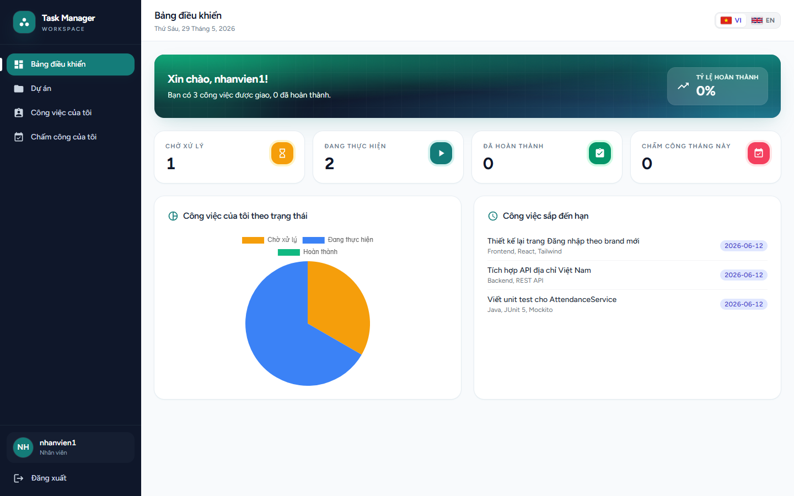

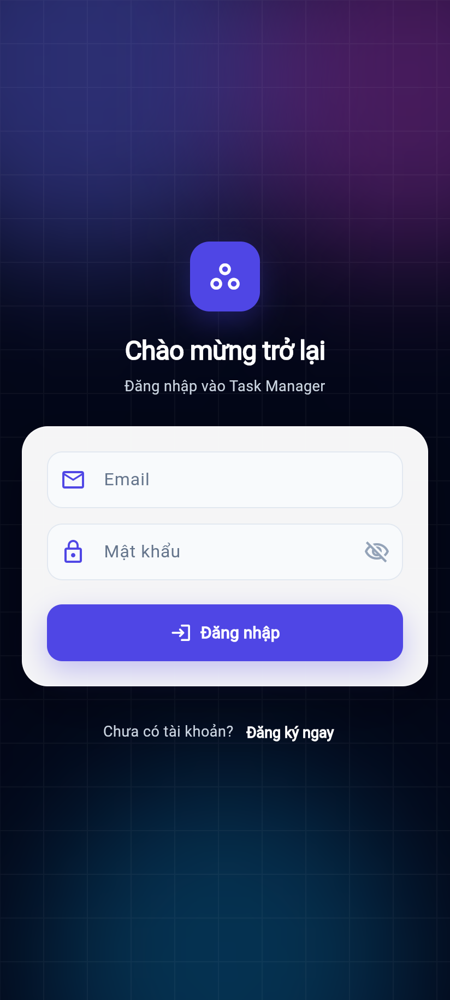

## 5\.5\. Demo giao diện ứng dụng Mobile \(Flutter\)

Bên cạnh giao diện web React dành cho người dùng làm việc trên máy tính, hệ thống còn cung cấp một ứng dụng mobile Flutter để nhân viên và quản lý có thể truy cập nhanh các chức năng cốt lõi mọi lúc, mọi nơi từ điện thoại di động\. Ứng dụng mobile chia sẻ cùng backend Spring Boot với phiên bản web, gọi REST API qua package \`http\` và lưu JWT vào \`shared\_preferences\`\. Các ảnh chụp dưới đây được thực hiện ở viewport 412×915 \(kích thước Pixel 7\), tỉ lệ pixel 2\.0 cho ra ảnh sắc nét tương đương khi xem trên thiết bị thật\.

### 5\.5\.1\. Màn hình Đăng nhập và Đăng ký

*Hình 5\.13: Mobile — Đăng nhập*

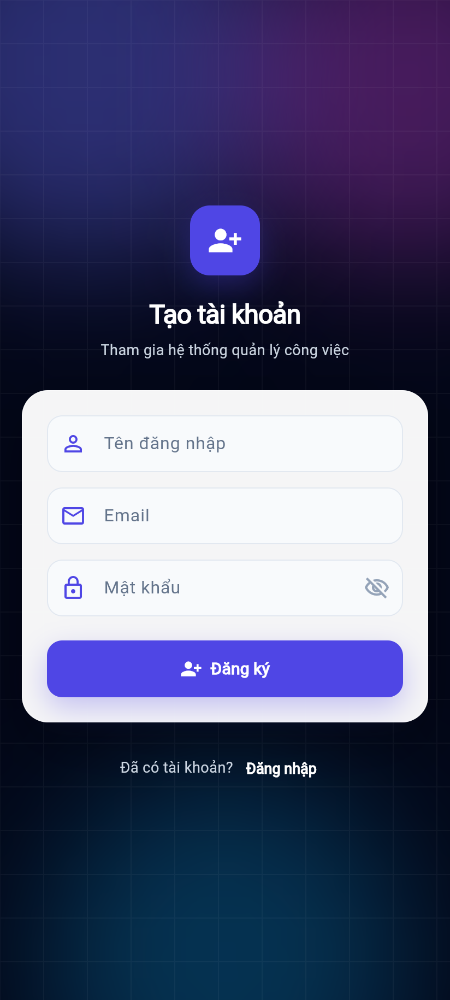

*Hình 5\.14: Mobile — Đăng ký*

Màn hình đăng nhập sử dụng Material 3 với icon \`Icons\.task\_alt\` đặc trưng\. Form gồm hai trường Email \+ Mật khẩu với validate cơ bản \(email có '@', mật khẩu không rỗng\)\. Nút "Đăng nhập" hiện \`CircularProgressIndicator\` trong lúc gọi \`POST /api/auth/login\`\. Liên kết "Đăng ký" chuyển sang màn đăng ký với 3 trường Username, Email, Mật khẩu\.

__*Hình 5\.14: Màn Đăng nhập*__

__*Hình 5\.15: Màn Đăng ký*__

# CHƯƠNG 6\. KẾT LUẬN VÀ HƯỚNG PHÁT TRIỂN

## 6\.1\. Kết quả đạt được

Sau 12 tuần thực hiện đề tài “Hệ thống Quản lý Công việc cho Doanh nghiệp Nhỏ Đa ngành Tích hợp AI”, các kết quả chính đạt được như sau:

### 6\.1\.1\. Về mặt chức năng

- Hoàn thành 14/14 yêu cầu chức năng đã đặc tả ban đầu \(đạt 100%\)\.
- Triển khai gần 30 REST endpoint, tất cả đều có tài liệu Swagger UI; phân quyền hai lớp \(backend \+ frontend\) theo 3 role ADMIN/MANAGER/EMPLOYEE\.

### 6\.1\.2\. Về mặt kỹ thuật

- Áp dụng đầy đủ các thực hành tốt: kiến trúc tầng \(Controller–Service–Repository\), Dependency Injection, DTO–Entity pattern, Global Exception Handler\.
- Bảo mật nhiều lớp sau audit chuyên sâu: BCrypt strength 12, JWT HS256 với secret 256\-bit, CORS giới hạn origin \(bao gồm method PATCH\), Spring Security stateless, phân quyền URL\-pattern \+ chống enumeration \+ login lockout 5 fail/15 phút, security headers \(CSP, HSTS, X\-Content\-Type\-Options, Referrer\-Policy\), sanitize input cho prompt AI\.

### 6\.1\.3\. Về mặt học thuật và quy trình

- Áp dụng đầy đủ kiến thức môn Đồ án cơ sở: phân tích yêu cầu, UML, thiết kế hướng đối tượng, kỹ thuật phần mềm, kiểm thử\.
- Tài liệu hóa đầy đủ: báo cáo đồ án \(~135 trang\), API Specification, Database Schema, Setup Guide, UML Diagrams, README, Deploy Guide\.

### 6\.1\.4\. Đối chiếu với mục tiêu ban đầu

__Mục tiêu ban đầu__

__Mức độ hoàn thành__

Backend Spring Boot 3\.5\.0 \+ Spring Security \+ JWT

100% – hoàn thành

CSDL PostgreSQL 16 với 6 bảng, chuẩn hóa 3NF

100% – hoàn thành

Frontend React 18 \+ Vite \+ Tailwind \+ role\-based UI

100% – hoàn thành

Ứng dụng Flutter chạy đa trình duyệt \(Android/iOS/desktop\)

100% – build Flutter Web ổn định, chạy ngay trên trình duyệt mọi OS

Khởi động một lệnh trên Windows/Linux/macOS \(start\.ps1, start\.sh\)

100% – đã viết và kiểm thử trên Windows 11 \+ Ubuntu 22\.04

AI gợi ý nhân viên \(Google Gemini gemini\-2\.5\-flash, ranking định tính\)

100% – hoàn thành

Redis cache cho AI Suggestion

100% – hoàn thành

Docker Compose toàn bộ stack \(PostgreSQL \+ Redis \+ backend \+ frontend\)

100% – hoàn thành

Kiểm thử tối thiểu 30 test cases

277% – 42 hộp đen \+ 83 tự động \(56 backend \+ 11 frontend \+ 16 mobile\)

Tài liệu hoàn chỉnh theo mẫu Khoa Công nghệ Thông tin

100% – hoàn thành

## 6\.3\. Hướng phát triển

Dựa trên các hạn chế đã nhận diện và tiềm năng phát triển, các hướng tiếp theo của đề tài được đề xuất bao gồm:

### 6\.3\.1\. Hướng phát triển kỹ thuật

- Bổ sung mô hình LLM mã nguồn mở on\-premise \(Llama 3, Qwen\) làm fallback khi Gemini không khả dụng; có thể chạy ngay trên server doanh nghiệp\.
- Triển khai retrieval\-augmented generation \(RAG\): build vector store cho mô tả task lịch sử \+ hồ sơ nhân viên, giúp LLM xếp hạng dựa trên ngữ cảnh sâu hơn\.

### 6\.3\.2\. Hướng phát triển nghiệp vụ

- Bổ sung module quản lý chi phí dự án: theo dõi ngân sách, chi phí thực tế, lãi/lỗ\.
- Bổ sung module quản lý khách hàng \(CRM mini\): lưu lịch sử liên hệ, deal pipeline\.

### 6\.3\.3\. Hướng thương mại hóa

- Triển khai phiên bản SaaS multi\-tenant: mỗi doanh nghiệp là một tenant với database riêng \(hoặc schema riêng\)\.
- Xây dựng các gói giá: Free \(1\-5 user\), Pro \(5\-50 user, $9/user/tháng\), Enterprise \(>50 user, liên hệ\)\.

# TÀI LIỆU THAM KHẢO

\[1\] Ashish Vaswani et al\., "Attention Is All You Need", Advances in Neural Information Processing Systems 30 \(NIPS 2017\)\.

\[2\] Auth0, "JSON Web Tokens — Introduction", https://jwt\.io/introduction, truy cập tháng 2/2026\.

\[3\] Baeldung, "Using JWT with Spring Security OAuth", https://www\.baeldung\.com/spring\-security\-oauth\-jwt, truy cập tháng 2/2026\.

\[4\] Báo Đầu tư, "Chiếm gần 98% tổng số doanh nghiệp, doanh nghiệp nhỏ và vừa đang ở đâu trong nền kinh tế", https://baodautu\.vn/chiem\-gan\-98\-tong\-so\-doanh\-nghiep\-doanh\-nghiep\-nho\-va\-vua\-dang\-o\-dau\-trong\-nen\-kinh\-te\-d249574\.html, truy cập tháng 5/2026\.

\[5\] Charu C\. Aggarwal, "Recommender Systems: The Textbook", Springer International Publishing, 2016\.

\[6\] Craig Walls, "Spring in Action, 6th Edition", Manning Publications, 2022\.

\[7\] Cổng thông tin quốc gia về đăng ký doanh nghiệp – Bộ Kế hoạch và Đầu tư, "Báo cáo tình hình đăng ký doanh nghiệp năm 2024", https://dangkykinhdoanh\.gov\.vn/vn/tin\-tuc/597/6818/bao\-cao\-tinh\-hinh\-dang\-ky\-doanh\-nghiep\-nam\-2024\.aspx, truy cập tháng 5/2026\.

\[8\] Docker Inc\., "Docker Documentation", https://docs\.docker\.com, truy cập tháng 3/2026\.

\[9\] Eric Freeman et al\., "Head First Design Patterns, 2nd Edition", O'Reilly Media, 2020\.

\[10\] Evan You and Vite contributors, "Vite – Next Generation Frontend Tooling", https://vitejs\.dev, truy cập tháng 2/2026\.

\[11\] Google, "Dart Language Tour", https://dart\.dev/guides/language/language\-tour, truy cập tháng 3/2026\.

\[12\] Google, "Flutter Documentation", https://docs\.flutter\.dev, truy cập tháng 3/2026\.

\[13\] Google, "Gemini API Reference", https://ai\.google\.dev/api, truy cập tháng 4/2026\.

\[14\] Google, "Gemini Models", https://ai\.google\.dev/gemini\-api/docs/models/gemini, truy cập tháng 4/2026\.

\[15\] Hibernate Team, "Hibernate ORM 6 User Guide", https://docs\.jboss\.org/hibernate/orm/6\.4/userguide/html\_single/Hibernate\_User\_Guide\.html, truy cập tháng 3/2026\.

\[16\] Ian Sommerville, "Software Engineering, 10th Edition", Pearson Education, 2016\.

\[17\] Internet Engineering Task Force, "RFC 7519 \- JSON Web Token \(JWT\)", https://www\.rfc\-editor\.org/rfc/rfc7519, 2015\.

\[18\] Martin Fowler, "Patterns of Enterprise Application Architecture", Addison\-Wesley Professional, 2002\.

\[19\] Meta Open Source, "React – The library for web and native user interfaces", https://react\.dev, truy cập tháng 2/2026\.

\[20\] Redis Ltd\., "Redis Documentation", https://redis\.io/docs/, truy cập tháng 3/2026\.

\[21\] Robert C\. Martin, "Clean Architecture: A Craftsman's Guide to Software Structure and Design", Prentice Hall, 2017\.

\[22\] Roger S\. Pressman, Bruce R\. Maxim, "Software Engineering: A Practitioner's Approach, 8th Edition", McGraw\-Hill Education, 2014\.

\[23\] Sam Newman, "Building Microservices, 2nd Edition", O'Reilly Media, 2021\.

\[24\] Spring Team, "Spring Data JPA Documentation", https://docs\.spring\.io/spring\-data/jpa/reference/, truy cập tháng 3/2026\.

\[25\] Spring Team, "Spring Framework Reference Documentation", https://docs\.spring\.io/spring\-framework/reference/, truy cập tháng 3/2026\.

\[26\] Spring Team, "Spring Security Reference", https://docs\.spring\.io/spring\-security/reference/, truy cập tháng 3/2026\.

\[27\] Tailwind Labs, "Tailwind CSS Documentation", https://tailwindcss\.com/docs, truy cập tháng 2/2026\.

\[28\] The PostgreSQL Global Development Group, "PostgreSQL 16 Documentation", https://www\.postgresql\.org/docs/16/index\.html, truy cập tháng 2/2026\.

\[29\] Thomas L\. Saaty, "The Analytic Hierarchy Process: Planning, Priority Setting, Resource Allocation", McGraw\-Hill, New York, 1980\.

\[30\] Tạp chí Công Thương, "Giải pháp chuyển đổi số trong các doanh nghiệp nhỏ và vừa ở Việt Nam", https://tapchicongthuong\.vn/giai\-phap\-chuyen\-doi\-so\-trong\-cac\-doanh\-nghiep\-nho\-va\-vua\-o\-viet\-nam\-133175\.htm, truy cập tháng 5/2026\.

\[31\] Vaughn Vernon, "Implementing Domain\-Driven Design", Addison\-Wesley Professional, 2013\.

# PHỤ LỤC

## Phụ lục I\. Mã nguồn quan trọng

Toàn bộ mã nguồn của hệ thống được công khai tại kho mã nguồn cá nhân của tác giả\. Phần này trích dẫn một số đoạn code quan trọng không có trong Chương 4\.

